<center>COURSE PROJECT</center>

<p align="center">
    <strong>Universidad Peruana de Ciencias Aplicadas</strong><br>
    </img><br>
    <strong>Ingeniería de Software</strong><br>
    <strong>Aplicaciones Móviles - NRC7128</strong><br>
    <strong>Profesor: Jorge Luis Mayta Guillermo</strong><br>
    <br>Final Project Report
</p>

<center>

### Startup: **DartlinWave**
#### Product: **LawConnect**

</center>

#### <center>Team  Members:</center>

<center>

| Member                             | Code       |
|------------------------------------|------------|
| Gonzalo Andre Zavala Quedena       | U202113656 |
| Camila Cristina Loli Ramirez       | U202110385 |
| Barbara Antonella Espinoza Delgado | u201911727 |
| Johan Jorge Quiñones Tintaya       | U202218183 |

<br> Abril 2025
</center>  


## Registro de Versiones del Informe  
| Version | Fecha      | Autor                              | Descripción de Modificación                      |
|---------|------------|------------------------------------|--------------------------------------------------|
| 1.0.0   | 09/04/2025 | Camila Cristina Loli Ramirez       | Desarrollo completo del **Capítulo I**           |
| 1.1.0   | 10/04/2025 | Zavala Quedena Gonzalo Andre       | Desarrollo parcial del **Capítulo II**           |
| 1.2.0   | 12/04/2025 | Barbara Antonella Espinoza Delgado | Desarrollo completo del **Capítulo III**         |
| 1.3.0   | 13/04/2025 | Johan Jorge Quiñones Tintaya       | Desarrollo parcial del **Capítulo II**           |
| 1.4.0   | 14/04/2025 | Zavala Quedena Gonzalo Andre       | Fusión de capítulos a la rama principal **main** |

## Project Report Collaboration Insights  
**TB1:**  
En esta entrega el equipo definió las bases del tema que se trabajará en el ciclo, sus segmentos objetivo, Lean UX, requisitos y bounded contexts.


## Project Report Collaboration Insights  
**TP:**  
En esta entrega el equipo definió los wireframes, mockups, prototypes y product implementation, validation & deployment.


## Contenido

[Registro de Versiones del Informe](#registro-de-versiones-del-informe)  
[Project Report Collaboration Insights](#project-report-collaboration-insights)  
[Student Outcome](#student-outcome) 

[Objetivos SMART](#objetivos-smart)

[Capítulo I: Presentación](#capítulo-i-presentación)

[1.1 Startup Profile](#11-startup-profile)  
[1.1.1. Descripción de la Startup](#111-descripción-de-la-startup)  
[1.1.2. Perfiles de integrantes del equipo](#112-perfiles-de-integrantes-del-equipo)  

[1.2. Solution Profile](#12-solution-profile)  
[1.2.1 Antecedentes y problemática](#121-antecedentes-y-problemática)  
[1.2.2 Lean UX Process.](#122-lean-ux-process)  
[1.2.2.1. Lean UX Problem Statements.](#1221-lean-ux-problem-statements)  
[1.2.2.2. Lean UX Assumptions.](#1222-lean-ux-assumptions)  
[1.2.2.3. Lean UX Hypothesis Statements.](#1223-lean-ux-hypothesis-statements)  
[1.2.2.4. Lean UX Canvas.](#1224-lean-ux-canvas)  

[1.3. Segmentos objetivo.](#13-segmentos-objetivo)  

[Capítulo II: Requirements Elicitation & Analysis](#capítulo-ii-requirements-elicitation--analysis)  

[2.1. Competidores](#21-competidores)  
[2.1.1. Análisis competitivo](#211-análisis-competitivo)  
[2.1.2. Estrategias y tácticas frente a competidores](#211-análisis-competitivo)  

[2.2. Entrevistas](#22-entrevistas)  
[2.2.1. Diseño de entrevistas](#221-diseño-de-entrevistas)  
[2.2.2. Registro de entrevistas](#222-registro-de-entrevistas)  
[2.2.3. Análisis de entrevistas](#223-análisis-de-entrevistas)  

[2.3. Needfinding](#23-needfinding)  
[2.3.1. User Personas](#231-user-personas)  
[2.3.2. User Task Matrix](#232-user-task-matrix)  
[2.3.3. User Journey Mapping](#233-user-journey-mapping)  
[2.3.4. Empathy Mapping](#234-empathy-mapping)  
[2.3.5. As-is Scenario Mapping](#235-as-is-scenario-mapping) 

[2.4. Ubiquitous Language](#24-ubiquitous-language)  

[Capítulo III: Requirements Specificatio](#capítulo-iii-requirements-specification)  

[3.1. To-Be Scenario Mapping](#31-to-be-scenario-mapping)    
[3.2. User Stories](#32-user-stories)  
[3.3. Impact Mapping](#33-impact-mapping)  
[3.4. Product Backlog](#34-product-backlog)  

[Capítulo IV: Solution Software Design](#capitulo-iv-solution-software-design)

[4.1. Strategic-Level Domain-Driven Design](#41-strategic-level-domain-driven-design)

[4.1.1. EventStorming](#411-eventstorming)  
[4.1.1.1. Candidate Context Discovery](#4111-candidate-context-discovery)  
[4.1.1.2. Domain Message Flows Modeling](#4112-domain-message-flows-modeling)  
[4.1.1.3. Bounded Context Canvases](#4113-bounded-context-canvases)

[4.1.2. Context Mapping](#412-context-mapping)

[4.1.3. Software Architecture](#413-software-architecture)  
[4.1.3.1. Software Architecture Context Level Diagrams](#4131-software-architecture-context-level-diagrams)  
[4.1.3.2. Software Architecture Container Level Diagrams](#4132-software-architecture-container-level-diagrams)  
[4.1.3.3. Software Architecture Deployment Diagrams](#4133-software-architecture-deployment-diagrams)

[4.2. Tactical-Level Domain-Driven Design](#42-tactical-level-domain-driven-design)  
[4.2.5. Bounded Context: Tracking](#425-bounded-context-tracking)  
[4.2.5.1. Domain Layer](#4251-domain-layer)  
[4.2.5.2. Interface Layer](#4252-interface-layer)  
[4.2.5.3. Application Layer](#4253-application-layer)  
[4.2.5.4. Infrastructure Layer](#4254-infrastructure-layer)  
[4.2.5.5. Bounded Context Software Architecture Component Level Diagrams](#4255-bounded-context-software-architecture-component-level-diagrams)  
[4.2.5.6. Bounded Context Software Architecture Code Level Diagrams](#4256-bounded-context-software-architecture-code-level-diagrams)  
[4.2.5.6.1. Bounded Context Domain Layer Class Diagrams](#42561-bounded-context-domain-layer-class-diagrams)  
[4.2.5.6.2. Bounded Context Database Design Diagram](#42562-bounded-context-database-design-diagram)

[Capítulo V: Solution UI/UX Design](#capitulo-v-solution-ui-ux-design)  

[5.1. Product design](#51-product-design)
[5.1.1. Style Guidelines](#511-style-guidelines)  
[5.1.1.1. General Style Guidelines](#5111-general-style-guidelines)

[5.1.2. Information Architecture](#512-information-architecture)  
[5.1.2.1. Organization Systems](#5121-organization-systems)  
[5.1.2.2. Labelling Systems](#5122-labelling-systems)  
[5.1.2.3. SEO Tags and Meta Tags](#5123-seo-tags-and-meta-tags)  
[5.1.2.4. Searching Systems](#5124-searching-systems)  
[5.1.2.5. Navigation Systems](#5125-navigation-systems)

[5.1.3. Landing Page UI Design](#513-landing-page-ui-design)  
[5.1.3.1. Landing Page Wireframe](#5131-landing-page-wireframe)  
[5.1.3.2. Landing Page Mock-up](#5132-landing-page-mock-up)

[5.1.4. Mobile Applications UX/UI Design](#514-mobile-applications-uxui-design)  
[5.1.4.1. Mobile Applications Wireframes](#5141-mobile-applications-wireframes)  
[5.1.4.2. Mobile Applications Wireflow Diagrams](#5142-mobile-applications-wireflow-diagrams)  
[5.1.4.3. Mobile Applications Mock-ups](#5143-mobile-applications-mock-ups)  
[5.1.4.4. Mobile Applications User Flow Diagrams](#5144-mobile-applications-user-flow-diagrams)  
[5.1.4.5. Mobile Applications Prototyping](#5145-mobile-applications-prototyping)

[Capítulo VI: Product Implementation, Validation & Deployment](#capitulo-vi-product-implementation-validation-and-deployment)

[6.1. Software Configuration Management](#61-software-configuration-management)

[6.1.1. Software Development Environment Configuration](#611-software-development-environment-configuration)  
[6.1.2. Source Code Management](#612-source-code-management)  
[6.1.3. Source Code Style Guide & Conventions](#613-source-code-style-guide-conventions)  
[6.1.4. Software Deployment Configuration](#614-software-deployment-configuration)  

[6.2. Landing Page & Mobile Application Implementation](#62-landing-page-and-mobile-application-implementation)  

[6.2.X. Sprint n](#62x-sprint-n)  
[6.2.X.1. Sprint Planning n](#62x1-sprint-planning-n)  
[6.2.X.2. Sprint Backlog n](#62x2-sprint-backlog-n)  
[6.2.X.3. Development Evidence for Sprint Review](#62x3-development-evidence-for-sprint-review)  
[6.2.X.4. Testing Suite Evidence for Sprint Review](#62x4-testing-suite-evidence-for-sprint-review)  
[6.2.X.5. Execution Evidence for Sprint Review](#62x5-execution-evidence-for-sprint-review)  
[6.2.X.6. Services Documentation Evidence for Sprint Review](#62x6-services-documentation-evidence-for-sprint-review)  
[6.2.X.7. Software Deployment Evidence for Sprint Review](#62x7-software-deployment-evidence-for-sprint-review)    
[6.2.X.8. Team Collaboration Insights during Sprint](#62x8-team-collaboration-insights-during-sprint)  

[6.3. Validation Interviews](#63-validation-interviews)  

[6.3.1. Diseño de Entrevistas](#631-diseño-de-entrevistas)  
[6.3.2. Registro de Entrevistas](#632-registro-de-entrevistas)  
[6.3.3. Evaluaciones según heurísticas](#633-evaluaciones-segun-heuristicas)  

[6.4. Video About-the-Product](#64-video-about-the-product)

[Conclusiones](#conclusiones)  
[Conclusiones y recomendaciones](#conclusiones-y-recomendaciones)  
[Video About-the-Team](#video-about-the-team)  
[Bibliografía](#bibliografía)  
[Anexos](#anexos) 


## Student Outcome

ABET - EAC - Student Outcome 7 

Criterio: La capacidad de adquirir y aplicar nuevos conocimientos según sea necesario, utilizando estrategias de aprendizaje apropiadas.


| **Criterio específico**                                                                                                                 | **Acciones realizadas**                                                                                                                                                                                                                                                                                                                                                                                                                                                                                                                                                                                                                                                                                                                                                                                                                                                                                                                                                                                                                                                                                                                                                                                                                                                                                                                                                                                                                                                                                                                                                                                                                                                                                                                                                                                                                                                                                                                                                                                                                                                     | **Conclusiones**                                                                                                                                                                                                                                                                                             |
|-----------------------------------------------------------------------------------------------------------------------------------------|-----------------------------------------------------------------------------------------------------------------------------------------------------------------------------------------------------------------------------------------------------------------------------------------------------------------------------------------------------------------------------------------------------------------------------------------------------------------------------------------------------------------------------------------------------------------------------------------------------------------------------------------------------------------------------------------------------------------------------------------------------------------------------------------------------------------------------------------------------------------------------------------------------------------------------------------------------------------------------------------------------------------------------------------------------------------------------------------------------------------------------------------------------------------------------------------------------------------------------------------------------------------------------------------------------------------------------------------------------------------------------------------------------------------------------------------------------------------------------------------------------------------------------------------------------------------------------------------------------------------------------------------------------------------------------------------------------------------------------------------------------------------------------------------------------------------------------------------------------------------------------------------------------------------------------------------------------------------------------------------------------------------------------------------------------------------------------|--------------------------------------------------------------------------------------------------------------------------------------------------------------------------------------------------------------------------------------------------------------------------------------------------------------|
| Actualiza conceptos y conocimientos necesarios para su desarrollo profesional y en especial para su proyecto en soluciones de software. | **Zavala Quedena, Gonzalo Andre**<br>*TB1*<br><br>Actualicé y apliqué conceptos clave en el proyecto LawConnect, liderando la organización del equipo, el análisis competitivo y la definición de user personas; realicé asimismo el análisis de las capas Domain, Application, Infrastructure e Interfaces en los bounded contexts IAM y Profiles.<br><br>**Loli Ramirez, Camila Cristina**<br>*TB1*<br><br>Actualicé mis conocimientos en la creación de los diferentes diagramas, investigué distintos patrones para agregarlos. De esta forma, pude crear una mejor planeación para nuestro proyecto. También, realicé la estructura del bounded context Matchmaking y definí cada capa del mismo (domain, application, infrastructure, interfaces). Además, agregué nueva información al apartado How Much de 5W's y 2H's.<br><br>*TP*<br><br>Actualicé mis conocimientos referente al guía de diseños para los productos relacionados a LawConnect. De esta manera, hay armonía entre los productos y será fácil de reconocer para los usuarios. Asimismo, también pude aplicar nuevos conocimientos al actualizar la landing page, debido a que este era de un proyecto anterior. También, actualicé mis conocimientos de SCRUM, para realizar el sprint planning 1 y sprint backlog 1. Por último, utilizar nuevos métodos en el backend para mejorar su rendimiento.<br><br>**Espinoza Delgado, Barbara Antonella**<br>*TB1*<br><br>Realicé los user stories y todo lo relacionado a la obtención de requisitos para que las ideas de nuestra solución estén justificadas además de definir las clases que se usarán en el quinto bounded context Tracking.<br><br>**Quiñones Tintaya, Johan Jorge**<br>*TB1*<br><br>Contribuí al proyecto LawConnect aplicando herramientas de diseño centrado en el usuario como user task matrix, journey mapping, empathy mapping y as-is scenario mapping. Participé en la definición de user personas y en el análisis de las capas Domain, Application, Infrastructure e Interfaces en los bounded contexts IAM y Profiles. | **TB1**<br>Para esta entrega, realizamos distintas actualizaciones en el proyecto para que se mantenga relevante durante estos tiempos de innovadoras tendencias tecnológicas. Con esta aplicación móvil, esperamos llegar a más alcance de usuarios debido a la facilidad que brinda a ellos.               |
| Reconoce la necesidad del aprendizaje permanente para el desempeño profesional y el desarrollo de proyectos en soluciones de software.  | **Zavala Quedena Gonzalo Andre**<br>*TB1*<br><br>Reconocí la necesidad del aprendizaje permanente para mantener actualizadas mis competencias técnicas y metodológicas, incorporando nuevas herramientas y buenas prácticas que optimizan el desempeño profesional y fortalecen el desarrollo de soluciones de software.<br><br>**Loli Ramirez, Camila Cristina**<br>*TB1*<br><br>Reconocí que es importante aprender constantemente nuevas técnicas para realizar los proyectos, como llevar cursos de distintos lenguajes o algoritmos para hacer un trabajo conciso y con base sólida.<br><br>*TP*<br><br>Reconocí, nuevamente, que es necesario aprender un tema luego de cada entrega. Por ejemplo, respecto al frontend, pude entender cómo funciona la navegación y el cómo debe ser el funcionamiento de cada aspecto que va a contener la aplicación.<br><br>**Espinoza Delgado, Barbara Antonella**<br>*TB1*<br><br>Reconocí la importancia de mantener actualizado nuestros conocimientos y analizar las nuevas tendencias en el desarrollo de software para poder aplicarlas al proyecto.<br><br>**Quiñones Tintaya, Johan Jorge**<br>*TB1*<br><br>Me mantuve en aprendizaje constante, incorporando nuevas herramientas y buenas prácticas de UX que mejoraron mis competencias técnicas y el desarrollo de soluciones centradas en el usuario.                                                                                                                                                                                                                                                                                                                                                                                                                                                                                                                                                                                                                                                                                                                | **TB1**<br>Tenemos que investigar constantemente nuevas técnicas, metodologías y habilidades para mantener nuestros proyectos útiles y funcionales. Asimismo, entendemos que las soluciones deben de ser escalables para poder seguir agregando nuevas opciones que llamen la atención de nuestros usuarios. |

## Objetivos SMART

**Objetivos SMART para Gonzalo Andre Zavala Quedena**    
1.	Lanzar un sitio web personal con diseño responsivo e interacción básica
*	Específico: Desarrollar y desplegar un sitio web que incluya las secciones “Inicio”, “Sobre mí”, “Proyectos” y un formulario de contacto funcional.
*	Medible: Implementar las 4 secciones y verificar el envío de mensajes con al menos 3 pruebas de usuario exitosas.
*	Alcanzable: Dedicando 4 horas semanales a maquetación, desarrollo e integración del formulario.
*	Relevante: Mejora mi dominio de desarrollo web y fortalece mi presencia profesional online.
*	Temporizado: Completar y publicar antes del 31 de julio de 2025.   

2. Crear y validar un prototipo de aplicación móvil con flujos esenciales de usuario  
*	Específico: Diseñar e implementar un prototipo que cubra los flujos de incorporación, autenticación y vista principal de contenido.
*	Medible: Tener 3 flujos operativos y recibir feedback de 5 usuarios beta con una satisfacción mínima del 80 %.
*	Alcanzable: Reservando 5 horas semanales para desarrollo de interfaces, gestión de estado y pruebas.
*	Relevante: Refuerza mis habilidades en desarrollo móvil y me prepara para proyectos reales.
*	Temporizado: Finalizar el prototipo y completar la fase de prueba antes del 30 de octubre de 2025.

**Objetivos SMART para Camila Cristina Loli Ramirez**    
1. Realizar un informe de análisis forense de software  
* Específico: Desarrollar un informe de análisis forense digital con una estructura apropiada, que es reconocer incidentes de ciberseguridad, tener en cuenta el proceso de recopilación y el funcionamiento del software (si es vulnerable a distintos ataques ya investigados con anterioridad).
* Medible: Recopilar por lo menos 3 fuentes confiables para tener una base sólida de investigación al momento de examinar el software.
* Alcanzable: Investigar y analizar el software escogido por 4 horas semanales.
* Relevante: Me permitirá incrementar mi habilidad de investigación y la manera de asegurar un software u organización con los respectivos frameworks.
* Temporizado: Inicios del mes de Julio de 2025  

2. Mejorar mis habilidades de programación en Full Stack.  
*  Específico: Mejorar mis habilidades de programación en Full Stack para poder crear un diseño eficaz y tener más rapidez al momento de desarrollarlas.
* Medible: Realizar, como mínimo, tres proyectos que sean con distintos lenguajes de programación. Y que, con cada uno vaya aumentando el nivel de dificultad (básico, intermedio, avanzado).
* Alcanzable: Realizar ocho horas semanales de práctica.
* Relevante: Los proyectos me permitirán desarrollarme laboralmente, realizar distintos productos viables y escalables.
* Temporizado: Finales de Diciembre del 2025.


**Objetivos SMART para Barbara Antonella Espinoza Delgado**  
1. Aprender y comprender como utilizar Flutter.
* Especifico: Adquirir habilidades básicas en Flutter para desarrollar aplicaciones móviles con interfaces atractivas y funcionales.
* Medible: Desarrollar un ejercicio con Flutter de la clase e implementar funcionalidades adicionales.
* Alcanzable: Dedicar 3 horas semanales al estudio del curso
* Relevante: Contribuye en un porcentaje a las exigencias de las empresas al contratar practicantes de Flutter
* Temporizado: Fin de ciclo.    

2. Aprender y comprender como utilizar Kotlin.   
* Especifico: Adquirir habilidades básicas en Kotlin para desarrollar aplicaciones móviles con interfaces atractivas y funcionales.
* Medible: Desarrollar un ejercicio con Kotlin de la clase e implementar funcionalidades adicionales.
* Alcanzable: Dedicar 3 horas semanales al estudio del curso
* Relevante: Contribuye en un porcentaje a las exigencias de las empresas al contratar practicantes de kotlin
* Temporizado: Fin de ciclo.  

**Objetivos SMART para Johan Jorge Quiñones Tintaya**   
1. Implementar pruebas unitarias y de integración en un proyecto de software  
* Específico: Desarrollar y ejecutar pruebas unitarias y de integración para al menos 3 módulos de un proyecto existente utilizando JUnit (para Java) o Jest (para JavaScript).
* Medible: Cubrir al menos un 80% del código con pruebas automatizadas y asegurar que todas las pruebas pasen correctamente antes de la entrega.
* Alcanzable: Dedicando 4 horas semanales al desarrollo y la escritura de pruebas para los módulos de la aplicación.
* Relevante: Mejora la calidad del código, reduce errores en el futuro y refuerza mis competencias en pruebas y desarrollo de software robusto.
* Temporizado: Completar la implementación y ejecución de las pruebas antes del 30 de noviembre de 2025.

2. Desarrollar un backend sólido y escalable para una aplicación web personal  
* Específico: Diseñar e implementar un backend completo usando Node.js y Express, con estructura modular, base de datos relacional y autenticación segura.
* Medible: Implementar al menos 5 endpoints funcionales, pruebas unitarias para cada uno y documentación técnica básica.
* Alcanzable: Dedicando 3 horas semanales al desarrollo, pruebas y mejoras durante 2 meses.
* Relevante: Mejora mis habilidades en arquitectura backend y fortalece mi portafolio técnico.
* Temporizado: Completar y documentar el backend antes del 30 de septiembre de 2025.

## Capítulo I: Presentación
<p align="justify">
En este capítulo se presentará con la startup y la previa planeación e investigación para el proyecto. Empezaremos con la explicación de nuestra startup y el equipo que la conforma, luego realizaremos un análisis sobre el problema escogido, junto con los antecedentes de este mismo. Además, utilizaremos el proceso Lean UX para planear la solución y determinar el mercado objetivo.
</p>

### 1.1 Startup Profile
En esta sección se detallará las características de nuestra startup, esto incluye la definición de nuestras metas como equipo, misión, visión y el perfil de los integrantes que componen el equipo.

#### 1.1.1. Descripción de la Startup
<p align="justify">
DartlinWave es una startup compuesta por un grupo de estudiantes de la carrera de Ingeniería de Software de la Universidad Peruana de Ciencias Aplicadas (UPC). Estamos enfocados en la creación de herramientas tecnológicas para mejorar y actualizar el rubro de abogacía. De esta forma, con las aplicaciones que desarrollemos, buscamos optimizar los procedimientos legales que los clientes tienen actualmente. Además, también tenemos en cuenta a los abogados para generar más oportunidades laborales, ya que no se excluirán a los profesionales dependiendo de su edad o experiencia laboral. Es así que llegamos a la realización de nuestro primer proyecto, se desarrollará la aplicación móvil LawConnect. Con esta aplicación esperamos facilitar la búsqueda de abogados calificados para personas que tengan un problema legal. Asimismo, deseamos generar más oportunidades laborales para los abogados recién egresados de la universidad, lo que les permitirá empezar una carrera en el rubro, obtener más experiencia e incrementar sus ofertas de trabajo. De esta forma, perfeccionamos la comunicación entre los abogados y potenciales clientes, lo que permite a ambos segmentos lograr sus metas; así, logramos nuestra misión y nos acercamos a nuestra visión.
</p>

**Misión**: Ofrecer una comunicación eficaz entre los abogados aptos y clientes, con el objetivo de mejorar los procedimientos legales y fomentar el uso de herramientas tecnológicas en el sector de abogacía. Nuestra motivación principal es aumentar las oportunidades de trabajo para los abogados y permitir que los clientes tengan la posibilidad de encontrar un profesional que se adapte a sus requisitos.

**Visión**: Liderar en el rubro jurídico con DartlinWave, ya que buscamos ofrecer alternativas sostenibles, digitales, y fáciles de usar; asimismo, esperamos crear un puente entre los abogados y clientes con los distintos productos que proponemos. Así, en DartlinWave, pretendemos reinventar el sector legal al implementar herramientas tecnológicas en los posibles procedimientos legales.

#### 1.1.2. Perfiles de integrantes del equipo
A continuación, se presentará a cada miembro del equipo de DartlinWave:

***Tabla 1***

*Perfiles de integrantes del equipo*

<table>
    <th>
        <td>Name</td>
        <td>Code</td>
        <td>Description</td>
    </th>
    <tr>
        <td>
            
        </td>
        <td align="center">Gonzalo Andre Zavala Quedena</td>
        <td align="center">u202113656</td>
        <td>
            <p align="justify">
                Soy estudiante de Ingeniería de Software en la Universidad Peruana de Ciencias Aplicadas (UPC), con una gran pasión por la tecnología y un fuerte compromiso con el aprendizaje continuo. Estoy enfocado en seguir desarrollándome profesionalmente, adquiriendo conocimientos y habilidades que me permitan enfrentar nuevos desafíos en el mundo del desarrollo de software. 
            </p>     
        </td>
    </tr>
    <tr>
        <td>
            
        </td>
        <td align="center">Loli Ramirez, Camila Cristina</td>
        <td align="center">u202110385</td>
        <td>
            <p align="justify">
                Soy Camila Cristina Loli Ramirez, tengo 20 años y soy estudiante de la carrera Ingeniería de Software. Mi carrera se basa en los conocimientos y técnicas científicas para crear un programa informático. Tengo experiencia con el trabajo en equipo, creación de proyectos y creación de programas básicos. Aportaré al equipo mi creatividad, compromiso de trabajo en equipo, puntualidad y responsabilidad. Me comprometo a trabajar constantemente para mejorar nuestro proyecto y a generar un entorno de trabajo sano con mi grupo.
            </p>     
        </td>
    </tr>
    <tr>
        <td>
            
        </td>
        <td align="center">Espinoza Delgado, Bárbara Antonella</td>
        <td align="center">u201911727</td>
        <td>
            <p align="justify">
                Mi nombre es Bárbara Antonella Espinoza Delgado, soy estudiante de Ingeniería de Software de 8vo ciclo. Y tengo experiencia en el uso de Cisco, SQL, redacción, búsqueda de información, exposiciones y cumplimiento de tareas
            </p>     
        </td>
    </tr>
    <tr>
        <td>
            
        </td>
        <td align="center">Quiñones Tintaya, Johan Jorge</td>
        <td align="center">u202218183</td>
        <td>
            <p align="justify">
                Mi nombre es Johan Jorge Quiñones Tintaya, tengo 19 años y soy estudiante de ingeniería de software en la UPC, cursando el quinto ciclo. He adquirido una base sólida en algoritmos y programación orientada a objetos, lo que me permite enfrentar desafíos de desarrollo con eficacia. Además, me destaco por mi capacidad para trabajar en equipo, manteniendo una comunicación clara y efectiva que facilita la colaboración. Estoy comprometido con mi crecimiento profesional y busco constantemente mejorar mis habilidades para contribuir de manera significativa en proyectos y equipos, ofreciendo soluciones innovadoras.
            </p>     
        </td>
    </tr>
</table>


### 1.2. Solution Profile
En este apartado se explicará la problemática investigada para planificar la solución planteada por el equipo, el uso de Lean UX para crear la solución con una base sólida y concretar nuestro mercado objetivo.

#### 1.2.1 Antecedentes y problemática

<p align="justify">
Según Vallecilla (2024), hasta febrero del año 2024, la tasa de desempleo en Perú alcanzó el 7.30%. Esta realidad no es ajena para los egresados de la carrera de derecho, los cuales se enfrentan a desafíos para encontrar un empleo estable debido a la coyuntura actual. Acorde al Tercer Informe Bienal sobre la Realidad Universitaria en el Perú de Sunedu (2022, p. 211), se explica que a los bachilleres de leyes les demora 3,6 meses en conseguir un trabajo, lo cual impide que tengan continuidad para ejercer su carrera luego de su graduación. Asimismo, todavía hay un porcentaje de estudiantes (6.4%) en Lima que les puede tomar desde 17 a 23 meses; es por ello que deseamos disminuir esa cantidad, debido a que implica un impacto en su currículum, esto complica aún más sus oportunidades laborales porque los empleadores prefieren que sus probables trabajadores sean consistentes con su carrera laboral. También, de acuerdo con el informe de la Bolsa de Trabajo de la Pontificia Universidad Católica del Perú (PUCP), El Mercado Laboral en la Carrera de Derecho PUCP (2019, p. 14), se demostró que el más del 35% de los encuestados (sobre una base de 73 entrevistados) considera que el 30% de los abogados egresados tienen problemas para obtener un empleo acorde a su especialidad; esto se aúna con los problemas mencionados con anterioridad, pues no tener experiencia laboral que corresponda a su especialidad significa que no tienen la posibilidad de ahondar en sus conocimientos adquiridos, ponerlos a prueba y reduce sus oportunidades de lograr sus metas personales. Por otro lado, también existe la dificultad para aquellas personas con problemas legales de encontrar un abogado calificado, ya que carecen de orientación sobre dónde buscar o cómo encontrarlos.
</p>

Para realizar los antecedentes y problemáticas, se realizó con anticipación la técnica 5 ‘W’s & 2 ‘H’s:

**What**: El problema es el desempleo entre los egresados de la carrera de derecho y la dificultad de las personas con problemas legales al momento de buscar abogados calificados para sus casos.  
**When**: El problema sucede desde hacer varios años atrás, según Segundo Informe Bienal sobre la Realidad Universitaria en el Perú de Sunedu (2020 p. 124), que considera un análisis del año 2012 a 2018, había una tasa de desempleo en universitarios de 8,8%, un nivel bastante alto a pesar de tener grado de bachiller.  
**Where**: Este análisis se enfoca en Lima, en este se enfrentan distintos desafíos al momento de encontrar un empleo al ser un estudiante egresado de la carrera de leyes. Asimismo, hay un grado de dificultad para acceder a los servicios legales debido a la falta de información al momento de contactar a un abogado.  
**Who**: Nos enfocamos en los egresados de la carrera de derecho que estén en búsqueda de empleo y en las personas que necesitan asistencia legal para sus respectivos casos.  
**Why**: La oferta laboral para los abogados es más alta que la demanda de trabajo, es por ello que nos enfocamos explícitamente en los egresados, porque es más difícil hallar trabajo en un rubro tan sobrepoblado. Buscamos mitigar el desempleo en el rubro de leyes.  
**How**: Desarrollaremos LawConnect para facilitar la búsqueda de abogados y aumentar la demanda laboral para los abogados. Asimismo, brindaremos la aplicación móvil a los clientes para mejorar la comunicación con abogados calificados.  

**How much**:

*Estadística de la problemática*
<p align="justify">
Según el Tercer Informe Bienal sobre la Realidad Universitaria en el Perú hecho por Sunedu (2022) para analizar el estado de los estudiantes universitarios - incluye de todo tipo de instituciones, sea privada o pública y a los de otros departamentos en el país - antes, durante y después de su formación superior académica, se pueden analizar dos gráficos estadísticos que explican la gravedad de la situación de los egresados.
</p>

<p align="justify">
Del primer gráfico analizamos la cantidad de meses que demora a un egresado de la carrera de derecho, les toma 3,6 meses a partir de la obtención de su grado (p. 211). A pesar de que no es un número tan alto como en las situaciones de las demás carreras, aún así es un tiempo preocupante debido a que varios estudiantes tienden a pagar su propia carrera, encontrando otro tipo de trabajos. Asimismo, en la página 127 del resumen ejecutivo, se señala que la tasa de desempleo de los egresados aumentó de 6.8% a 15.5% a nivel nacional, lo cual refuerza las complicaciones que tienen para encontrar un empleo formal.
</p>


***Figura 1.*** Tiempo promedio hasta la consecución del primer empleo asalariado formal, según su campo de la educación. 

  

*Nota.* Estadística sobre el tiempo promedio que toma a un estudiante egresado lograr su primer empleo asalariado formal según su carrera. Tomado de *Tercer Informe Bienal sobre la Realidad Universitaria en el Perú* (p. 211), por Sunedu, 2022.

<p align="justify">
En el segundo gráfico se muestra el tiempo que demora a los egresados encontrar trabajo luego de su graduación acorde a su experiencia laboral. A los egresados sin experiencia previa en el rubro les toma 9,4 meses encontrar un puesto para laborar; la cantidad de meses disminuye a medida que la cantidad de tiempo trabajado en prácticas pre profesionales es mayor. Al tener en cuenta estos números, se comprueba que hay más dificultad al momento de buscar trabajo sin experiencia previa.
</p>

***Figura 2.*** Tiempo promedio hasta la consecución del primer empleo asalariado formal, segpun tiempo de experiencia laboral previa.

  

*Nota.* Estadística sobre el tiempo promedio que toma a un estudiante egresado lograr su primer empleo asalariado formal según su carrera acorde a su experiencia laboral durante su trayectoria laboral. Tomado de *Tercer Informe Bienal sobre la Realidad Universitaria en el Perú* (p. 211), por Sunedu, 2022.

<p align="justify">
Asimismo, del informe de El Mercado Laboral en la Carrera de Derecho PUCP (p. 13), encontramos que el 43% de los egresados de la carrera de derecho considera que el mercado laboral está saturado, según su especialidad. Esto demuestra que gran parte de la falta de experiencia laboral y dificultad para conseguir empleo luego de egresar se debe a que la cantidad de abogados es mayor a las ofertas de trabajo disponibles en el mercado.
</p>

***Figura 3.*** Gráfica parte poco grata de la especialidad escogida por egresados de derecho.

  

*Nota.* Estadística sobre la parte poco grata respecto a la especialidad según la perspectiva de los egresados de la carrera de derecho de la Pontificia Universidad Católica del Perú. Tomado de *El Mercado Laboral en la Carrera de Derecho PUCP* (p. 13), por Bolsa de Trabajo PUCP, 2019.
#### 1.2.2 Lean UX Process

##### 1.2.2.1. Lean UX Problem Statements

**Problem Statement 1:**

<p align="justify">
El estado actual del mercado laboral para los abogados egresados en Perú ha estado centrado principalmente en profesionales con experiencia establecida, lo que causa que muchos egresados no encuentren oportunidades laborales a pesar de sus habilidades y prácticas previas. Esto se debe a la alta competencia que hay en el rubro. Lo que los productos existentes no logran abordar es una conexión efectiva entre los egresados y las ofertas de empleo adecuadas que les permita adquirir experiencia. Nuestro producto, LawConnect, abordará esta brecha mediante una plataforma digital enfocada en simplificar el proceso para que los abogados puedan ser contactados. Nuestro enfoque inicial serán los abogados desempleados que buscan integrarse al mercado laboral. Sabremos que hemos tenido éxito cuando veamos un aumento en la tasa de empleo entre los abogados egresados y una disminución en el tiempo que tardan en encontrar su primer empleo.
</p>

**Problem Statement 2:**

<p align="justify">
El estado actual de la búsqueda de servicios legales en el Perú se ha centrado principalmente en abogados de renombre, los cuales suelen ser bastante inasequible en términos de tiempo y costos, y a redes netamente profesionales con muchos años de experiencia, esto ocasiona que muchas personas con problemas legales que no posean esta ventaja, no consigan la asistencia que necesitan con tanta urgencia. Lo que los productos existentes no logran abordar es facilitar la búsqueda de abogados que sean capaces de solucionar sus problemas y que tengan la disponibilidad de tiempo que se necesita para el caso, lo cual permitiría a los clientes ahorrar tiempo al buscar un abogado y que se enfoque netamente en su caso. Nuestro producto abordará esta brecha mediante el desarrollo de nuestra aplicación móvil LawConnect, los clientes podrán contactarse con abogados calificados y que estén al tanto de sus respectivos casos. Esto mejorará la experiencia del usuario y tendrá la oportunidad de resolver su caso de manera efectiva y rápida. Nuestro enfoque inicial será las personas con problemas legales que necesiten encontrar un abogado capacitado y que brinde una solución eficaz mediante una búsqueda simple pero efectiva. Sabremos que hemos tenido éxito cuando veamos un aumento de personas satisfechas con la búsqueda de un abogado apropiado para su caso y los casos resueltos en la ciudad de Lima incremente, debido a que hay una gran cantidad que no llegan a un punto de conclusión.
</p>

##### 1.2.2.2. Lean UX Assumptions

**Business Outcomes:**

* **Creo que mis usuarios necesitan** una plataforma que les permita encontrar asistencia legal de manera eficiente y confiable con abogados calificados.
* **Estas necesidades se pueden resolver** una aplicación móvil amigable que conecte a las personas con serios problemas legales con abogados egresados que estén interesados en ofrecer sus servicios.
* **Mis clientes iniciales son** personas con casos legales que desean encontrar asistencia legal para hallar una solución viable y abogados recién graduados en búsqueda de oportunidades laborales.
* **El valor #1 que un cliente requiere de mi servicio es** una comunicación clara, efectiva y rápida entre cliente y abogado.
* **El cliente también puede obtener estos beneficios adicionales** como accesibilidad a servicios legales a precios asequibles y seguimiento de sus respectivos casos.
* **Voy a adquirir a mis clientes a través de** estrategias de marketing digital en las aplicaciones más utilizadas dentro del rango de edad delimitado para ambos segmentos objetivos. Asimismo, esperamos tener la oportunidad de asistir a universidades y mostrar nuestra propuesta a los alumnos.
* **Haré dinero a través de** suscripciones premium para servicios adicionales y comisiones por caso resuelto (un monto bastante ligero al tener en cuenta que los abogados van a ser recién egresados de la universidad).
* **Mi competencia de mercado serán** las firmas de abogados cimentadas en el rubro y reconocidas, y plataformas en línea que ofrecen vacantes de trabajo a los egresados.
* **Los venceremos debido a que** ofrecemos una solución accesible y enfocada a los últimos cambios en la tecnología. De esta forma, mantenemos una aplicación relevante en un mundo tan avanzado tecnológicamente.
* **Mis mayores riesgos son** la desconfianza de los usuarios en los servicios legales en línea y la saturación que presenta el rubro de derecho.
* **Resolveremos esto mediante** campañas de sensibilización sobre la seguridad, consejos para reconocer cuando una aplicación es confiable y cuando no.
* **Sabremos que hemos tenido éxito cuando uno de estos cambios en el comportamiento de nuestro cliente:** incremento en la tasa de abogados recientemente egresados contratados y de clientes en nuestra aplicación debido a que confían en nosotros.
* **Qué otras suposiciones tenemos que, de probarse falsas pueden causar que nuestro proyecto fracase:** los clientes estén dispuestos a darle una oportunidad a una aplicación completamente nueva que la un gran giro a lo tradicional en el rubro y que los abogados estén interesados en brindar su servicios mediante una plataforma en línea.

**User Outcomes**

**¿Quiénes serán nuestros usuarios?**

Nuestros usuarios principales son:
* Personas con problemas legales con necesidad urgente de hallar asesoramiento legal.
* Abogados egresados de la universidad que desean encontrar un lugar estable de trabajo.

**¿Dónde encaja nuestro producto en su vida o trabajo?**

<p align="justify">
Para las personas con problemas legales: Law Connect encaja perfectamente en sus casos, el hecho de encontrar un abogado que sea calificado y resolver sus problemas es lo que más necesitan debido a que un juicio no es fácil de lidiar. Después de todo, los problemas legales no son solamente limitados a crímenes, esto también incluye incumplimiento de proveedores, demandas de trabajadores, etc.
</p>

<p align="justify">
Para los egresados de la carrera de derecho: La aplicación móvil encaja en su rutina diaria debido a que esta va a ser su medio para conseguir distintos trabajos en varios casos. Esto permite que generen más experiencia laboral y, por lo tanto, incrementar su economía.
</p>

**¿Qué problemas tiene nuestro producto y cómo se pueden resolver?**

**Problemas:**

* El uso de la tecnología en el rubro de leyes es casi inexistente, la mayoría de veces siguen dependiendo de antiguas máquinas o de una gran cantidad de archivos difíciles de encontrar.
* Los abogados pueden pensar que LawConnect no brinda algo distinto de las demás aplicaciones sin haber intentado usarla.

**Soluciones:**

* Incrementar la propaganda de nuestra aplicación, basándonos en la idea de demostrar que las aplicaciones móviles son intuitivas y fáciles de usar una vez que el usuario se acostumbra a ellas. También, es cuestión de mostrarles la facilidad que viene con tener todos los archivos en un solo lugar y que van a ser mucho menos complicadas de encontrar con nuestra plataforma.
* Promover los beneficios que brinda LawConnect a partir de distintas investigaciones y entrevistas. De esta forma, ganaremos la confianza de los abogados egresados y demostraremos que LawConnect no es simple.

**¿Cómo y cuándo es usado nuestro producto?**

LawConnect es utilizada por los clientes cuando presentan problemas legales y buscan un abogado que esté dispuesto a ayudarlos en esa desesperante y cansada situación. En el caso de los abogados egresados, lo utilizan cuando necesitan generar ingresos de forma rápida y segura, pueden confiar que LawConnect solo busca el beneficio para ambos segmentos.

**¿Qué características son importantes?**

* La interfaz de la aplicación de ser intuitiva y amigable para ambos tipos de usuario. Los clientes deben de poder utilizar LawConnect sin problema alguno y navegar en ella con facilidad.
* Mantener a ambos usuarios al tanto de la situación del caso. Es por ello que un tracker es indicado para la aplicación debido a que las personas con problemas legales quieren estar al tanto de sus casos mientras que los abogados quieren estar en continuo aprendizaje sobre cada caso.

**¿Cómo debe verse y comportarse nuestro producto?**

* La aplicación debe verse elegante y confiable al ojo de los usuarios. Mayormente, cuando algo está relacionado al derecho, se espera que todo se tome con seriedad y eso es exactamente lo que busca transmitir LawConnect.
* La aplicación debe estar activa en todo momento debido a la importancia que representa en los clientes. Para los abogados, es su ingreso económico y para las personas con problemas legales, es urgente que encuentren un abogado que les provea un apropiado asesoramiento para sus casos.

**Features**

* Desde la cuenta del abogado:
    * Los abogados deben de tener a su disposición todos los documentos utilizados en cada caso de manera organizada. Esto es para evitar problemas con respecto a la documentación debido a que son archivos muy delicados.
    * Tener la oportunidad de presentar sus casos exitosos en sus cuentas mientras que se mantiene oculta la información de sus clientes. La privacidad es muy importante y LawConnect busca salvaguardarla. De esta forma, conseguirán más contratos sin necesidad de exponer sus casos.
    * Acorde a su especialidad, que le aparezcan casos en relación a ello; esto se debe a que les permitirá ganar más experiencia durante su trayecto en LawConnect.
* Desde la cuenta de un cliente con problemas legales:
    * Los clientes tendrán la facilidad de hallar a un abogado calificado para su caso debido a los filtros de búsqueda presentes en la aplicación. No solo eso, la comunicación será más directa al momento de interactuar con ellos porque es inmediato y mediante la aplicación.
    * Tener un historial de consultas en este caso es importante para mantener una guía de todos sus casos tratados. Asimismo, se mostrará la información de cada abogado que se encargó del caso, lo que permite que el cliente pueda volver a interactuar con este.
    * Un tracker es primordial para este usuario. Visualizar el progreso de su caso es completamente importante debido a la magnitud que los juicios tienen. Por ello, buscamos que el usuario pueda estar al tanto de qué documentación se está utilizando y cómo va avanzando este.


##### 1.2.2.3. Lean UX Hypothesis Statements

* **Creemos que** al ofrecer una plataforma que optimice la interacción entre personas con problemas legales con abogados calificados, aumentaremos la demanda laboral por un abogado mientras que los clientes podrán confiar en nuestra aplicación para proveerles una solución viable.
  **Sabremos que** la interacción es un éxito cuando observemos un gran incremento en la contratación de abogados dentro de la aplicación y los clientes se sientan satisfechos con la experiencia.

* **Creemos que** promover los casos resueltos de cada usuario podemos permitir que los abogados ganen más reconocimiento dentro del rubro y demostrar sus habilidades respecto a su carrera.
  **Sabremos que** este plan es un éxito cuando la demanda de abogados incremente dentro de la aplicación a un 50% y la satisfacción de los clientes sea palpable con las calificaciones a cada abogado.

* **Creemos que** los abogados egresados se interesarán en LawConnect porque les brinda la facilidad de encontrar un empleo desde la palma de su mano y con distintas herramientas que permitirán un mejor desempeño.
  **Sabremos que** los abogados prefieren nuestra plataforma cuando más del 80% de egresados prefiera empezar su carrera laboral en LawConnect en vez de esperar a los cupos que raramente suelen haber disponibles en las firmas de abogados.


##### 1.2.2.4. Lean UX Canvas

***Tabla 2.***

*Representación del Lean UX Canvas en tabla*

| 1. Business Problem                                                                                                                                                                                                                                                                                                                                                                                                                                                                                                                                                                                                                                                                                                                                                                                                                          | 5. Solution Ideas                                                                                                                                                                                                                                                                                                                                                                                                                                                                                                                                                                                                                                                                                                                                                                                                                                                                                                                                                                                                                                                                                                                                                                                                                                                                                                                                                                                                                                                                                                                                                                                                                                                                                                                                                                                                                | 2. Business Outcomes                                                                                                                                                                                                                                                                                                                                                                                                                                                                                                                                                                     |
|----------------------------------------------------------------------------------------------------------------------------------------------------------------------------------------------------------------------------------------------------------------------------------------------------------------------------------------------------------------------------------------------------------------------------------------------------------------------------------------------------------------------------------------------------------------------------------------------------------------------------------------------------------------------------------------------------------------------------------------------------------------------------------------------------------------------------------------------|----------------------------------------------------------------------------------------------------------------------------------------------------------------------------------------------------------------------------------------------------------------------------------------------------------------------------------------------------------------------------------------------------------------------------------------------------------------------------------------------------------------------------------------------------------------------------------------------------------------------------------------------------------------------------------------------------------------------------------------------------------------------------------------------------------------------------------------------------------------------------------------------------------------------------------------------------------------------------------------------------------------------------------------------------------------------------------------------------------------------------------------------------------------------------------------------------------------------------------------------------------------------------------------------------------------------------------------------------------------------------------------------------------------------------------------------------------------------------------------------------------------------------------------------------------------------------------------------------------------------------------------------------------------------------------------------------------------------------------------------------------------------------------------------------------------------------------|------------------------------------------------------------------------------------------------------------------------------------------------------------------------------------------------------------------------------------------------------------------------------------------------------------------------------------------------------------------------------------------------------------------------------------------------------------------------------------------------------------------------------------------------------------------------------------------|
| Abogados recién egresados no suelen contar con las posibilidades de ser contratados apenas reciben su diploma de graduación. Esto complica que puedan construir una carrera estable en el rubro debido a la gran oferta laboral que está experimentando. Esto conlleva a que varios egresados tengan problemas al momento de querer encontrar un trabajo estable. <br><br>Las personas con problemas legales suelen tener problemas para encontrar un abogado calificado accesible y no tan costoso. Después de todo, un proceso judicial toma bastante tiempo y dinero, aparte de los gastos que puedan tener día a día. Eso causa que, a veces, las personas simplemente dejen pasar el juicio o caso por el hecho de que es mucho más costoso debatirlo que dejarlo pasar. A pesar de que pueden haber peores consecuencias debido a eso. | Una aplicación móvil que mejore la comunicación entre personas que necesitan ayuda legal para sus casos y los abogados egresados que tienen un gran ímpetu de empezar su vida laboral.<br><br>Desde la cuenta del abogado:<br>Los abogados deben de tener a su disposición todos los documentos utilizados en cada caso de manera organizada. Esto es para evitar problemas con respecto a la documentación debido a que son archivos muy delicados.<br><br>Tener la oportunidad de presentar sus casos exitosos en sus cuentas mientras que se mantiene oculta la información de sus clientes. La privacidad es muy importante y LawConnect busca salvaguardarla. De esta forma, conseguirán más contratos sin necesidad de exponer sus casos.<br><br>Acorde a su especialidad, que le aparezcan casos en relación a ello; esto se debe a que les permitirá ganar más experiencia durante su trayecto en LawConnect.<br><br>Desde la cuenta de un cliente con problemas legales:<br>Los clientes tendrán la facilidad de hallar a un abogado calificado para su caso debido a los filtros de búsqueda presentes en la aplicación. No solo eso, la comunicación será más directa al momento de interactuar con ellos porque es inmediato y mediante la aplicación.<br><br>Tener un historial de consultas en este caso es importante para mantener una guía de todos sus casos tratados. Asimismo, se mostrará la información de cada abogado que se encargó del caso, lo que permite que el cliente pueda volver a interactuar con este.<br><br>Un tracker es primordial para este usuario. Visualizar el progreso de su caso es completamente importante debido a la magnitud que los juicios tienen. Por ello, buscamos que el usuario pueda estar al tanto de qué documentación se está utilizando y cómo va avanzando este. | Al disminuir el tiempo necesario para que los abogados egresados consigan empleo, mejoraremos su calidad de vida y aumentar su experiencia laboral. Esto se debe a que el estrés por encontrar un empleo ya no sea tan grave o simplemente desaparezca.<br><br>Mejorar la situación de las personas con problemas legales, evitar que se generen más consecuencias a futuro a partir de que eviten ignorar sus casos o juicios. Asimismo, permitir que tengan más ímpetu de denunciar las injusticias que vivan sin necesidad de dejarlas pasar por lo costoso que puede ser el proceso. |

| 3. Users                                                                                                                                                                                                                                                                                                                                                                                                                                                      | 4. User Outcomes and Benefits                                                                                                                                                                                                                                                                                                                                                                                                                                                                                                                                                                                                                                                                                                    |
|---------------------------------------------------------------------------------------------------------------------------------------------------------------------------------------------------------------------------------------------------------------------------------------------------------------------------------------------------------------------------------------------------------------------------------------------------------------|----------------------------------------------------------------------------------------------------------------------------------------------------------------------------------------------------------------------------------------------------------------------------------------------------------------------------------------------------------------------------------------------------------------------------------------------------------------------------------------------------------------------------------------------------------------------------------------------------------------------------------------------------------------------------------------------------------------------------------|
| Abogados egresados en búsqueda de trabajo debido a la alta oferta laboral presente en el rubro de leyes. También, esperan cultivar más experiencia para poder tener una mejor línea de carrera en la abogacía.<br><br>Personas mayores de 18 años que se encuentren en medio de problemas legales. Buscan una forma de obtener un abogado calificado que los pueda asesorar legalmente y ayudarlos a resolver sus casos de manera calmada, seria y asequible. | Aumentar la demanda laboral:<br>Los abogados egresados podrán tener más ofertas de trabajo de las cuales pueda depender sin problema alguno. Construir experiencia que, eventualmente, les permitirá crear sus propias firmas o encontrar otro empleo mucho más estable, es un gran beneficio para ellos.<br><br>Ahorrar tiempo y dinero:<br>Las personas con problemas legales van a poder ahorrar su tiempo por evitar tediosos largos procesos para conseguir un abogado capacitado para su caso. Con tan solo un click, tendrán una gran lista de abogados disponibles. En el caso del dinero, van a poder ahorrarse una gran cantidad debido a que el precio es bastante más sostenible que el que una firma puede proveer. |

| 6. Hypotheses                                                                                                                                                                                                                                                                                                                                                                                                                                                                                                                                                                                                                                                                                                                                                                                                                                                                                                                                                                                                                                                                                                                                                                                                                                                                                                                                                                                                                                                                                                                                                                                                                                                                                                                                                                                                                                                                                  | 7. What's the most important thing we need to learn first?                                                                                                                                                                                                                                                                                                                                                                           | 8. What's the least amount of work we need to do to learn the next most important thing?                                                                                                                                                                                                                                                                                                                                                                                                                                                                                                         |
|------------------------------------------------------------------------------------------------------------------------------------------------------------------------------------------------------------------------------------------------------------------------------------------------------------------------------------------------------------------------------------------------------------------------------------------------------------------------------------------------------------------------------------------------------------------------------------------------------------------------------------------------------------------------------------------------------------------------------------------------------------------------------------------------------------------------------------------------------------------------------------------------------------------------------------------------------------------------------------------------------------------------------------------------------------------------------------------------------------------------------------------------------------------------------------------------------------------------------------------------------------------------------------------------------------------------------------------------------------------------------------------------------------------------------------------------------------------------------------------------------------------------------------------------------------------------------------------------------------------------------------------------------------------------------------------------------------------------------------------------------------------------------------------------------------------------------------------------------------------------------------------------|--------------------------------------------------------------------------------------------------------------------------------------------------------------------------------------------------------------------------------------------------------------------------------------------------------------------------------------------------------------------------------------------------------------------------------------|--------------------------------------------------------------------------------------------------------------------------------------------------------------------------------------------------------------------------------------------------------------------------------------------------------------------------------------------------------------------------------------------------------------------------------------------------------------------------------------------------------------------------------------------------------------------------------------------------|
| Nosotros creemos que vamos a poder lograr disminuir el tiempo necesario para que los abogados egresados consigan empleo, mejoraremos su calidad de vida y aumentar su experiencia laboral. Esto se debe a que el estrés por encontrar un empleo ya no sea tan grave o simplemente desaparezca. Si los abogados obtienen la oportunidad de tener más ofertas de trabajo de las cuales pueda depender sin problema alguno. Construir experiencia que, eventualmente, les permitirá crear sus propias firmas o encontrar otro empleo mucho más estable, es un gran beneficio para ellos; con la opción de presentar sus casos exitosos en sus cuentas mientras que se mantiene oculta la información de sus clientes. La privacidad es muy importante y LawConnect busca salvaguardarla. De esta forma, conseguirán más contratos sin necesidad de exponer sus casos.<br><br>Nosotros creemos que vamos a poder lograr mejorar la situación de las personas con problemas legales, evitar que se generen más consecuencias a futuro a partir de que eviten ignorar sus casos o juicios. Asimismo, permitir que tengan más ímpetu de denunciar las injusticias que vivan sin necesidad de dejarlas pasar por lo costoso que puede ser el proceso; si las personas con problemas legales obtienen ahorrar su tiempo por evitar tediosos largos procesos para conseguir un abogado capacitado para su caso. Con tan solo un click, tendrán una gran lista de abogados disponibles. En el caso del dinero, van a poder ahorrarse una gran cantidad debido a que el precio es bastante más sostenible que el que una firma puede proveer; con la facilidad de hallar a un abogado calificado para su caso debido a los filtros de búsqueda presentes en la aplicación. No solo eso, la comunicación será más directa al momento de interactuar con ellos porque es inmediato y mediante la aplicación. | Hacer una comparación de precios respecto a los abogados de firmas y los posibles precios que tenemos planteados para nuestra aplicación.<br><br>Entender que es exactamente lo que necesitan nuestros usuarios para encontrar una solución para sus problemas.<br><br>Conocer como las personas perciben los negocios basados en una aplicación para poder demostrar que LawConnect sería una muy buena adición a su rutina diaria. | Realizar una investigación exhaustiva, como análisis de competidores para entender qué es lo que nos falta, qué ventajas tienen ellos y cuáles son nuestras fortalezas. De esta manera, podremos mejorar la base de nuestra aplicación.<br><br>Realizar entrevistas a distintos abogados egresados y personas con problemas legales, de esta forma, podremos reunir suficientes necesidades que tengan y basarnos en eso.<br><br>Hacer una propaganda positiva sobre nuestra aplicación y dar consejos de cómo la tecnología puede ser incluida en nuestra rutina de manera consciente y segura. |

### 1.3. Segmentos objetivo

**Personas con problemas legales**

<p align="justify">
Personas mayores de 18 años que se encuentren en medio de problemas legales. Buscan una forma de obtener un abogado calificado que los pueda asesorar legalmente y ayudarlos a resolver sus casos de manera calmada, seria y asequible. En este caso, los problemas legales pueden ser de cualquier tipo: familiar, laboral, corporativo, entre otros. Buscan un abogado calificado para evitar errores durante el caso y tener una defensa sólida en los posibles juicios.
</p>

**Abogados egresados**

<p align="justify">
Abogados egresados en búsqueda de trabajo debido a la alta oferta laboral presente en el rubro de leyes. También, esperan cultivar más experiencia para poder tener una mejor línea de carrera en la abogacía. Esta experiencia es necesaria para fortalecer su perfil profesional, tener más oportunidades laborales en el futuro. Pero, esto va a ser acorde a la especialización que decidan; por ejemplo, si son abogados familiares, solamente se enfocarán en ello dentro de la aplicación.
</p>

## Capítulo II: Requirements Elicitation & Analysis

### 2.1. Competidores

<p align="justify">
En esta sección explicaremos quienes son nuestros principales competidores y descripción principal, con esto podremos
manejar una buena estrategia y planeación de nuestro producto, ya que es importante saber a quienes nos enfretaremos en el rubro.
</p>

***Tabla 3.***

*Competidores de LawConnect*

<table border="1">
    <tr>
        <th>EMPRESA</th>
        <th>DESCRIPCIÓN</th>
        <th>IMAGEN</th>
    </tr>
    <tr>
        <td>Lawyered</td>
        <td>
            Una plataforma que permite el acceso a ayuda legal en India. Permite a los usuarios conectarse con distintos abogados verificados, a un precio razonable. Está disponible 24/7, recomendaciones legales y manejo de documentación.
        </td>
        <td>
            
        </td>
    </tr>
    <tr>
        <td>Linkea tu Abogado</td>
        <td>
            Es una plataforma legal donde los usuarios pueden encontrar distintos tipos de abogados (familiar, laboral, corporativo). Brinda a los usuarios una experiencia transparente debido a que muestra las credenciales de cada abogado y los comentarios de los clientes respecto a estos.
        </td>
        <td>
            
        </td>
    </tr>
    <tr>
        <td>Abogado Agil</td>
        <td>
            Es una aplicación móvil, diseñada para abogados que ayuden a manejar los casos de sus clientes y documentaciones, para mantener un orden. Permite organizar llamadas, grabar notas de voz, tener recordatorios de las presentaciones, monitorea los pagos. Mejora la forma de documentar los archivos del casos, y organización de los calendarios con Google Calendar.
        </td>
        <td>
            
        </td>
    </tr>
    <tr>
        <td>Legal Help Abogados</td>
        <td>
            Es una firma de abogados de Colombia que provee servicios legales a distintas compañías. Brindan diferentes soluciones laborales como auditorías legales, propiedad intelectual, entre otros.
        </td>
        <td>
            
        </td>
    </tr>
</table>

#### 2.1.1. Análisis competitivo 

<p align="justify">
En esta sección analizaremos nuestros competidores de manera profunda. Investigaremos sobre su <b>FODA</b>, perfil de la empresa y la solución. Así, podemos refinar nuestras características y saber que es lo que tenemos en nuestro producto que capte más la atención de nuestro mercado objetivo.
</p>

***Tabla 4.***

*Análisis competitivo de nuestros competidores*

<table border="1">
  <tr>
    <th colspan="2">Competitive analysis landscape</th>
  </tr>
  <tr>
    <td rowspan="2">¿Por qué llevar a cabo este análisis?</td>
    <td>
    Realizamos este análisis a fin de poder conocer el mercado al que nos enfrentamos en un inicio, para de esta manera poder
    evaluar las estrategias adoptadas por plataformas ya existentes y así aprender de sus aciertos y errores.
    </td>
  </tr>
  <tr>
    <td>
    </td>
  </tr>
</table>

<table border="1">
  <tr>
    <td width="280px">
      Competidor
    </td>
    <td width="170px">
      
    </td>
    <td width="170px">
      
    </td>
    <td width="170px">
      <span style="font-weight: 700;">Abogado Agil</span>
      
    </td>
    <td width="170px">
      
    </td>
  </tr>
</table>

<table border="1">
    <tr>
        <td rowspan="2" width="127px">Perfil</td>
        <td width="127px">
            Overview
        </td>
        <td>
            Una aplicación móvil diseñada para simplificar la búsqueda de abogados, ofreciendo una solución directa y eficiente para los usuario
        </td>
        <td>
            Un sitio web que facilita a los abogados el registro y promoción de sus servicios, permitiendo además recibir contactos de potenciales clientes.
        </td>
        <td>
            Una aplicación móvil orientada a abogados para el manejo y seguimiento eficaz de sus casos y clientes.
        </td>
        <td>
            Un portal que mediante una suscripción ofrece servicios legales a empresas, conectando a abogados con corporaciones en busca de asesoría legal.
        </td>
    </tr>
    <tr>
        <td>
            Ventaja competitiva ¿Qué valor ofrece a los clientes?
        </td>
        <td>
            Facilita una amplia red de abogados especializados para una búsqueda rápida y precisa según las necesidades legales del usuario.
        </td>
        <td>
            Ofrece una plataforma intuitiva que conecta a los usuarios directamente con abogados locales, fomentando una comunicación eficiente.
        </td>
        <td>
            Destaca por su sistema de gestión de casos en tiempo real, permitiendo a los abogados optimizar su productividad y servicio al cliente.
        </td>
        <td>
            Proporciona acceso a asesoría legal integral para empresas y particulares, con énfasis en la personalización del servicio y la experiencia del usuario.
        </td>
    </tr>
    <tr>
        <td rowspan="2" width="127px">Perfil de Marketing</td>
        <td width="127px">
            Mercado Objetivo
        </td>
        <td>
            Individuos y pymes buscando asesoría especializada.
        </td>
        <td>
            Personas y pequeños negocios que prefieren abogados locales.
        </td>
        <td>
            Abogados y bufetes enfocados en eficiencia.
        </td>
        <td>
            Empresas de todos los tamaños que requieren servicios personalizados.
        </td>
    </tr>
    <tr>
        <td>
            Estrategias de marketing
        </td>
        <td>
            SEO, publicidad en redes sociales, colaboraciones profesionales.
        </td>
        <td>
            Testimonios, marketing local en redes sociales, eventos comunitarios.
        </td>
        <td>
            Demostraciones de producto, publicidad PPC, alianzas con colegios de abogados.
        </td>
        <td>
            Contenido de calidad, webinars, marketing de entrada.
        </td>
    </tr>
    <tr>
        <td rowspan="3" width="127px">Perfil de Producto</td>
        <td width="127px">
            Productos y Servicios
        </td>
        <td>
            Plataforma móvil con amplia selección de abogados especializados.
        </td>
        <td>
            Conexión directa con abogados locales mediante plataforma web.
        </td>
        <td>
            Aplicación móvil para la gestión eficiente de casos y seguimiento de clientes.
        </td>
        <td>
            Asesoría legal integral para empresas a través de una plataforma web.
        </td>
    </tr>
    <tr>
        <td>
            Precios y Costos
        </td>
        <td>
            Modelo basado en suscripción o tarifas por servicio.
        </td>
        <td>
            Posible tarifa por conexión o membresía para usuarios.
        </td>
        <td>
            Suscripción para abogados con opción de prueba gratuita.
        </td>
        <td>
            Modelos de suscripción mensual o anual, con tarifas basadas en servicios específicos.
        </td>
    </tr>
    <tr>
        <td>
            Canales de distribución (Web y/o Móvil)
        </td>
        <td>
            Aplicación Móvil
        </td>
        <td>
            Aplicación Web
        </td>
        <td>
            Aplicación Móvil
        </td>
        <td>
            Aplicación Web.
        </td>
    </tr>
</table>

#### 2.1.2. Estrategias y tácticas frente a competidores  

***Tabla 5.***

*Análisis FODA de nuestros competidores*

<table border="1">
    <tr>
        <td rowspan="5" width="127px">Análisis SWOT</td>
        <td width="127px">
            Fortalezas
        </td>
        <td>
            Amplia gama de abogados especializados; interfaz fácil de usar.
        </td>
        <td>
            Conexión directa y personal con abogados locales; fácil acceso.
        </td>
        <td>
            Optimización de la gestión de casos para abogados; aplicación móvil dedicada.
        </td>
        <td>
            Especialización en servicios para empresas; asesoría integral.
        </td>
    </tr>
    <tr>
        <td>
            Debilidades
        </td>
        <td>
            Puede tener altas tarifas; limitado a móvil.
        </td>
        <td>
            Menor alcance en áreas menos pobladas; dependencia de la web.
        </td>
        <td>
            Enfoque limitado a abogados, no a clientes directamente; puede requerir curva de aprendizaje.
        </td>
        <td>
            Puede ser percibido como caro; enfoque limitado al sector empresarial.
        </td>
    </tr>
    <tr>
        <td>
            Oportunidades
        </td>
        <td>
            Expandir a aplicación web; añadir más áreas de especialización.
        </td>
        <td>
            Expandirse a áreas rurales; desarrollar una app móvil.
        </td>
        <td>
            Integración con otras plataformas; expansión a web.
        </td>
        <td>
            Ampliar servicios a startups y emprendedores; ofrecer paquetes escalables.
        </td>
    </tr>
    <tr>
        <td>
            Amenazas
        </td>
        <td>
            Nuevos competidores; cambios en la regulación legal.
        </td>
        <td>
            Competencia de plataformas más grandes; variabilidad en la calidad del servicio.
        </td>
        <td>
           Soluciones de gestión de casos integradas por competidores; resistencia al cambio por parte de abogados tradicionales.
        </td>
        <td>
            Firmas de abogados tradicionales; plataformas con modelos de precios más flexibles.
        </td>
    </tr>
</table>

### 2.2. Entrevistas
<p align="justify">  
En esta sección se presentarán las entrevistas realizadas a los segmentos objetivos identificados en los anteriores capítulos. Con la información brindada, podremos conocer más a fondo las necesidades y expectativas de nuestros usuarios, lo que nos permitirá diseñar una solución más efectiva y centrada en sus requerimientos.  
</p>  

#### 2.2.1. Diseño de entrevistas

***Preguntas Generales***
1. ¿Cuál es su nombre?
2. ¿Qué edad tiene?
3. ¿Cuál es su ocupación?
4. ¿En que sector trabajas laboral se desempeña? (Se asume que el abogado egresado está, al momento de la entrevista, trabajando en el sector de leyes)
5. ¿Cuánto tiempo lleva trabajando en en su sector?

**SEGMENTO OBJETIVO 1:** Personas con problemas legales

Con estas preguntas, esperamos entender los comportamientos, motivaciones y dificultades de personas que requieren ayuda legal para sus problemas legales.

***Preguntas Específicas***

1. ¿En qué situaciones ha necesitado servicios legales, últimamente?
2. ¿Cómo describiría su experiencia general al buscar asesoría legal? ¿Qué pasos suele seguir para encontrar la ayuda que necesita?
3. ¿A qué medios suele recurrir para informarse sobre cuestiones legales? (contacto personal, búsqueda en internet, redes sociales)
4. ¿Qué características considera esenciales en una plataforma digital para buscar asistencia legal en línea? (disponibilidad, amigable para el usuario)
5. ¿Qué dificultades ha encontrado al usar plataformas en línea para asuntos legales?
6. ¿Qué canales de comunicación digital considera más cómodos para tratar con asuntos legales? (videollamada, chat, correo electrónico, llamada telefónica)
7. ¿Qué funcionalidades adicionales le facilitarían la experiencia al usar una plataforma digital para asistencia legal?

**SEGMENTO OBJETIVO 2:** Abogados egresados

Con este diseño de entrevista, buscamos entender las frustraciones, necesidades y preferencias de abogados recién egresados que desean empezar su carrera laboral.

***Preguntas Específicas***
1. ¿Qué recursos ha encontrado más útiles en su búsqueda de empleo en el sector legal desde que egresó?
2. ¿Qué desafíos ha enfrentado al buscar oportunidades laborales en el campo legal?
3. ¿Cómo se mantiene actualizado con las tendencias en el ámbito legal y oportunidades legales?
4. ¿Qué funcionalidades considera importantes en una plataforma que conecta a los abogados con potenciales clientes de manera rápida y eficaz?
5. ¿Qué tipo de servicios o recursos esperaría de una plataforma le ofreciera para apoyar su carrera?
6. ¿Qué factores toma en cuenta al evaluar una oportunidad profesional? (remuneración, experiencia, flexibilidad)
7. ¿Qué funcionalidades adicionales podrían hacer más eficiente su trabajo diario si las tuviera integradas en una plataforma? (gestión de casos, seguimiento de los mismos)
8. ¿Qué herramientas digitales creen que facilitarían su interacción con los clientes o su experiencia en la plataforma? (por ejemplo, sistema de seguimiento de casos, lista de oportunidades)

#### 2.2.2. Registro de entrevistas  

| Entrevistado | Christian Andre, Matos Fernandez                                                   |
|--------------|------------------------------------------------------------------------------------|
| Edad         | 24                                                                                 |
| Link         | https://drive.google.com/file/d/1e3GpSuxFyhxeMzBt9iF-DuoUMY6x8CjO/view?usp=sharing |
| Minuto       | 0:30                                                                               |

#### 2.2.3. Análisis de entrevistas 

| Entrevista | Christian Andre, Matos Fernandez                                                                                                                                                                                                                                                                                                                                                                                                                                                                                                                                                                                                                                                                                                                                                                                                                                                                                                                                                                                                                                                                                                                                                                                                                                                                                                                                                             |
|------------|----------------------------------------------------------------------------------------------------------------------------------------------------------------------------------------------------------------------------------------------------------------------------------------------------------------------------------------------------------------------------------------------------------------------------------------------------------------------------------------------------------------------------------------------------------------------------------------------------------------------------------------------------------------------------------------------------------------------------------------------------------------------------------------------------------------------------------------------------------------------------------------------------------------------------------------------------------------------------------------------------------------------------------------------------------------------------------------------------------------------------------------------------------------------------------------------------------------------------------------------------------------------------------------------------------------------------------------------------------------------------------------------|
|            | A partir de la entrevista realizada, se identifican varios aspectos clave sobre el comportamiento y las necesidades de personas con problemas legales. El entrevistado suele buscar asesoría legal cuando enfrenta conflictos relacionados con contratos o deudas, y su experiencia general al buscar ayuda ha sido complicada, marcada por la falta de confianza, desconocimiento y miedo a los altos costos. El primer paso que da es consultar con personas cercanas, y si no obtiene respuestas, recurre a internet o redes sociales, aunque se siente inseguro respecto a la información que encuentra. Valora mucho que una plataforma digital sea clara, sencilla y le permita comunicarse fácilmente con abogados, siendo el chat su canal preferido, aunque también recurre a llamadas o videollamadas si el caso es complejo. Entre las principales dificultades al usar plataformas digitales, menciona el lenguaje técnico, la falta de accesibilidad en el celular y la desconfianza en el servicio. Además, señala que funcionalidades como un seguimiento de caso, notificaciones y la posibilidad de subir documentos desde el celular facilitarían mucho su experiencia. Todo esto refuerza la importancia de que LawConnect se enfoque en una interfaz amigable, comunicación efectiva, confianza y herramientas prácticas adaptadas al contexto digital de este segmento. |
### 2.3. Needfinding 

#### 2.3.1. User Personas  
<p align="justify">
En esta sección se presentan las fichas de User Persona, las cuales representan perfiles detallados de los segmentos de público objetivo identificados para nuestra aplicación web. Estos perfiles han sido elaborados a partir del análisis de entrevistas con usuarios reales y de un estudio comparativo de la competencia, con el propósito de reflejar las características, necesidades y comportamientos de nuestros usuarios.
</p>

**SEGMENTO OBJETIVO 1**  
<p align="justify">
La siguiente imagen representa a un abogado <b>egresado</b> que utiliza la tecnología para encontrar alguna oportunidad laboral.
</p>

***Figura 7.*** *User Persona: Lucia Martinez*


*Nota.* Este user persona representa al segmento: abogado egresado.

**SEGMENTO OBJETIVO 2**  
<p align="justify">
La siguiente imagen representa cliente <b>con problemas legales</b> que utiliza la tecnología para encontrar algún abogado especializado en su caso.
</p>

***Figura 8.*** *User Persona: Jean Patrick*


*Nota.* Este user persona representa al segmento: cliente con problemas legales.

#### 2.3.2. User Task Matrix

<p align="justify">
En esta sección se presenta el User Task Matrix, una herramienta clave centrada en los segmentos objetivos que permite identificar las tareas y objetivos principales de los usuarios. Esta matriz facilita la priorización de características y funcionalidades al momento de elaborar el product backlog.
</p>

**La matriz incluye:**

- **Tareas:** Listado de las tareas que los usuarios necesitan realizar dentro de la plataforma.

- **Objetivos:** Metas que los usuarios buscan alcanzar al llevar a cabo cada tarea.

- **Frecuencia:** Clasificación de la frecuencia con la que los usuarios realizan cada tarea, utilizando las opciones:

Never (Nunca) Rarely (Raramente) Sometimes (A veces) Often (A menudo) Always (Siempre)

**Importancia:** Evaluación de la importancia de cada tarea para los usuarios, con las opciones:

Low (Baja) Medium (Media) High (Alta)

<p align="justify">
Esta herramienta ayuda a visualizar qué tareas y objetivos son más relevantes para los usuarios, permitiendo así una mejor planificación y priorización en el desarrollo del producto.
</p>

***Tabla 6.***

*User Task Matrix*

<table border="1">
  <tr>
    <td></td>
    <td colspan="2">Jean <br>(Persona en busca de asesorías legales)</td>
    <td colspan="2">Lucía <br>(Abogada)</td>
  </tr>
  <tr>
    <td>User Task</td>
    <td>Frequency</td>
    <td>Importance</td>
    <td>Frequency</td>
    <td>Importance</td>
  </tr>
  <tr>
    <td>Buscar a abogados para asesoramiento legal</td>
    <td>Sometimes</td>
    <td>High</td>
    <td>Never</td>
    <td>Medium</td>
  </tr>
  <tr>
    <td>Evaluar la experiencia de cada abogado</td>
    <td>Sometimes</td>
    <td>Medium</td>
    <td>Never</td>
    <td>Medium</td>
  </tr>
  <tr>
    <td>Valorar a abogados por los servicios realizados</td>
    <td>Rarely</td>
    <td>Low</td>
    <td>Never</td>
    <td>High</td>
  </tr>
  <tr>
    <td>Contactar con abogado/cliente</td>
    <td>Always</td>
    <td>High</td>
    <td>Always</td>
    <td>High</td>
  </tr>
  <tr>
    <td>Explicar/escuchar problema o necesidad del cliente</td>
    <td>Always</td>
    <td>High</td>
    <td>Always</td>
    <td>High</td>
  </tr>
  <tr>
    <td>Ofrecer servicio por plataformas</td>
    <td>Never</td>
    <td>Low</td>
    <td>Often</td>
    <td>High</td>
  </tr>
  <tr>
    <td>Promocionar servicios ofrecidos</td>
    <td>Never</td>
    <td>Low</td>
    <td>Sometimes</td>
    <td>Medium</td>
  </tr>
  <tr>
    <td>Realizar el servicio solicitado</td>
    <td>Never</td>
    <td>Low</td>
    <td>Sometimes</td>
    <td>High</td>
  </tr></table>

 
#### 2.3.3. User Journey Mapping

***Figura 9.*** *User Journey Mapping 1: Abogado*


*Nota.* Representación visual de la experiencia de un abogado egresado en la aplicación móvil.

***Figura 10.*** *User Journey Mapping 2: Cliente*


*Nota.* Representación visual de la experiencia de un cliente con problemas legales en la aplicación móvil.

#### 2.3.4. Empathy Mapping 

<p align="justify">
En esta sección se presenta el Empathy Mapping, una herramienta que facilita la creación de un perfil detallado de los User Personas y permite desarrollar una comprensión profunda de su perspectiva y experiencia. Los diagramas de empatía proporcionan una visión completa de cómo los usuarios piensan, sienten, dicen y hacen, ayudando a captar mejor sus emociones, preocupaciones y necesidades.
</p>

<p align="justify">
Para la elaboración de estos diagramas, se ha utilizado la herramienta UXPressia, que ofrece facilidades para desarrollar mapas de empatía detallados y precisos. Estos mapas incluyen:
</p>

**Lo que el usuario piensa:** Reflexiones internas, creencias y actitudes.

**Lo que el usuario siente:** Emociones y sentimientos predominantes.

**Lo que el usuario dice:** Declaraciones y comentarios que el usuario hace sobre su experiencia.

**Lo que el usuario hace:** Acciones y comportamientos observables.

<p align="justify">
Este enfoque permite una comprensión más rica y matizada de los usuarios, facilitando la creación de soluciones que realmente respondan a sus necesidades y expectativas.
</p>

***Figura 11.*** *Empathy Mapping 1: Abogado que busca expandir su clientela*


*Nota.* Mapa de empatía para entender los sentimientos, pensamientos y comportamientos de nuestro segmento objetivo: abogado egresado.

***Figura 12.*** *Empathy Mapping 2: Cliente en busca de asesoría legal*


*Nota.* Mapa de empatía para entender los sentimientos, pensamientos y comportamientos de nuestro segmento objetivo: cliente con problemas legales.

#### 2.3.5. As-is Scenario Mapping

<p align="justify">
En esta sección se presentan los As-Is Scenario Mapping para ambos segmentos objetivos. Estos mapas detallan los escenarios actuales en los que los usuarios interactúan con el software, identificando y comprendiendo los puntos de contacto y las experiencias a lo largo del proceso.
</p>

El As-Is Scenario Mapping incluye:

<p align="justify">
<b>Puntos de Contacto:</b> Momentos clave donde los usuarios interactúan con la plataforma, como la búsqueda de información, la selección de abogados y la gestión de consultas.
</p>

<p align="justify">
<b>Experiencias del Usuario:</b> Cómo los usuarios perciben y experimentan cada punto de contacto, incluyendo sus emociones y niveles de satisfacción.
</p>

<p align="justify">
<b>Problemas y Obstáculos:</b> Dificultades y fricciones que los usuarios enfrentan en su interacción con el software actual.
</p>

<p align="justify">
<b>Oportunidades de Mejora:</b> Áreas donde se pueden realizar mejoras para optimizar la experiencia del usuario y resolver los problemas identificados.
</p>

<p align="justify">
Estos mapas ayudan a visualizar el flujo actual de interacción del usuario, permitiendo identificar áreas críticas que necesitan ser optimizadas para mejorar la experiencia general del usuario.
</p>

***Figura 13.*** *As-is Scenario Mapping 1: Abogado que busca expandir su clientela*


*Nota.* Mapa hecho para entender la situación actual del abogado egresado.

***Figura 14.*** *As-is Scenario Mapping 2: Cliente en busca de asesoría legal*


*Nota.* Mapa hecho para entender la situación actual del cliente con problemas legales.

### 2.4. Ubiquitous Language 

En esta sección se presenta el glosario de términos utilizados en el dominio del producto **LawConnect**, el cual busca facilitar la comunicación clara y sin ambigüedades entre todos los stakeholders del proyecto.

***Tabla 7.***

*Glosario de términos utilizados para el Ubiquitous Language de LawConnect*

<table border="1">
  <tr>
    <td>Término (EN)</td>
    <td>Término (ES)</td>
    <td>Definición</td>
  </tr>
  <tr>
    <td><strong>Legal Advice</strong></td>
    <td>Asesoría Legal</td>
    <td>Orientación proporcionada por un abogado a un cliente en relación a un problema jurídico específico.</td>
  </tr>
  <tr>
    <td><strong>Client</strong></td>
    <td>Cliente</td>
    <td>Persona que busca asistencia legal para resolver un problema jurídico.</td>
  </tr>
  <tr>
    <td><strong>Lawyer</strong></td>
    <td>Abogado</td>
    <td>Profesional del derecho que brinda servicios legales a los clientes.</td>
  </tr>
  <tr>
    <td><strong>Legal Case</strong></td>
    <td>Caso Legal</td>
    <td>Situación específica con implicancias legales que requiere la intervención de un abogado.</td>
  </tr>
  <tr>
    <td><strong>Legal Services</strong></td>
    <td>Servicios Legales</td>
    <td>Conjunto de actividades realizadas por un abogado para asistir a un cliente, incluyendo representación, asesoría y redacción de documentos.</td>
  </tr>
  <tr>
    <td><strong>Specialization Area</strong></td>
    <td>Área de Especialización</td>
    <td>Campo específico del derecho en el que un abogado se desempeña (ej. derecho laboral, penal, civil, etc.).</td>
  </tr>
  <tr>
    <td><strong>Legal Profile</strong></td>
    <td>Perfil Legal</td>
    <td>Información profesional de un abogado, incluyendo experiencia, especialización, educación y valoraciones de clientes.</td>
  </tr>
  <tr>
    <td><strong>Rating</strong></td>
    <td>Calificación</td>
    <td>Evaluación cuantitativa de los servicios recibidos, realizada por un cliente después de utilizar la plataforma.</td>
  </tr>
  <tr>
    <td><strong>Review</strong></td>
    <td>Reseña</td>
    <td>Comentario cualitativo emitido por un cliente sobre la experiencia con un abogado.</td>
  </tr>
  <tr>
    <td><strong>Legal Consultation</strong></td>
    <td>Consulta Legal</td>
    <td>Primera reunión o interacción entre abogado y cliente para entender el problema legal y definir una posible solución.</td>
  </tr>
  <tr>
    <td><strong>Matching Algorithm</strong></td>
    <td>Algoritmo de Emparejamiento</td>
    <td>Mecanismo que conecta automáticamente a un cliente con abogados que se ajustan a sus necesidades.</td>
  </tr>
  <tr>
    <td><strong>Legal Marketplace</strong></td>
    <td>Mercado Legal</td>
    <td>Entorno digital donde clientes y abogados se encuentran para ofrecer o recibir servicios legales.</td>
  </tr>
  <tr>
    <td><strong>Service Request</strong></td>
    <td>Solicitud de Servicio</td>
    <td>Acción de un cliente al requerir asistencia legal a través de la plataforma.</td>
  </tr>
  <tr>
    <td><strong>Availability</strong></td>
    <td>Disponibilidad</td>
    <td>Horarios en los que un abogado está habilitado para brindar atención legal.</td>
  </tr>
  <tr>
    <td><strong>Verification</strong></td>
    <td>Verificación</td>
    <td>Proceso mediante el cual se valida la identidad y credenciales del abogado antes de permitirle ofrecer servicios en la plataforma.</td>
  </tr>
</table>

## Capítulo III: Requirements Specificatio

### 3.1. To-Be Scenario Mapping    
Luego de realizar el as-is con sus fases propuestas, para el to-be se realizaron nuevos procesos enfocados en mejorar las fases de los segmentos objetivos con nuestro proyecto.

***Figura 15.*** *Segmento Objetivo 1: Lucía Martinez - Abogada*


*Nota.* Mapa hecho para entender la situación futura del abogado egresado dentro de la aplicación móvil.

***Figura 16.*** *Segmento Objetivo 2: Jean Patrick Sanchez Rios - Cliente*


*Nota.* Mapa hecho para entender la situación futura del cliente con problemas legales dentro de la aplicación móvil.

**Enlace en Miro:** https://miro.com/welcomeonboard/Q21WYmhzZ3ByQktwYm0zMkVsYUpjWUVWTHJiNGVuSmFyM3BYYllaTlZHeDVZWGdtMG9abzBUQWt1K0swT0dOcU1wRzArL2crYUp4N0M2SS9VODJGdHROMnV3Tm5iYXVzQ25DbUFKWG1CNituMUgyV0tmdGVyVmszZFUvcDlyOWlyVmtkMG5hNDA3dVlncnBvRVB2ZXBnPT0hdjE=?share_link_id=210891533560

### 3.2. User Stories 
Los User Stories sirven para describir de manera más detallada las diferentes funciones de la aplicación, adaptándolas a las necesidades y prioridades de los usuarios. Estas historias también capturan el propósito de uso de las personas, brindando una comprensión más completa de cómo se relacionan con la aplicación y qué esperan lograr con ella.

#### Epic Stories

***Tabla 8.***

*Epic Stories para la aplicación móvil*

<table> 
    <tr> 
        <th>Epic / Story ID</th> 
        <th>Título</th> 
        <th>Descripción</th> 
    </tr> 
    <tr> 
        <td>EP01</td> 
        <td>Funciones de Usuario</td> 
        <td>
            Descripción: 
            Como Abogado, deseo tener funciones y opciones relacionadas con mi perfil para manejar mis datos, presentar mis casos de éxito y gestionar mi portafolio de servicios. Como cliente, deseo poder crear una cuenta, buscar abogados según mis necesidades legales, y gestionar mis consultas y preferencias. 
            <br><br>
            Technical Stories:
            <ul>
                <li>Como desarrollador, deseo implementar un sistema de autenticación seguro con OAuth2, para proteger los datos de los usuarios.</li>
                <li>Como desarrollador, deseo crear una API RESTful para gestionar el registro, autenticación y modificación de perfiles de usuarios.</li>
                <li>Como desarrollador, deseo integrar la aplicación con un servicio de email para el envío automático de correos de verificación y recuperación de cuentas.</li>
            </ul>
        </td> 
    </tr> 
    <tr> 
        <td>EP02</td> 
        <td>Visualización de Apartados</td> 
        <td>
            Descripción: 
            Como abogado, deseo tener un dashboard donde pueda visualizar y gestionar todos mis casos activos, revisar la documentación recibida y programar mis actividades. Como cliente, deseo acceder fácilmente a los apartados donde pueda ver el progreso de mis consultas, gestionar mis documentos legales, y realizar pagos de manera sencilla.
            <br><br>
            Technical Stories:
            <ul>
                <li>Como desarrollador, deseo implementar una base de datos NoSQL para almacenar los casos y consultas, permitiendo una rápida visualización en el dashboard.</li>
                <li>Como desarrollador, deseo integrar un sistema de reportes automáticos para que los abogados puedan descargar informes mensuales de sus casos activos.</li>
                <li>Como desarrollador, deseo optimizar el backend para la actualización en tiempo real de los casos activos en el dashboard.</li>
            </ul>
        </td>
    </tr> 
    <tr> 
        <td>EP03</td> 
        <td>Landing Page</td> 
        <td>
            Descripción: 
            Como abogado, deseo que la landing page comunique claramente los beneficios de LawConnect y cómo puede ayudarme a atraer clientes de alto perfil. Como cliente, deseo entender rápidamente cómo LawConnect puede ayudarme a encontrar el abogado adecuado para mis necesidades.
            <br><br>
            Technical Stories:
            <ul>
                <li>Como desarrollador, deseo optimizar la landing page para SEO y mejorar el posicionamiento en motores de búsqueda.</li>
                <li>Como desarrollador, deseo crear endpoints para cargar dinámicamente testimonios y servicios destacados desde el backend.</li>
                <li>Como desarrollador, deseo mejorar el tiempo de carga de la landing page utilizando técnicas de lazy loading y optimización de imágenes.</li>
            </ul>
        </td> 
    </tr> 
    <tr> 
        <td>EP04</td> 
        <td>Interacción Abogado/Cliente y Seguimiento</td> 
        <td>
            Descripción: 
            Como abogado, deseo poder interactuar fácilmente con mis clientes a través de la plataforma para programar citas, y tener la opción de marcar el progreso de los casos. Como cliente, deseo poder contactar a mi abogado de manera rápida y segura, recibir asesoramiento legal a través de la aplicación y visualizar el progreso de mi caso.
            <br><br>
            Technical Stories:
            <ul>
                <li>Como desarrollador, deseo crear una API para gestionar las citas y sincronizar la disponibilidad de los abogados.</li>
                <li>Como desarrollador, deseo integrar una opción que permita visualizar el progreso de los casos a medida que el abogado avance con el estudio del caso.</li>
            </ul>
        </td> 
    </tr> 
    <tr> 
        <td>EP05</td> 
        <td>Infraestructura y Seguridad</td> 
        <td>
            Descripción: 
            Como administrador, deseo asegurarme de que la aplicación sea segura, confiable y escalable, implementando medidas de seguridad como la autenticación de dos factores, el cifrado de datos, y la realización de backups automáticos.
            <br><br>
            Technical Stories:
            <ul>
                <li>Como desarrollador, deseo implementar autenticación multifactor (MFA) para asegurar el acceso a la aplcación.</li>
                <li>Como desarrollador, deseo utilizar cifrado AES-256 para proteger los datos sensibles en la base de datos.</li>
                <li>Como desarrollador, deseo configurar un sistema de backups automáticos para prevenir la pérdida de datos.</li>
                <li>Como administrador, deseo escalar la infraestructura utilizando contenedores Docker y Kubernetes para garantizar que el sistema soporte más usuarios sin afectar el rendimiento.</li>
            </ul>
        </td>
    </tr> 
    <tr> 
        <td>EP06</td> 
        <td>Interacción y Accesibilidad</td> 
        <td>
            Descripción: 
            Como desarrollador, deseo asegurarme de que la aplicación cumpla con los estándares de accesibilidad (WCAG) y ofrezca una experiencia de usuario coherente y satisfactoria en todos los dispositivos.
            <br><br>
            Technical Stories:
            <ul>
                <li>Como desarrollador, deseo implementar un diseño responsivo que se adapte a todos los dispositivos móviles y tamaños de pantalla.</li>
                <li>Como desarrollador, deseo realizar pruebas de compatibilidad en diferentes navegadores y dispositivos para asegurar una experiencia de usuario fluida.</li>
            </ul>
        </td>
    </tr> 
</table>

#### User Stories

***Tabla 9.***

*User Stories para la aplicación móvil*

<table> 
    <tr> 
        <th>Epic / Story ID</th> 
        <th>Título</th> 
        <th>Descripción</th> 
        <th>Criterios de Aceptación</th> 
        <th>Relacionado con (Epic ID)</th> 
    </tr> 
 <tr> 
    <td>HU01</td> 
    <td>Registro de Abogado</td> 
    <td>Como abogado, quiero registrarme en la aplicación para ofrecer mis servicios de manera segura y organizada, para captar clientes y gestionar mi trabajo de forma más eficiente.</td> 
    <td>
        Scenario 1: Registro de Abogado
        <br><br>
        GIVEN un abogado nuevo
        <br><br>
        WHEN completa el formulario de registro con su información
        <br><br>
        THEN su perfil es creado y puede acceder a la aplicación
        <br><br>
        AND recibe un correo de confirmación con los detalles de su cuenta.
        <br><br>
        Scenario 2: Error en el registro por información incompleta
        <br><br>
        GIVEN un abogado que deja campos obligatorios sin completar
        <br><br>
        WHEN intenta enviar el formulario de registro
        <br><br>
        THEN la aplicación muestra un mensaje de error indicando los campos faltantes
        <br><br>
        AND no puede proceder hasta completar todos los campos obligatorios.
    </td> 
    <td>EP01</td> 
</tr>
<tr> 
    <td>HU02</td> 
    <td>Completar Perfil de Abogado</td> 
    <td>Como abogado, quiero completar mi perfil con información detallada sobre mi experiencia y áreas de especialización para atraer clientes de manera más efectiva.</td> 
    <td>
        Scenario 1: Completar Perfil
        <br><br>
        GIVEN un abogado registrado
        <br><br>
        WHEN agrega información adicional a su perfil (experiencia, especialización, etc.)
        <br><br>
        THEN la información se guarda y está disponible públicamente para los clientes
        <br><br>
        AND el abogado recibe una notificación de que su perfil está listo para ser visto por clientes.
        <br><br>
        Scenario 2: Error al intentar guardar el perfil sin completar información
        <br><br>
        GIVEN un abogado que no completa todos los campos requeridos
        <br><br>
        WHEN intenta guardar el perfil
        <br><br>
        THEN se muestra un mensaje de error indicando los campos faltantes
        <br><br>
        AND no se permite guardar hasta completar los campos obligatorios.
    </td> 
    <td>EP01</td> 
</tr>
<tr> 
    <td>HU03</td> 
    <td>Gestión de Casos Activos</td> 
    <td>Como abogado, quiero gestionar mis casos activos en la aplicación para mantener un registro organizado y actualizado de mi trabajo.</td> 
    <td>
        Scenario 1: Gestión de Casos Activos
        <br><br>
        GIVEN un abogado con casos activos
        <br><br>
        WHEN accede al apartado de casos
        <br><br>
        THEN puede ver, actualizar y organizar sus casos por prioridad o fecha de vencimiento
        <br><br>
        AND puede generar reportes mensuales de su progreso.
        <br><br>
        Scenario 2: Error al actualizar un caso
        <br><br>
        GIVEN un abogado que intenta actualizar la información de un caso
        <br><br>
        WHEN hay un error de conexión
        <br><br>
        THEN el sistema muestra un mensaje de error
        <br><br>
        AND guarda los cambios en un estado temporal para intentar reintentar la actualización más tarde.
    </td> 
    <td>EP01</td> 
</tr>
<tr> 
    <td>HU04</td> 
    <td>Publicación de Casos de Éxito</td> 
    <td>Como abogado, quiero publicar casos de éxito en mi perfil para demostrar mi experiencia y atraer a más clientes interesados en mis servicios.</td> 
    <td>
        Scenario 1: Publicación de Casos de Éxito
        <br><br>
        GIVEN un abogado con casos de éxito
        <br><br>
        WHEN publica un nuevo caso de éxito
        <br><br>
        THEN el caso se muestra en su perfil público
        <br><br>
        AND se solicita automáticamente al cliente que califique el servicio.
        <br><br>
        Scenario 2: Error al publicar un caso de éxito
        <br><br>
        GIVEN un abogado que intenta publicar un caso de éxito
        <br><br>
        WHEN el servidor no está disponible
        <br><br>
        THEN se muestra un mensaje de error
        <br><br>
        AND el caso no se publica hasta que el servidor vuelva a estar disponible.
    </td> 
    <td>EP01</td> 
</tr>
<tr> 
    <td>HU05</td> 
    <td>Configuración de Disponibilidad</td> 
    <td>Como abogado, quiero configurar mi disponibilidad en la aplicación para que los clientes puedan reservar citas conmigo en los horarios correctos.</td> 
    <td>
        Scenario 1: Configuración de Disponibilidad
        <br><br>
        GIVEN un abogado con un perfil completo
        <br><br>
        WHEN configura su disponibilidad en la sección de horarios
        <br><br>
        THEN los clientes pueden ver y agendar citas en los horarios disponibles
        <br><br>
        AND el abogado recibe notificaciones de las citas programadas.
        <br><br>
        Scenario 2: Error al configurar disponibilidad por conflicto de horarios
        <br><br>
        GIVEN un abogado que intenta configurar su disponibilidad
        <br><br>
        WHEN selecciona un horario que entra en conflicto con otra cita
        <br><br>
        THEN el sistema muestra un mensaje de advertencia indicando el conflicto
        <br><br>
        AND no permite guardar hasta resolver el conflicto.
    </td> 
    <td>EP01</td> 
</tr>
<tr> 
    <td>HU06</td> 
    <td>Gestión de Documentos Personales</td> 
    <td>Como abogado, quiero poder subir y gestionar documentos personales relacionados con mis casos para tener todo centralizado en un solo lugar y acceder de forma rápida y eficiente a la documentación relevante.</td> 
    <td>
        Scenario 1: Gestión de Documentos Personales
        <br><br>
        GIVEN un abogado con un caso activo
        <br><br>
        WHEN sube documentos a la aplicación
        <br><br>
        THEN los documentos se guardan y están disponibles para su consulta
        <br><br>
        AND el abogado puede asignar permisos de acceso a los clientes o compañeros.
        <br><br>
        Scenario 2: Error al subir documentos
        <br><br>
        GIVEN un abogado que intenta subir documentos
        <br><br>
        WHEN el archivo excede el tamaño máximo permitido
        <br><br>
        THEN el sistema muestra un mensaje de error
        <br><br>
        AND no permite cargar el archivo hasta que se ajuste el tamaño o el tipo de archivo.
    </td> 
    <td>EP01</td> 
</tr>
<tr> 
    <td>HU07</td> 
    <td>Registro de Cliente</td> 
    <td>Como visitante, quiero poder registrarme en la aplicación como cliente para poder contactar abogados y gestionar mis casos legales de manera eficiente.</td> 
    <td>
        Scenario 1: Registro de Cliente
        <br><br>
        GIVEN un cliente nuevo
        <br><br>
        WHEN completa el formulario de registro
        <br><br>
        THEN su perfil es creado y puede acceder a la plataforma para buscar abogados
        <br><br>
        AND recibe recomendaciones automáticas de abogados basadas en su perfil y necesidades.
        <br><br>
        Scenario 2: Error en el registro por dirección de correo duplicada
        <br><br>
        GIVEN un cliente intentando registrarse
        <br><br>
        WHEN utiliza un correo electrónico que ya está registrado
        <br><br>
        THEN el sistema muestra un mensaje de error
        <br><br>
        AND no permite el registro hasta que use una dirección de correo válida.
    </td> 
    <td>EP01</td> 
</tr>
<tr> 
    <td>HU08</td> 
    <td>Búsqueda de Abogado</td> 
    <td>Como cliente, quiero buscar abogados según su especialización, experiencia y ubicación para elegir al más adecuado para mi caso y agilizar el proceso de contratación de servicios legales.</td> 
    <td>
        Scenario 1: Búsqueda de Abogado
        <br><br>
        GIVEN un cliente registrado
        <br><br>
        WHEN ingresa criterios de búsqueda (especialización, experiencia, ubicación)
        <br><br>
        THEN se muestran abogados que coinciden con esos criterios
        <br><br>
        AND puede filtrar los resultados por calificación y costo.
        <br><br>
        Scenario 2: No se encuentran abogados según los criterios
        <br><br>
        GIVEN un cliente que busca abogados
        <br><br>
        WHEN los criterios de búsqueda no coinciden con ningún abogado
        <br><br>
        THEN se muestra un mensaje indicando que no hay coincidencias
        <br><br>
        AND el sistema sugiere ampliar o ajustar los criterios de búsqueda.
    </td> 
    <td>EP01</td> 
</tr>
<tr> 
    <td>HU09</td> 
    <td>Consulta de Perfil de Abogado</td> 
    <td>Como cliente, quiero poder ver el perfil completo de un abogado, incluyendo sus casos de éxito y calificaciones, para evaluar si es el adecuado para mi caso y tomar una decisión informada.</td> 
    <td>
        Scenario 1: Consulta de Perfil de Abogado
        <br><br>
        GIVEN un cliente buscando abogado
        <br><br>
        WHEN selecciona un abogado en los resultados de búsqueda
        <br><br>
        THEN se muestra su perfil completo con información detallada y casos de éxito
        <br><br>
        AND el cliente puede ver las calificaciones de otros usuarios sobre ese abogado.
        <br><br>
        Scenario 2: Perfil de abogado no disponible
        <br><br>
        GIVEN un cliente intentando acceder a un perfil
        <br><br>
        WHEN el abogado ha desactivado su perfil temporalmente
        <br><br>
        THEN se muestra un mensaje indicando que el perfil no está disponible
        <br><br>
        AND el cliente puede buscar otros abogados disponibles.
    </td> 
    <td>EP01</td> 
</tr>
<tr> 
    <td>HU10</td> 
    <td>Agendamiento de Cita</td> 
    <td>Como cliente, quiero poder reservar una cita con un abogado para discutir mi caso en un horario conveniente, con la posibilidad de recibir una confirmación automática y reprogramar si es necesario.</td> 
    <td>
        Scenario 1: Reservación de Cita
        <br><br>
        GIVEN un cliente ha seleccionado un abogado
        <br><br>
        WHEN elige un horario disponible para la cita
        <br><br>
        THEN la cita se reserva y ambas partes reciben una confirmación automática por correo y notificación en la aplicación
        <br><br>
        AND la aplicación permite reprogramar la cita si es necesario.
        <br><br>
        Scenario 2: Error al reservar por conflicto de horario
        <br><br>
        GIVEN un cliente que intenta reservar una cita
        <br><br>
        WHEN selecciona un horario que ya está reservado
        <br><br>
        THEN el sistema muestra un mensaje de error
        <br><br>
        AND sugiere otros horarios disponibles.
    </td> 
    <td>EP01</td> 
</tr>
<tr> 
    <td>HU11</td> 
    <td>Visualización de Consultas Pendientes</td> 
    <td>Como abogado, quiero ver una lista de todas las consultas pendientes para gestionar mejor mi tiempo y priorizar mis tareas, para evitar retrasos en la atención de mis clientes.</td> 
    <td>
        Scenario 1: Visualización de Consultas Pendientes
        <br><br>
        GIVEN un abogado con consultas pendientes
        <br><br>
        WHEN accede a su panel de usuario
        <br><br>
        THEN se muestra una lista detallada de todas las consultas pendientes, incluyendo fechas, detalles relevantes y el estado de cada consulta
        <br><br>
        AND puede marcar consultas como "resueltas" o "en progreso".
        <br><br>
        Scenario 2: No hay consultas pendientes
        <br><br>
        GIVEN un abogado sin consultas pendientes
        <br><br>
        WHEN accede al panel de usuario
        <br><br>
        THEN se muestra un mensaje indicando que no hay consultas pendientes
        <br><br>
        AND se le sugiere revisar el historial de consultas.
    </td> 
    <td>EP02</td> 
</tr>

<tr> 
    <td>HU12</td> 
    <td>Visualización de Historial de Consultas</td> 
    <td>Como cliente, quiero ver el historial de todas las consultas anteriores para tener un registro de mis interacciones legales y casos tratados.</td> 
    <td>
        Scenario 1: Visualización de Historial de Consultas
        <br><br>
        GIVEN un cliente registrado con consultas previas
        <br><br>
        WHEN accede a su perfil
        <br><br>
        THEN se muestra un historial completo de todas las consultas anteriores con detalles de cada una
        <br><br>
        AND puede descargar o compartir los detalles de sus consultas.
        <br><br>
        Scenario 2: No hay historial de consultas
        <br><br>
        GIVEN un cliente registrado sin consultas anteriores
        <br><br>
        WHEN accede a su perfil
        <br><br>
        THEN se muestra un mensaje indicando que no hay consultas en el historial
        <br><br>
        AND se le sugiere iniciar una nueva consulta.
    </td> 
    <td>EP02</td> 
</tr>

<tr> 
    <td>HU13</td> 
    <td>Visualización de Progreso de Caso</td> 
    <td>Como cliente, quiero ver el progreso actual de mi caso en tiempo real para estar al tanto de los avances y próximos pasos.</td> 
    <td>
        Scenario 1: Visualización de Progreso de Caso
        <br><br>
        GIVEN un cliente con un caso activo
        <br><br>
        WHEN accede a la sección de su caso
        <br><br>
        THEN se muestra el progreso actual, incluyendo hitos alcanzados y próximos pasos con fechas estimadas de conclusión
        <br><br>
        AND recibe notificaciones de los cambios más importantes.
        <br><br>
        Scenario 2: No hay actualizaciones recientes
        <br><br>
        GIVEN un cliente que ha revisado recientemente su caso
        <br><br>
        WHEN accede a la sección de su caso
        <br><br>
        THEN se muestra un mensaje indicando que no hay actualizaciones recientes
        <br><br>
        AND se le informa de los últimos cambios registrados.
    </td> 
    <td>EP02</td> 
</tr>

<tr> 
    <td>HU14</td> 
    <td>Acceso a Documentos Relevantes</td> 
    <td>Como cliente, quiero acceder a todos los documentos relevantes de mi caso en un solo lugar para facilitar su revisión y seguimiento.</td> 
    <td>
        Scenario 1: Acceso a Documentos Relevantes
        <br><br>
        GIVEN un cliente con documentos cargados por su abogado
        <br><br>
        WHEN accede a su perfil y selecciona su caso
        <br><br>
        THEN se muestra una lista organizada de todos los documentos relevantes, con opciones de búsqueda y descarga
        <br><br>
        AND puede solicitar actualizaciones directamente a través de la plataforma.
        <br><br>
        Scenario 2: No hay documentos disponibles
        <br><br>
        GIVEN un cliente que accede a su perfil
        <br><br>
        WHEN no hay documentos cargados en el caso
        <br><br>
        THEN se muestra un mensaje indicando que no hay documentos disponibles
        <br><br>
        AND se le ofrece la opción de contactar a su abogado para solicitar más información.
    </td> 
    <td>EP02</td> 
</tr>

<tr> 
    <td>HU15</td> 
    <td>Notificaciones de Actualizaciones</td> 
    <td>Como cliente, quiero recibir notificaciones cuando haya actualizaciones importantes en mi caso para estar al tanto de cualquier cambio o avance y tomar medidas rápidas si es necesario.</td> 
    <td>
        Scenario 1: Notificaciones de Actualizaciones
        <br><br>
        GIVEN un cliente con un caso activo
        <br><br>
        WHEN hay una actualización en su caso
        <br><br>
        THEN recibe una notificación inmediata, tanto en la aplicación como por correo electrónico
        <br><br>
        AND las notificaciones incluyen un resumen de los cambios o próximos pasos.
        <br><br>
        Scenario 2: No hay actualizaciones disponibles
        <br><br>
        GIVEN un cliente con un caso activo
        <br><br>
        WHEN no hay actualizaciones recientes en su caso
        <br><br>
        THEN el cliente no recibe notificaciones
        <br><br>
        AND puede revisar el estado actual del caso en la plataforma en cualquier momento.
    </td> 
    <td>EP02</td> 
</tr>

<tr> 
    <td>HU16</td> 
    <td>Visualización de Servicios Destacados</td> 
    <td>Como cliente, quiero ver los servicios legales más destacados en la landing page para entender rápidamente cómo la aplicación puede ayudarme a resolver mis problemas legales.</td> 
    <td>
        Scenario 1: Visualización de Servicios Destacados
        <br><br>
        GIVEN un cliente potencial visitando la landing page
        <br><br>
        WHEN accede al sitio web
        <br><br>
        THEN se muestran los servicios legales más relevantes y populares en un formato atractivo, organizado por categorías para facilitar la navegación
        <br><br>
        AND puede hacer clic directamente en los servicios para obtener más información.
        <br><br>
        Scenario 2: No hay servicios destacados disponibles
        <br><br>
        GIVEN un cliente potencial accediendo a la landing page
        <br><br>
        WHEN no hay servicios destacados disponibles
        <br><br>
        THEN se muestra un mensaje indicando que los servicios se actualizarán pronto
        <br><br>
        AND se ofrece la opción de registrarse para recibir notificaciones sobre los nuevos servicios.
    </td> 
    <td>EP03</td> 
</tr> 

<tr> 
    <td>HU17</td> 
    <td>Testimonios de Clientes Satisfechos</td> 
    <td>Como cliente, quiero leer testimonios de otros clientes satisfechos en la landing page para sentirme más confiado al contratar los servicios.</td> 
    <td>
        Scenario 1: Visualización de Testimonios
        <br><br>
        GIVEN un cliente potencial interesado en los servicios
        <br><br>
        WHEN navega por la landing page
        <br><br>
        THEN se muestra una sección con testimonios auténticos de clientes satisfechos, ordenados por relevancia
        <br><br>
        AND puede filtrar los testimonios por el tipo de servicio o abogado contratado.
        <br><br>
        Scenario 2: No hay testimonios disponibles
        <br><br>
        GIVEN un cliente potencial buscando opiniones en la landing page
        <br><br>
        WHEN no hay testimonios disponibles
        <br><br>
        THEN se muestra un mensaje indicando que pronto se publicarán nuevos testimonios
        <br><br>
        AND se invita al cliente a contactar con la aplicación para más información.
    </td> 
    <td>EP03</td> 
</tr>

<tr> 
    <td>HU18</td> 
    <td>Acceso Rápido a Funcionalidades Principales</td> 
    <td>Como cliente, quiero tener accesos rápidos a las funcionalidades principales desde la landing page para encontrar fácilmente lo que necesito, sin tener que hacer clics innecesarios.</td> 
    <td>
        Scenario 1: Acceso Rápido desde la Landing Page
        <br><br>
        GIVEN un cliente potencial explorando el sitio web
        <br><br>
        WHEN llega a la landing page
        <br><br>
        THEN se muestran accesos directos claros a las funcionalidades clave como registro, búsqueda de abogados y contacto, con un diseño intuitivo y responsivo
        <br><br>
        AND puede realizar una acción en 3 clics o menos.
        <br><br>
        Scenario 2: No hay accesos rápidos disponibles
        <br><br>
        GIVEN un cliente potencial buscando funcionalidades clave
        <br><br>
        WHEN no se muestran accesos rápidos en la landing page
        <br><br>
        THEN el cliente puede navegar a través del menú principal para acceder a las funcionalidades deseadas
        <br><br>
        AND se le informa de los accesos disponibles en otras secciones.
    </td> 
    <td>EP03</td> 
</tr>

<tr> 
    <td>HU19</td> 
    <td>Información Clara y Concisa sobre el Servicio</td> 
    <td>Como cliente, quiero encontrar una descripción clara y concisa de los servicios ofrecidos en la landing page para entender de qué se trata la aplicación sin complicaciones.</td> 
    <td>
        Scenario 1: Información sobre el Servicio
        <br><br>
        GIVEN un cliente potencial sin experiencia previa con la plataforma
        <br><br>
        WHEN accede a la landing page
        <br><br>
        THEN se presenta una descripción clara y simple de los servicios y beneficios de la plataforma
        <br><br>
        AND puede acceder a más información sin tener que navegar por varias páginas.
        <br><br>
        Scenario 2: No se muestra la información clara
        <br><br>
        GIVEN un cliente potencial buscando más información
        <br><br>
        WHEN la descripción no es clara o está incompleta
        <br><br>
        THEN el cliente puede contactar a la aplicación para obtener más detalles
        <br><br>
        AND se le ofrece una guía o página de preguntas frecuentes.
    </td> 
    <td>EP03</td> 
</tr>

<tr> 
    <td>HU20</td> 
    <td>Diseño Atractivo y Responsivo</td> 
    <td>Como cliente, quiero que la landing page tenga un diseño atractivo y sea responsivo para una experiencia de usuario agradable desde cualquier dispositivo.</td> 
    <td>
        Scenario 1: Diseño de la Landing Page
        <br><br>
        GIVEN un cliente potencial utilizando diferentes dispositivos
        <br><br>
        WHEN visita la landing page
        <br><br>
        THEN la página se adapta perfectamente al dispositivo, con un diseño atractivo que facilita la navegación
        <br><br>
        AND las principales funcionalidades son accesibles sin problemas desde móviles y tablets.
        <br><br>
        Scenario 2: Problemas de responsividad
        <br><br>
        GIVEN un cliente utilizando un dispositivo móvil
        <br><br>
        WHEN la página no se adapta correctamente a su pantalla
        <br><br>
        THEN el cliente puede informar del problema a través de un formulario de retroalimentación
        <br><br>
        AND se le ofrece una versión simplificada de la página para continuar su navegación.
    </td> 
    <td>EP03</td> 
</tr>
<tr> 
    <td>HU21</td> 
    <td>Consulta de Disponibilidad de Abogados</td> 
    <td>Como cliente, quiero poder consultar la disponibilidad de los abogados en tiempo real para reservar una cita en el momento que mejor me convenga y pueda organizar mis consultas de manera eficiente.</td> 
    <td>
        Scenario 1: Consulta de Disponibilidad
        <br><br>
        GIVEN un cliente buscando asesoría legal
        <br><br>
        WHEN navega por la lista de abogados en la aplicación
        <br><br>
        THEN puede ver las fechas y horarios disponibles de cada abogado, con opciones para filtrar por disponibilidad
        <br><br>
        AND puede seleccionar una fecha para reservar directamente desde el calendario.
        <br><br>
        Scenario 2: No hay disponibilidad inmediata
        <br><br>
        GIVEN un cliente buscando una cita con un abogado
        <br><br>
        WHEN selecciona un abogado con disponibilidad limitada
        <br><br>
        THEN se le muestra un mensaje indicando la falta de horarios cercanos
        <br><br>
        AND se le sugieren alternativas o la opción de recibir una notificación cuando haya disponibilidad.
    </td> 
    <td>EP04</td> 
</tr>

<tr> 
    <td>HU22</td> 
    <td>Solicitud de Cita con Abogado</td> 
    <td>Como cliente, quiero solicitar una cita con un abogado a través de la aplicación para discutir mi caso legal de manera conveniente, para recibir asesoría legal en el menor tiempo posible.</td> 
    <td>
        Scenario 1: Solicitud de Cita
        <br><br>
        GIVEN un cliente interesado en un abogado específico
        <br><br>
        WHEN elige una fecha y hora disponible
        <br><br>
        THEN puede enviar una solicitud de cita al abogado, y ambas partes reciben una confirmación por correo y en la plataforma.
        <br><br>
        Scenario 2: Cita no confirmada
        <br><br>
        GIVEN un cliente interesado en un abogado específico
        <br><br>
        WHEN selecciona una fecha que ya no está disponible
        <br><br>
        THEN recibe una notificación de que la cita no pudo ser confirmada
        <br><br>
        AND se le ofrece la opción de seleccionar una nueva fecha.
    </td> 
    <td>EP04</td> 
</tr>

<tr> 
    <td>HU23</td> 
    <td>Solicitud de Cita con Abogado por número celular</td> 
    <td>Como cliente, quiero solicitar una cita con un abogado a través del número proporcionado en su perfil para discutir mi caso legal, para recibir asesoría legal en tiempo real.</td> 
    <td>
        Scenario 1: Solicitud de Cita
        <br><br>
        GIVEN un cliente interesado en un abogado específico
        <br><br>
        WHEN encuentra el número de contacto del abogado
        <br><br>
        THEN puede enviar un mensaje o llamada y comunicarse directamente.
        <br><br>
        Scenario 2: Cita no confirmada
        <br><br>
        GIVEN un cliente interesado en un abogado específico
        <br><br>
        WHEN no encuentra un número de contacto con el abogado
        <br><br>
        THEN opta por la opción de solicitud de cita programada.
    </td> 
    <td>EP04</td> 
</tr>

<tr> 
    <td>HU24</td> 
    <td>Revisión del Progreso del Caso</td> 
    <td>Como cliente, quiero poder revisar el progreso de mi caso a través de la aplicación para estar al tanto de los avances realizados por el abogado, para tener control y visibilidad del estado de mi caso en cualquier momento.</td> 
    <td>
        Scenario 1: Revisión del Progreso
        <br><br>
        GIVEN un cliente con un caso en proceso
        <br><br>
        WHEN inicia sesión en la aplicación
        <br><br>
        THEN puede ver una actualización del progreso de su caso en su perfil, con hitos y fechas esperadas para los próximos pasos.
        <br><br>
        Scenario 2: No hay progreso reciente
        <br><br>
        GIVEN un cliente con un caso en proceso
        <br><br>
        WHEN revisa su caso y no se han registrado avances recientes
        <br><br>
        THEN se le muestra la última actualización disponible
        <br><br>
        AND se le sugiere contactar a su abogado si tiene dudas.
    </td> 
    <td>EP04</td> 
</tr>

<tr> 
    <td>HU25</td> 
    <td>Evaluación y Calificación del Abogado</td> 
    <td>Como cliente, quiero poder evaluar y calificar al abogado después de la consulta para contribuir a la retroalimentación y calidad del servicio, para que otros clientes puedan tomar decisiones informadas.</td> 
    <td>
        Scenario 1: Evaluación y Calificación
        <br><br>
        GIVEN un cliente que ha completado una consulta con un abogado
        <br><br>
        WHEN finaliza la consulta
        <br><br>
        THEN puede evaluar y dejar una calificación del abogado en la aplicación, con comentarios opcionales para mejorar la calidad del servicio.
        <br><br>
        Scenario 2: Evaluación no completada
        <br><br>
        GIVEN un cliente que ha completado una consulta con un abogado
        <br><br>
        WHEN no completa la evaluación dentro de un plazo determinado
        <br><br>
        THEN recibe un recordatorio para evaluar al abogado
        <br><br>
        AND se le ofrece la opción de realizar la evaluación más tarde.
    </td> 
    <td>EP04</td> 
</tr>

<tr> 
    <td>HU26</td> 
    <td>Gestión de Roles y Permisos</td> 
    <td>Como administrador, quiero gestionar los roles y permisos de los usuarios en la aplicación para garantizar que cada usuario tenga acceso solo a la información y funcionalidades necesarias, para mantener la seguridad y el control de los datos.</td> 
    <td>
        Scenario 1: Gestión de Roles y Permisos
        <br><br>
        GIVEN un administrador con acceso al panel de administración
        <br><br>
        WHEN accede a la sección de roles y permisos
        <br><br>
        THEN puede crear, modificar o eliminar roles y asignar permisos específicos a cada uno
        <br><br>
        AND puede ver un registro de cambios en los permisos asignados.
        <br><br>
        Scenario 2: Asignación incorrecta de permisos
        <br><br>
        GIVEN un administrador con acceso al panel de administración
        <br><br>
        WHEN asigna un rol incorrecto a un usuario
        <br><br>
        THEN puede revertir los cambios o corregir la asignación de permisos desde el registro.
    </td> 
    <td>EP05</td> 
</tr> 

<tr> 
    <td>HU27</td> 
    <td>Monitorización de Actividad</td> 
    <td>Como administrador, quiero monitorizar la actividad de los usuarios en la aplicación para detectar comportamientos inusuales o potenciales amenazas de seguridad, para proteger los datos de los usuarios y prevenir accesos no autorizados.</td> 
    <td>
        Scenario 1: Monitorización de Actividad
        <br><br>
        GIVEN un administrador preocupado por la seguridad
        <br><br>
        WHEN accede al panel de administración
        <br><br>
        THEN puede ver registros detallados de la actividad de los usuarios, con alertas automáticas de actividades inusuales o intentos de acceso no autorizados.
        <br><br>
        Scenario 2: Alerta de comportamiento sospechoso
        <br><br>
        GIVEN un administrador supervisando la actividad
        <br><br>
        WHEN detecta una actividad inusual en un perfil de usuario
        <br><br>
        THEN recibe una alerta automática
        <br><br>
        AND puede bloquear temporalmente al usuario o solicitar una verificación adicional.
    </td> 
    <td>EP05</td> 
</tr> 

<tr> 
    <td>HU87</td> 
    <td>Implementación de Autenticación Multifactor</td> 
    <td>Como administrador, quiero implementar la autenticación multifactor para aumentar la seguridad del acceso a la aplicación y proteger la información sensible, para evitar accesos no autorizados y aumentar la protección de los datos.</td> 
    <td>
        Scenario 1: Implementación de Autenticación Multifactor
        <br><br>
        GIVEN un administrador responsable de la seguridad
        <br><br>
        WHEN configura la autenticación de los usuarios
        <br><br>
        THEN puede activar y exigir la autenticación multifactor para todos los usuarios al iniciar sesión, con verificación por correo electrónico o SMS.
        <br><br>
        Scenario 2: Fallo en la autenticación multifactor
        <br><br>
        GIVEN un usuario que está intentando acceder a la plataforma
        <br><br>
        WHEN no puede completar la autenticación multifactor por un problema técnico
        <br><br>
        THEN se le ofrece la opción de verificar su identidad a través de un canal alternativo (correo o llamada).
    </td> 
    <td>EP05</td> 
</tr> 

<tr> 
    <td>HU29</td> 
    <td>Respaldo y Recuperación de Datos</td> 
    <td>Como administrador, quiero asegurar que la plataforma realice respaldos automáticos de todos los datos importantes y cuente con un sistema de recuperación para prevenir la pérdida de información, garantizando la disponibilidad de los datos ante cualquier eventualidad.</td> 
    <td>
        Scenario 1: Respaldo y Recuperación de Datos
        <br><br>
        GIVEN un administrador encargado de la integridad de datos
        <br><br>
        WHEN accede al panel de configuración
        <br><br>
        THEN puede establecer la frecuencia de respaldos automáticos y configurar procedimientos de recuperación en caso de fallos o pérdida de datos
        <br><br>
        AND puede probar el sistema de recuperación sin afectar los datos actuales.
        <br><br>
        Scenario 2: Fallo en la recuperación de datos
        <br><br>
        GIVEN un administrador intentando recuperar datos
        <br><br>
        WHEN el sistema de recuperación de datos falla
        <br><br>
        THEN se activa un protocolo de emergencia para contactar al soporte técnico
        <br><br>
        AND se ejecuta una segunda copia de seguridad para restaurar los datos de manera segura.
    </td> 
    <td>EP05</td> 
</tr> 

<tr> 
    <td>HU30</td> 
    <td>Actualización de Seguridad</td> 
    <td>Como administrador, quiero poder aplicar actualizaciones de seguridad a la aplicación para protegerla contra vulnerabilidades emergentes y mantener la integridad y seguridad de los sistemas y datos.</td> 
    <td>
        Scenario 1: Actualización de Seguridad
        <br><br>
        GIVEN un administrador responsable de la protección de la aplicación
        <br><br>
        WHEN recibe alertas sobre nuevas vulnerabilidades
        <br><br>
        THEN puede aplicar parches y actualizaciones de seguridad sin interrumpir el servicio para mantener la plataforma protegida.
        <br><br>
        Scenario 2: Problemas con la actualización de seguridad
        <br><br>
        GIVEN un administrador implementando una actualización
        <br><br>
        WHEN la actualización de seguridad causa problemas en la aplicación
        <br><br>
        THEN puede revertir la actualización
        <br><br>
        AND el equipo de soporte técnico es notificado para resolver el problema de inmediato.
    </td> 
    <td>EP05</td> 
</tr>
<tr> 
    <td>HU31</td> 
    <td>Implementación de Diseño Responsivo</td> 
    <td>Como desarrollador, quiero implementar un diseño responsivo en la aplicación para asegurar que los usuarios puedan acceder y utilizar la plataforma desde cualquier dispositivo móvil con facilidad, para mejorar la accesibilidad y la experiencia de usuario en diferentes pantallas.</td> 
    <td>
        Scenario 1: Implementación de Diseño Responsivo
        <br><br>
        GIVEN una aplicación móvil que debe ser accesible en diferentes dispositivos
        <br><br>
        WHEN un usuario accede a la aplicación desde un dispositivo móvil o tableta      <br><br>
        THEN el diseño se adapta automáticamente para proporcionar una experiencia de usuario óptima en cualquier tamaño de pantalla
        <br><br>
        AND las pruebas de diseño se realizarán en múltiples tamaños de pantalla y resoluciones para asegurar la compatibilidad.
        <br><br>
        Scenario 2: Problemas de compatibilidad en dispositivos
        <br><br>
        GIVEN un usuario que accede a la aplicación desde un dispositivo antiguo
        <br><br>
        WHEN el diseño no se adapta correctamente
        <br><br>
        THEN se muestran versiones más ligeras de la aplicación para garantizar la funcionalidad básica
        <br><br>
        AND el equipo de desarrollo es notificado para realizar ajustes.
    </td> 
    <td>EP06</td> 
</tr> 

<tr> 
    <td>HU32</td> 
    <td>Mejoras en la Interacción del Usuario</td> 
    <td>Como desarrollador, quiero optimizar la interacción del usuario con la aplicación para que las acciones sean intuitivas y rápidas, mejorando la experiencia general y haciendo que la navegación sea más eficiente.</td> 
    <td>
        Scenario 1: Mejoras en la Interacción del Usuario
        <br><br>
        GIVEN una aplicación que necesita ser intuitiva y fácil de usar
        <br><br>
        WHEN un usuario interactúa con la aplicación
        <br><br>
        THEN las interacciones deben ser suaves, con tiempos de respuesta rápidos y una navegación clara
        <br><br>
        AND las animaciones y transiciones deben ser optimizadas para no afectar el rendimiento de la aplicación.
        <br><br>
        Scenario 2: Problemas con la velocidad de respuesta
        <br><br>
        GIVEN un usuario navegando en la aplicación
        <br><br>
        WHEN experimenta lentitud en la respuesta de la aplicación
        <br><br>
        THEN se activan automáticamente scripts de optimización para mejorar el rendimiento
        <br><br>
        AND el sistema envía un informe de rendimiento al equipo de soporte.
    </td> 
    <td>EP06</td> 
</tr> 

<tr> 
    <td>HU33</td> 
    <td>Internacionalización de la aplicación</td> 
    <td>Como desarrollador, quiero implementar la internacionalización en la aplicación para que sea accesible en múltiples idiomas, expandiendo el alcance a usuarios de diferentes regiones y permitiendo una experiencia personalizada para cada usuario.</td> 
    <td>
        Scenario 1: Internacionalización de la aplicación
        <br><br>
        GIVEN una aplicación con usuarios de diferentes regiones
        <br><br>
        WHEN un usuario selecciona su idioma preferido
        <br><br>
        THEN la aplicación debe mostrar todo el contenido en el idioma seleccionado sin pérdida de funcionalidad
        <br><br>
        AND la selección de idioma debe guardarse para futuras sesiones y aplicarse uniformemente a todo el contenido.
        <br><br>
        Scenario 2: Cambio de idioma a mitad de sesión
        <br><br>
        GIVEN un usuario que ha iniciado sesión en la aplicación
        <br><br>
        WHEN cambia el idioma mientras está navegando
        <br><br>
        THEN todos los elementos de la aplicación cambian automáticamente sin pérdida de información
        <br><br>
        AND el cambio se guarda como preferencia para futuros accesos.
    </td> 
    <td>EP06</td> 
    
</tr> 
</table>

### 3.3. Impact Mapping 
En esta sección, se plantearon metas de negocio utilizando los criterios SMART para elaborar el Impact Mapping en base a nuestras User Personas y User Stories.

***Figura 17.*** *Segmento Objetivo 1: Lucía Martinez - Abogada Impact Mapping*

</img>

*Nota. Mapa realizado para ver cómo los procesos del proyecto se alinean con los objetivos SMART de la startup para los abogados egresados.*

***Figura 18.*** *Segmento Objetivo 2: Jean Patrick Sanchez Rios - Cliente*

</img>

*Nota. Mapa realizado para ver cómo los procesos del proyecto se alinean con los objetivos SMART de la startup para los clientes que buscan abogados.*

### 3.4. Product Backlog 

***Tabla 10***

*Product Backlog de la aplicación móvil*

<table>
    <tr>
        <th>Orden</th>
        <th>User Story/Technical Story Id</th>
        <th>Título</th>
        <th>Descripción</th>
        <th>Story Points (1 / 2 / 3 / 5 / 8)</th>
    </tr>
    <tr>
        <td>1</td>
        <td>HU08</td>
        <td>Búsqueda de Abogado</td>
        <td>Como cliente, quiero buscar abogados según su especialización y experiencia para elegir al más adecuado para mi caso.</td>
        <td>8</td>
    </tr>
    <tr>
        <td>2</td>
        <td>HU06</td>
        <td>Gestión de Documentos Personales</td>
        <td>Como abogado, quiero poder subir y gestionar documentos personales relacionados con mis casos para tener todo centralizado en un solo lugar.</td>
        <td>5</td>
    </tr>
    <tr>
        <td>3</td>
        <td>HU09</td>
        <td>Consulta de Perfil de Abogado</td>
        <td>Como cliente, quiero poder ver el perfil completo de un abogado, incluyendo sus casos de éxito, para evaluar si es el adecuado para mi caso.</td>
        <td>5</td>
    </tr>
    <tr>
        <td>4</td>
        <td>HU10</td>
        <td>Agendamiento de Cita</td>
        <td>Como cliente, quiero poder reservar una cita con un abogado para discutir mi caso en un horario conveniente.</td>
        <td>5</td>
    </tr>
    <tr>
        <td>5</td>
        <td>HU12</td>
        <td>Visualización de Historial de Consultas</td>
        <td>Como cliente, quiero ver el historial de todas las consultas anteriores para tener un registro de mis interacciones legales y casos tratados.</td>
        <td>5</td>
    </tr>
    <tr>
        <td>6</td>
        <td>HU18</td>
        <td>Acceso Rápido a Funcionalidades Principales</td>
        <td>Como cliente, quiero tener accesos rápidos a las funcionalidades principales desde la landing page para encontrar fácilmente lo que necesito.</td>
        <td>5</td>
    </tr>
    <tr>
        <td>7</td>
        <td>HU19</td>
        <td>Información Clara y Concisa sobre el Servicio</td>
        <td>Como cliente, quiero encontrar una descripción clara y concisa de los servicios ofrecidos en la landing page para entender de qué se trata la aplicación sin complicaciones.</td>
        <td>5</td>
    </tr>
    <tr>
        <td>8</td>
        <td>HU21</td>
        <td>Consulta de Disponibilidad de Abogados</td>
        <td>Como cliente, quiero poder consultar la disponibilidad de los abogados en la aplicación para reservar una cita en el momento que mejor me convenga.</td>
        <td>5</td>
    </tr>
    <tr>
        <td>9</td>
        <td>HU22</td>
        <td>Solicitud de Cita con Abogado</td>
        <td>Como cliente, quiero solicitar una cita con un abogado a través de la aplicación para discutir mi caso legal de manera conveniente.</td>
        <td>5</td>
    </tr>
    <tr>
        <td>10</td>
        <td>HU23</td>
        <td>Solicitud de Cita con Abogado por número celular</td>
        <td>Como cliente, quiero solicitar una cita con un abogado a través del número proporcionado en su perfil para discutir mi caso legal, para recibir asesoría legal en tiempo real.</td>
        <td>5</td>
    </tr>
    <tr>
        <td>11</td>
        <td>HU24</td>
        <td>Revisión del Progreso del Caso</td>
        <td>Como cliente, quiero poder revisar el progreso de mi caso a través de la aplicación para estar al tanto de los avances realizados por el abogado.</td>
        <td>5</td>
    </tr>
    <tr>
        <td>12</td>
        <td>HU03</td>
        <td>Gestión de Casos Activos</td>
        <td>Como abogado, quiero gestionar mis casos activos en la aplicación para mantener un registro organizado de mi trabajo.</td>
        <td>3</td>
    </tr>
    <tr>
        <td>13</td>
        <td>HU04</td>
        <td>Publicación de Casos de Éxito</td>
        <td>Como abogado, quiero publicar casos de éxito en mi perfil para demostrar mi experiencia a potenciales clientes.</td>
        <td>3</td>
    </tr>
    <tr>
        <td>14</td>
        <td>HU11</td>
        <td>Visualización de Consultas Pendientes</td>
        <td>Como abogado, quiero ver una lista de todas las consultas pendientes para gestionar mejor mi tiempo y priorizar mis tareas.</td>
        <td>3</td>
    </tr>
    <tr>
        <td>15</td>
        <td>HU13</td>
        <td>Visualización de Progreso de Caso</td>
        <td>Como cliente, quiero ver el progreso actual de mi caso en tiempo real para estar al tanto de los avances y próximos pasos.</td>
        <td>3</td>
    </tr>
    <tr>
        <td>16</td>
        <td>HU14</td>
        <td>Acceso a Documentos Relevantes</td>
        <td>Como cliente, quiero acceder a todos los documentos relevantes de mi caso en un solo lugar para facilitar su revisión y seguimiento.</td>
        <td>3</td>
    </tr>
    <tr>
        <td>17</td>
        <td>HU20</td>
        <td>Diseño Atractivo y Responsivo</td>
        <td>Como cliente, quiero que la landing page tenga un diseño atractivo y sea responsivo para una experiencia de usuario agradable desde cualquier dispositivo.</td>
        <td>3</td>
    </tr>
    <tr>
        <td>18</td>
        <td>HU27</td>
        <td>Monitorización de Actividad</td>
        <td>Como administrador, quiero monitorizar la actividad de los usuarios en la aplicación para detectar comportamientos inusuales o potenciales amenazas de seguridad.</td>
        <td>3</td>
    </tr>
    <tr>
        <td>19</td>
        <td>HU31</td>
        <td>Implementación de Diseño Responsivo</td>
        <td>Como desarrollador, quiero implementar un diseño responsivo en la aplicación para asegurar que los usuarios puedan acceder y utilizar la aplicación desde cualquier dispositivo con facilidad.</td>
        <td>3</td>
    </tr>
    <tr>
        <td>20</td>
        <td>HU01</td>
        <td>Registro de Abogado</td>
        <td>Como abogado, quiero registrarme en la aplicación para ofrecer mis servicios.</td>
        <td>2</td>
    </tr>
    <tr>
        <td>21</td>
        <td>HU02</td>
        <td>Completar Perfil de Abogado</td>
        <td>Como abogado, quiero completar mi perfil con información detallada sobre mi experiencia y áreas de especialización para atraer clientes.</td>
        <td>2</td>
    </tr>
    <tr>
        <td>22</td>
        <td>HU05</td>
        <td>Configuración de Disponibilidad</td>
        <td>Como abogado, quiero configurar mi disponibilidad en la aplicación para que los clientes puedan reservar citas conmigo.</td>
        <td>2</td>
    </tr>
    <tr>
        <td>23</td>
        <td>HU07</td>
        <td>Registro de Cliente</td>
        <td>Como cliente, quiero registrarme en la aplicación para poder contactar a abogados que me ayuden con mis necesidades legales.</td>
        <td>2</td>
    </tr>
    <tr>
        <td>24</td>
        <td>HU15</td>
        <td>Notificaciones de Actualizaciones</td>
        <td>Como cliente, quiero recibir notificaciones cuando haya actualizaciones importantes en mi caso para estar al tanto de cualquier cambio o avance.</td>
        <td>2</td>
    </tr>
    <tr>
        <td>25</td>
        <td>HU25</td>
        <td>Evaluación y Calificación del Abogado</td>
        <td>Como cliente, quiero poder evaluar y calificar al abogado después de la consulta para contribuir a la retroalimentación y calidad del servicio.</td>
        <td>2</td>
    </tr>
    <tr>
        <td>26</td>
        <td>HU29</td>
        <td>Respaldo y Recuperación de Datos</td>
        <td>Como administrador, quiero asegurar que la aplicación realice respaldos automáticos de todos los datos importantes y cuente con un sistema de recuperación para prevenir la pérdida de información.</td>
        <td>2</td>
    </tr>
    <tr>
        <td>27</td>
        <td>HU30</td>
        <td>Actualización de Seguridad</td>
        <td>Como administrador, quiero poder aplicar actualizaciones de seguridad a la aplicación para protegerla contra vulnerabilidades emergentes.</td>
        <td>2</td>
    </tr>
    <tr>
        <td>28</td>
        <td>HU16</td>
        <td>Visualización de Servicios Destacados</td>
        <td>Como cliente, quiero ver los servicios legales más destacados en la landing page para entender rápidamente cómo la aplicación puede ayudarme.</td>
        <td>1</td>
    </tr>
    <tr>
        <td>29</td>
        <td>HU17</td>
        <td>Testimonios de Clientes Satisfechos</td>
        <td>Como cliente, quiero leer testimonios de otros clientes satisfechos en la landing page para sentirme más confiado al contratar los servicios.</td>
        <td>1</td>
    </tr>
    <tr>
        <td>30</td>
        <td>HU26</td>
        <td>Gestión de Roles y Permisos</td>
        <td>Como administrador, quiero gestionar los roles y permisos de los usuarios en la aplicación para garantizar que cada usuario tenga acceso solo a la información y funcionalidades necesarias.</td>
        <td>1</td>
    </tr>
    <tr>
        <td>31</td>
        <td>HU28</td>
        <td>Implementación de Autenticación Multifactor</td>
        <td>Como administrador, quiero implementar la autenticación multifactor para aumentar la seguridad del acceso a la aplicación y proteger la información sensible.</td>
        <td>1</td>
    </tr>
    <tr>
        <td>32</td>
        <td>HU32</td>
        <td>Mejoras en la Interacción del Usuario</td>
        <td>Como desarrollador, quiero optimizar la interacción del usuario con la aplicación para que las acciones sean intuitivas y rápidas, mejorando la experiencia general.</td>
        <td>1</td>
    </tr>
    <tr>
        <td>33</td>
        <td>HU33</td>
        <td>Internacionalización de la aplicación</td>
        <td>Como desarrollador, quiero implementar la internacionalización en la aplicación para que sea accesible en múltiples idiomas, expandiendo el alcance a usuarios de diferentes regiones.</td>
        <td>1</td>
    </tr>
</table>

## Capítulo IV: Solution Software Design

### 4.1. Strategic-Level Domain-Driven Design
<p align="justify">
El diseño estratégico en Domain-Driven Design se enfoca en definir los límites y relaciones entre distintos subdominios del sistema. Esta etapa permitió identificar Bounded Contexts, establecer una visión clara del dominio y organizar los equipos y responsabilidades de forma alineada con el negocio.
</p>

#### 4.1.1. EventStorming  
<p align="justify">
EventStorming es una técnica visual y colaborativa que permite descubrir y entender procesos del dominio a través de eventos clave. Fue utilizada para alinear al equipo y definir los flujos principales del sistema desde una perspectiva de negocio.
</p>

***Figura 19.*** *Event Storming del proyecto*


*Nota.* El event storming fue hecho para organizar las ideas para la creación del proyecto.

##### 4.1.1.1. Candidate Context Discovery
<p align="justify">
Para esta sesión, el equipo utilizó la herramienta Miro y tuvo una duración de aproximadamente una hora y media. A partir del EventStorming inicial, se aplicó la técnica Start with Value, enfocándonos en las partes del dominio que representan mayor valor para el negocio. Esto permitió identificar las áreas funcionales críticas para el funcionamiento de la aplicación.
</p>

**Técnica aplicada: Start with Value**
<p align="justify">
Dado que el propósito de la aplicación es conectar abogados recién egresados con usuarios que buscan asistencia legal rápida, se priorizaron las siguientes áreas:
</p>

* **Gestión de Casos Legales:** Núcleo de valor, ya que representa el servicio principal del sistema.

* **Asignación de Abogados:** Proceso clave que permite emparejar de forma eficiente a los profesionales con los clientes.

* **Gestión de Usuarios y Autenticación:** Soporte esencial para la interacción en la plataforma.

* **Calificaciones y Reseñas:** Relevante para la confianza y transparencia del servicio.

<p align="justify">
A partir del análisis de los eventos identificados en el EventStorming, y guiándonos por los eventos que generaban transiciones de responsabilidad o cambios significativos de estado (como "Caso creado", "Abogado asignado", "Caso cerrado", "Usuario registrado"), se establecieron límites naturales entre contextos funcionales.
</p>

**Candidate Bounded Contexts Identificados**
**1. Cases:** Gestión de casos legales publicados por clientes y postulaciones de abogados.
**2. Matchmaking:** Lógica para sugerencias inteligentes, filtros por calificación, especialidad, etc.
**3. Tracking:** Seguimiento de la evolución del caso aceptado (progreso, actualizaciones, cierre).

<p align="justify">
La sesión permitió al equipo tener una visión clara de los componentes clave del sistema y sentar las bases para la definición de los Bounded Contexts. Esta claridad será fundamental para aplicar patrones de comunicación entre contextos y mantener la cohesión interna de cada uno.
</p>


##### 4.1.1.2. Domain Message Flows Modeling
<p align="justify">
Una vez identificados los Bounded Contexts, el equipo procedió a modelar cómo estos deben colaborar entre sí para resolver los escenarios clave del negocio. Para ello se utilizó la técnica de Domain Storytelling, que permitió representar de forma clara y narrativa el flujo de mensajes y responsabilidades entre los distintos contextos del dominio.
</p>

**Técnica aplicada: Domain Storytelling**
<p align="justify">
El enfoque se basó en describir casos reales de uso desde la perspectiva de los actores del sistema (clientes, abogados y la plataforma) a través de pasos secuenciales que reflejan las interacciones entre los Bounded Contexts. Esto permitió visualizar cómo fluye la información y qué mensajes deben intercambiarse para cumplir con los objetivos funcionales del sistema.
</p>

**Diagramas y visualización**
<p align="justify"> 
Cada uno de estos escenarios fue representado en <b>Miro</b> como un diagrama de Domain Storytelling, utilizando íconos, actores y flechas que describen la interacción paso a paso. Esta visualización ayudó al equipo a identificar claramente qué Bounded Contexts se comunican, qué datos deben compartirse y en qué orden ocurren las acciones.
</p>

***Figura 20.*** *Domain Storytelling del proyecto*


*Nota.* El Domain Storytelling fue para transformar las ideas del dominio al software de la aplicación.

##### 4.1.1.3. Bounded Context Canvases
<p align="justify">
En esta sección se presentan los Canvases de los bounded contexts identificados durante las actividades previas. Cada Canvas detalla su propósito, reglas de negocio, lenguaje ubicuo, capacidades, dependencias, y una revisión crítica de su diseño, siguiendo un proceso iterativo para refinar su definición.
</p>

***Figura 21.*** *Bounded Context Cases*


*Nota.* Encargado de la gestión de los casos legales creados por los clientes. Abarca el proceso de publicación, visualización por parte de los abogados, postulación, selección y aceptación de abogados para un caso.

***Figura 22.*** *Bounded Context Matchmaking*


*Nota.* Encargado de sugerir abogados relevantes a los clientes, usando filtros, puntuaciones y lógica de recomendación. Optimiza el proceso de búsqueda y selección.

***Figura 23.*** *Bounded Context Tracking*


*Nota.* Supervisa el avance de los casos ya asignados. Incluye hitos, comentarios, y actualizaciones de progreso hasta su cierre.

#### 4.1.2. Context Mapping
<p align="justify">
En esta sección veremos ell proceso se llevó a cabo en <b>Miro</b> mediante sesiones de análisis colaborativo que incluyeron preguntas clave que nos ayudaron a evaluar posibles reorganizaciones de capacidades.
</p>

***Figura 24.*** *Context Mapping del proyecto*


*Nota*. Este diagrama fue hecho para ver cómo los bounded contexts interactúan entre sí y cómo se comunican.

#### 4.1.3. Software Architecture 
<p align="justify">
Esta sección describe la arquitectura del sistema utilizando el modelo C4, alineado con Domain-Driven Design. Se incluyen los niveles de contexto, contenedores y despliegue para mostrar cómo se estructura y ejecuta la solución.
</p>

##### 4.1.3.1. Software Architecture Context Level Diagrams 
<p align="justify">
Este apartado muestra el diagrama de contexto, donde se representa cómo el sistema interactúa con los actores y sistemas externos. Define los límites del sistema y su relación con el entorno.
</p>

***Figura 25.*** *Context Level Diagram del proyecto*


*Nota.* Este diagrama es para ver cómo los usuarios (abogados egresados y clientes con problemas legales) interactúan con la aplicación.

##### 4.1.3.2. Software Architecture Container Level Diagrams
<p align="justify">
Aquí se presenta el diagrama de contenedores, detallando los componentes principales del sistema, su organización interna y cómo colaboran para cumplir los objetivos funcionales.
</p>

***Figura 26.*** *Container Level Diagram del proyecto*


*Nota.* Este diagrama es para ver los contenedores dentro de la aplicación y cómo van a interactuar entre ellos.

##### 4.1.3.3. Software Architecture Deployment Diagrams

### 4.2. Tactical-Level Domain-Driven Design  
<p align="justify">
En esta sección se explicará el nivel táctico del diseño de nuestro proyecto. A continuación se explicará el diseño para cada bounded context presente en nuestra aplicación.
</p>

#### 4.2.1. Bounded Context: Iam

##### 4.2.1.1. Domain Layer  

La capa de Dominio es la capa que contiene el núcleo del modelo de negocio y la lógica de dominio.

**Aggregate Root:**

* **User:** Entidad raíz que representa los datos de autenticación de un usuario (Abogado/Cliente). Contiene username & contraseña. Tiene lógica interna para su construcción correspondiente.

**Interfaces:**

* **UserCommandService:** Define las operaciones del dominio para aplicar comandos: handle(CreateUserCommand).  
* **UserQueryService:** Define las operaciones del dominio para ejecutar consultas: handle(GetUserByIdQuery) y handle(GetUserByUsernameQuery).

**Comandos:**

* **SignUpCommand:** Objeto inmutable que encapsula los datos necesarios para crear una nueva instancia de User.
* **SignInCommand:** Objeto inmutable que encapsula los datos necesarios para validar el inicio de sesión del usuario.

**Consultas:**

* **GetUserByIdQuery:** Objeto inmutable para solicitar usuario por ID.  
* **GetUserByUsernameQuery:** Objeto inmutable para solicitar usuario por el Username.

##### 4.2.1.2. Interface Layer  

La capa de Interfaz es la capa responsable de exponer el API al exterior y transformar los datos entre el modelo de dominio y los recursos HTTP.

**UsersController:**  
<p align="justify">
Controlador que representa los metodos que se van a exponer a la web, esta clase se encarga de interactuar con el usuario mediante HTTP. Esta clase tiene dependencias con los transformadores y los contratos definidos para cada servicio, esto porque los transformadores tienen la responsabilidad de serializar las clases que representan respuestas del servicio en commandos o en la entidad principal.  
</p>

**Recursos:**

* **SignUpResource:** Objeto inmutable que representa los datos enviados por el cliente para registrarse.
* **SignInResource:** Objeto inmutable que representa los datos enviados por el cliente para iniciar sesión.
* **UserResource:** Objeto inmutable que representa los datos de usuario enviados por el cliente para obtener sus datos.

**Assemblers (Transformadores):**

* **SignInCommandFromResourceAssembler:** Convierte SignInResource en SignInCommand.
* **SignUpCommandFromResourceAssembler:** Convierte SignUpResource en SignUpCommand.
* **UserResourceFromEntityAssembler:** Transforma un objeto del dominio User en un UserResource para ser enviado al cliente.

##### 4.2.1.3. Application Layer  

<p align="justify">
La capa de Aplicación es la capa que contiene la lógica de aplicación, orquesta las operaciones entre capas externas y el dominio.
</p>

**Interfaces:**

* **ExternalProfileService:** Define método para crear un perfil de usuario.

**Implementaciones:**

* **UserCommandServiceImpl:** Implementa la lógica para registrar un usuario o iniciar sesión.

##### 4.2.1.4. Infrastructure Layer  
La capa de Infraestructura es la capa encargada de la persistencia y conexión con sistemas externos.

**Repositorio:**

* **UserRepository:** Interfaz que define operaciones de acceso a datos sobre la entidad User. Su implementación concreta se encargará de interactuar con la base de datos.

##### 4.2.1.5. Bounded Context Software Architecture Component Level Diagrams
<p align="justify">
A continuación se muestra el diagrama de componentes realizado para el Bounded Context <b>"Iam"</b>, mostrando los componentes que lo conformarn.
</p>


##### 4.2.1.6. Bounded Context Software Architecture Code Level Diagrams
<p align="justify">
Esta sección presenta una vista detallada a nivel de código de la arquitectura interna del bounded context "Iam". El objetivo es mostrar cómo se estructuran los elementos fundamentales dentro de cada contexto, desde las clases del dominio hasta el diseño de la base de datos, siguiendo los principios de Domain-Driven Design (DDD).
</p>

###### 4.2.1.6.1. Bounded Context Domain Layer Class Diagrams  
A continuación se muestra el diagrama de clases realizado para el Bounded Context "Iam".


###### 4.2.1.6.2. Bounded Context Database Design Diagram
A continuación se muestra el diagrama de Base de Datos realizado para el Bounded Context "Iam".

<center>

</center>

#### 4.2.2. Bounded Context: Profiles

##### 4.2.2.1. Domain Layer
La capa de Dominio es la capa que contiene el núcleo del modelo de negocio y la lógica de dominio.

**Aggregate Root:**

* **Profile:** Entidad raíz que representa los datos de un usuario (Abogado/Cliente). Contiene datos personales. Tiene lógica interna para su construcción correspondiente.

**Interfaces:**

* **ProfileCommandService:** Define las operaciones del dominio para aplicar comandos: handle(CreateProfileCommand).  
* **ProfileQueryService:** Define las operaciones del dominio para ejecutar consultas: handle(GetProfileByIdQuery) y handle(GetProfileByUserIdQuery).

**Comandos:**

* **CreateProfileCommand:** Objeto inmutable que encapsula los datos necesarios para crear una nueva instancia de Profile.

**Consultas:**

* **GetProfileByIdQuery:** Objeto inmutable para solicitar un perfil por ID.  
* **GetProfileByUserIdQuery:** Objeto inmutable para solicitar perfil por el userId.

##### 4.2.2.2. Interface Layer
La capa de Interfaz es la capa responsable de exponer el API al exterior y transformar los datos entre el modelo de dominio y los recursos HTTP.

**ProfilesController:**  
<p align="justify">
Controlador que representa los metodos que se van a exponer a la web, esta clase se encarga de interactuar con el usuario mediante HTTP. Esta clase tiene dependencias con los transformadores y los contratos definidos para cada servicio, esto porque los transformadores tienen la responsabilidad de serializar las clases que representan respuestas del servicio en commandos o en la entidad principal.  
</p>

**Recursos:**

* **ProfileResource:** Objeto inmutable que representa los datos enviados por el cliente para un perfil de usuario.

**Assemblers (Transformadores):**

* **ProfileFromEntityAssembler:** Transforma un objeto del dominio User en un ProfileResource para ser enviado al cliente.

##### 4.2.2.3. Application Layer
<p align="justify">
La capa de Aplicación es la capa que contiene la lógica de aplicación, orquesta las operaciones entre capas externas y el dominio.
</p>

**Interfaces:**

* **ExternalUserService:** Define método para validar el perfil de un usuario.

**Implementaciones:**

* **UserCommandServiceImpl:** Implementa la lógica para registrar un usuario o iniciar sesión.

##### 4.2.2.4. Infrastructure Layer
La capa de Infraestructura es la capa encargada de la persistencia y conexión con sistemas externos.

**Repositorio:**

* **ProfileRepository:** Interfaz que define operaciones de acceso a datos sobre la entidad User. Su implementación concreta se encargará de interactuar con la base de datos.

##### 4.2.2.5. Bounded Context Software Architecture Component Level Diagrams
<p align="justify">
A continuación se muestra el diagrama de componentes realizado para el Bounded Context <b>"Profiles"</b>, mostrando los componentes que lo conformarn.
</p>


##### 4.2.2.6. Bounded Context Software Architecture Code Level Diagrams
<p align="justify">
Esta sección presenta una vista detallada a nivel de código de la arquitectura interna del bounded context "Profiles". El objetivo es mostrar cómo se estructuran los elementos fundamentales dentro de cada contexto, desde las clases del dominio hasta el diseño de la base de datos, siguiendo los principios de Domain-Driven Design (DDD).
</p>

###### 4.2.2.6.1. Bounded Context Domain Layer Class Diagrams
A continuación se muestra el diagrama de clases realizado para el Bounded Context "Profiles".


###### 4.2.2.6.2. Bounded Context Database Design Diagram
A continuación se muestra el diagrama de Base de Datos realizado para el Bounded Context "Profiles".

<center>

</center>

#### 4.2.3. Bounded Context: Cases

##### 4.2.3.1. Domain Layer  

### Entities

**Legal Case:** Representa un caso legal publicado por un cliente
- **Atributos:**
    - ```Id: UUID```
    - ```ClientId: UUID```
    - ```Title: string```
    - ```Description: string```
    - ```Category: LegalCategory```
    - ```Status: CaseStatus```
    - ```BudgetRange: BudgetRange```
    - ```RequiredDocuments: List<DocumentRequirement>```
    - ```CreatedAt: DateTim```
    - ```UpdatedAt: DateTime```
- **Métodos:**
    - ```Publish():``` Transiciona el caso a estado "publicado"
    - ```AddDocumentRequirement():``` Añade un documento requerido
    - ```Close():``` Cierra el caso

**CaseApplication:** Representa la postulación de un abogado a un caso
- **Atributos:**
    - ```Id: UUID```
    - ```CaseId: UUID```
    - ```LawyerId: UUID```
    - ```ProposalText: string```
    - ```ProposedFee: decimal```
    - ```Status: ApplicationStatus```
    - ```CreatedAt: DateTime```
    - ```UpdatedAt: DateTime```
- **Métodos:**
    - ```Accept():``` Acepta la postulación
    - ```Reject():``` Rechaza la postulación

### Value Objects

**BudgetRange**
- **Atributos:**
    - ```MinAmount: decimal```
    - ```MaxAmount: decimal```
    - ```Currency: string```
- **Métodos:**
    - ```IsWithinRange():``` Verifica si un monto está dentro del rango

**DocumentRequirement**
- **Atributos:**
    - ```Description: string```
    - ```IsMandatory: bool```

### Aggregates

**LegalCaseAggregate**

- **Raíz agregada:** LegalCase
- **Contiene:** CaseApplications asociadas
- **Reglas de invariante:**
    - Solo permite una postulación aceptada por caso
    - No permite modificaciones después de publicación

### Domain Services

**CasePublishingService**
- **Métodos:**
    - ```ValidateAndPublish():``` Valida y publica un caso

**CaseAssignmentService**
- **Métodos:**
    - ```AssignLawyer():``` Asigna abogado a caso

### Repository Interfaces

**ILegalCaseRepository**

Define las operaciones para la gestión de casos legales desde la capa de infraestructura.

- **Métodos:**
    - ```GetById(id: UUID): LegalCase``` – Obtiene un caso legal por su identificador único.
    - ```Add(legalCase: LegalCase)``` – Agrega un nuevo caso legal al sistema.
    - ```Update(legalCase: LegalCase)``` – Actualiza la información de un caso legal existente.

**ICaseApplicationRepository**

Gestiona las postulaciones de abogados a los casos legales.

- **Métodos:**
    - ```GetByCaseId(caseId: UUID): List<CaseApplication>``` – Retorna todas las postulaciones asociadas a un caso.
    - ```Add(application: CaseApplication)``` – Agrega una nueva postulación.
    - ```Update(application: CaseApplication)``` – Actualiza una postulación existente.

##### 4.2.3.2. Interface Layer  

### Controllers
**CasesController**

Controlador que expone los endpoints relacionados con los casos legales.

- **Rutas y métodos:**
    - ```POST /api/cases``` – Crea un nuevo caso legal a partir de un DTO recibido.
    - ```PUT /api/cases/{id}/publish``` – Publica un caso legal con el identificador proporcionado.
- **Dependencias:**
    - ```ICommandHandler<PublishCaseCommand>``` – Encargado de ejecutar la lógica de publicación del caso.

##### 4.2.3.3. Application Layer  

### Command Handlers

**PublishCaseCommandHandler**

Maneja la lógica de publicación de un caso legal como respuesta a un comando.

- **Métodos:**
    - ```Handle(command: PublishCaseCommand)``` – Recupera el caso desde el repositorio, valida la publicación, actualiza el estado y dispara eventos de dominio.
- **Dependencias:**
    - ```ILegalCaseRepository```
    - ```CasePublishingService```

### Event Handlers

**CasePublishedEventHandler**

Maneja el evento que se genera al publicar un caso legal.

- **Métodos:**
    - ```Handle(event: CasePublishedEvent)``` – Notifica al servicio de emparejamiento sobre un nuevo caso publicado.
- **Dependencias:**
    - ```IMatchmakingService```

##### 4.2.3.4. Infrastructure Layer  

### Implementations

**LegalCaseRepositoryEF**

Implementación de ILegalCaseRepository usando Entity Framework.

- **Métodos:**
    - ```GetById(id: UUID): LegalCase``` – Recupera un caso desde la base de datos, incluyendo sus postulaciones.
    - ```Add(legalCase: LegalCase)``` – Persiste un nuevo caso.
    - ```Update(legalCase: LegalCase)``` – Actualiza los datos del caso en la base de datos.
- **Dependencias:**
    - ```AppDbContext```

**DomainEventDispatcher**

Encargado de propagar eventos de dominio al sistema de mensajería.

- **Métodos:**
    - ```Dispatch(event: IDomainEvent)``` – Publica el evento en el bus de mensajes.
- **Dependencias:**
    - ```IMessageBus```

##### 4.2.3.5. Bounded Context Software Architecture Component Level Diagrams  


Este diagrama de componentes representa la estructura interna del módulo de gestión de casos legales en LawConnect, organizado en capas. El flujo comienza con el Cases Controller que recibe peticiones HTTP y las deriva al Case Service, el cual orquesta la lógica principal utilizando los modelos del Domain Layer (entidades como LegalCase y CaseApplication). El servicio interactúa con múltiples repositorios (Case Repository, Application Repository, Client Repository y Lawyer Repository) para persistir datos en la base de datos, manteniendo una separación clara entre la lógica de negocio y el acceso a datos. Este diseño sigue principios DDD, con componentes especializados que permiten escalabilidad y facilitan la integración con otros contextos del sistema, todo ello representado visualmente mediante relaciones que muestran el flujo de datos y dependencias entre los distintos elementos arquitectónicos.

##### 4.2.3.6. Bounded Context Software Architecture Code Level Diagrams

###### 4.2.3.6.1. Bounded Context Domain Layer Class Diagrams  


Este diagrama modela el dominio específico de gestión de casos legales en LawConnect, estructurado bajo los principios de Domain-Driven Design. Representa las entidades centrales (LegalCase como raíz de agregado y CaseApplication para postulaciones), objetos valor (BudgetRange, DocumentRequirement) y servicios de dominio (CasePublishingService, CaseAssignmentService) que encapsulan la lógica para publicar casos, gestionar postulaciones y realizar asignaciones. El diseño muestra las relaciones entre estos componentes, las invariantes del negocio (como la restricción de una única postulación aceptada por caso) y las interfaces clave (repositorios) que permiten la integración con otros contextos del sistema, manteniendo un límite bien definido alrededor de este subdominio específico de la aplicación.

###### 4.2.3.6.2. Bounded Context Database Design Diagram


Este diagrama de base de datos del Bounded Context Cases define la estructura de persistencia para los casos legales y sus relaciones. La tabla principal ```LEGAL_CASES``` almacena la información básica de cada caso (título, descripción, presupuesto y estado), mientras que ```CASE_APPLICATIONS``` gestiona las postulaciones de los abogados, incluyendo propuestas económicas y estados de aceptación. La tabla ```CASE_DOCUMENTS_REQ``` registra los documentos requeridos para cada caso. Las relaciones has y requires reflejan la vinculación entre entidades, asegurando la integridad referencial y soportando consultas eficientes para el emparejamiento (matchmaking) y seguimiento de casos.

#### 4.2.4. Bounded Context: Matchmaking  
En esta parte el informe se describirá el proceso de diseño a nivel táctico del bounded context "Matchmaking", el cual permitirá a los clientes tener un abogado acorde al caso que presenta.

##### 4.2.4.1. Domain Layer  
Aquí se explicará el núcleo del negocio utilizado en "Matchmaking". También se mostrarán los modelos y reglas de negocio aplicadas al bounded context.

**Model**  
*Aggregates*  
`Match`: Este aggregate root, representado por una clase, es la relación entre un cliente y su abogado respecto a la recomendación producida en la entidad `Recommendation`.

*Entities*  
`Recommendation`: Esta clase representa una sugerencia basada en los criterios definidos en el value object `SearchCriteria`.

*Value Objects*  
`SearchCriteria`: Esta clase va procesar el criterio de búsqueda dependiendo de la puntuación, especialidad y ubicación del abogado respecto al cliente.

`MatchStatus`: Esta clase enum representa los posibles estados de un Match; esto define si la sugerencia fue rechazada (REJECTED), aceptada (ACCEPTED) o si sigue pendiente (SUGGESTED).

*Commands*  
`CreateMatchCommand`: Este comando es para crear un match nuevo.

`AcceptMatchCommand`: Este es un comando para designar que el match ha sido aceptado por el cliente.

`RejectMatchCommand`: Este comando es para designar que el match ha sido rechazado por el cliente.

`CreateRecommendationCommand`: Este es un comando para crear una recomendación a partir de la información del cliente y abogado.

*Queries*  
`GetMatchByIdQuery`: Esta consulta recupera un match específico por su Id (único).

`GetMatchByClientIdAndLawyerIdQuery`: Esta consulta devuelve el match respecto al Id del cliente y del abogado.

`GetAllMatchesByClientIdQuery`: Esta consulta lee todos los matches por el Id del cliente.

`GetAllMatchesByLawyerIdQuery`: Esta consulta lee todos los matches por el Id del abogado.

`GetAllRejectedMatchesByClientIdQuery`: Esta consulta lee todos los matches rechazados por el Id del cliente.

`GetAllAcceptedMatchesByClientIdQuery`: Esta consulta lee todos los matches aceptados por el Id del cliente.

`GetAllSuggestedMatchesByClientIdQuery`: Esta consulta lee todos los matches por el Id del cliente.

`GetAllRecommendedLawyersQuery`: Esta consulta recupera todos los abogados recomendados acorde al criterio de búsqueda.

*Events*  
`SuggestedLawyerEvent`: Este evento representa el evento de la sugerencia de un abogado para el cliente respecto al caso.

**Services**  
*Command Service*  
`MatchmakingCommandService`: Interfaz que define las operaciones relacionadas al bounded context.

*Query Service*  
`MatchmakingQueryService`: Interfaz que define los queries del bounded context.

##### 4.2.4.2. Interface Layer
Aquí se presentarán las clases pertenecientes al API que interactúan directamente con el exterior, los transformadores y controladores.

**RESTful API**  
*Controller*  
`MatchmakingController`: Este es el controlador que expone los endpoints RESTful, permite a los usuarios interactuar con el bounded context. Aquí se tienen en cuenta las consultas y comandos realizados por los usuarios.

*Resources*  
`MatchResource`: Recurso que representa el match generado al cliente.

`CreateMatchResource`: Este recurso permite que se genere el match acorde a los datos ingresados por el cliente y caso.

`RecommendationResource`: Este recurso permite presentar las recomendaciones hechas para el cliente.

`CreateRecommendationResource`: Este recurso permite crear la recomendación a partir de los datos ingresados por el cliente y caso.

*Assemblers*  
`MatchResourceFromEntityAssembler`: Transforma la entidad de Match a MatchResource.

`CreateMatchCommandFromResourceAssembler` Transforma el recurso de creación de Match en el comando de creación.

`RecommendationResourceFromEntityAssembler`: Transforma la entidad de Recommendation a RecommendationResource.  

`CreateRecommendationCommandFromResourceAssembler`: Transforma el recurso de creación de Recommendation en el comando de creación.

**ACL**  
`MatchmakingContextFacade`: Se utiliza esta clase para exponer la información de Matchmaking para los otros bounded contexts que lo necesiten.

Se utiliza ACL para proteger el bounded context; así, no se acoplará directamente a los otros bounded contexts que lo utilice.

##### 4.2.4.3. Application Layer
En esta capa se presentarán los flujos de negocios en el bounded context.

**Internal**  
*Command Services*  
`MatchmakingCommandServiceImpl`: Esta es la implementación del servicio de comandos del bounded context.

*Query Services*  
`MatchmakingQueryServiceImpl`: Esta es la implementación del servicio de consultas del bounded context.

*Outbound Services*  
`ExternalCaseService`: Se utiliza esta clase para obtener la información de los casos en el bounded context Cases.

`ExternalProfileService`: Esta clase se encarga de obtener la información relevante y necesaria del bounded context Profiles para los filtros de Matchmaking.

*Event Handlers*  
`SuggestedLawyerEventHandler`: Esta clase maneja el evento de la sugerencia de abogado al cliente.
##### 4.2.4.4. Infrastructure Layer
En esta sección se presentará el repositorio para el bounded context.

**Repository**  
`MatchRepository`: Esta interfaz es el repositorio para la entidad Match, en la cual se definen los métodos necesarios para realizar consultas y operaciones.

##### 4.2.4.5. Bounded Context Software Architecture Component Level Diagrams

En este diagrama se muestra la relación entre las clases que pertenecen al bounded context Matchmaking.  

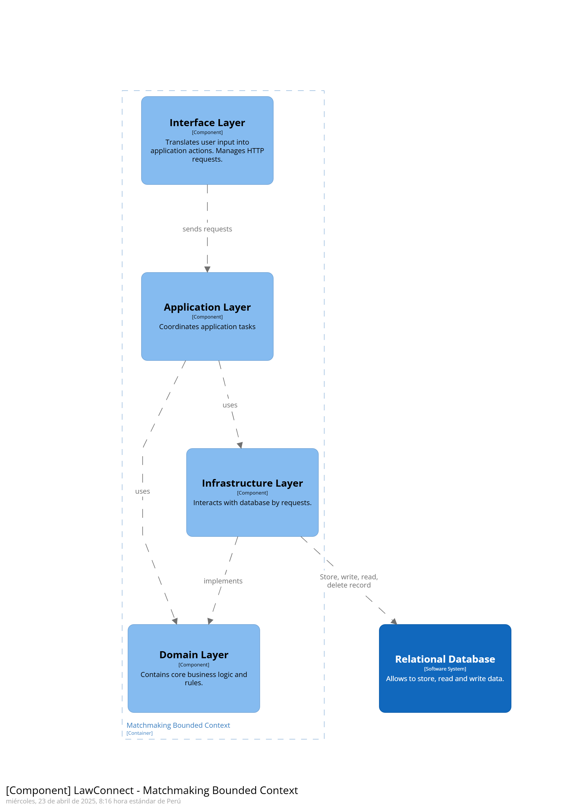  


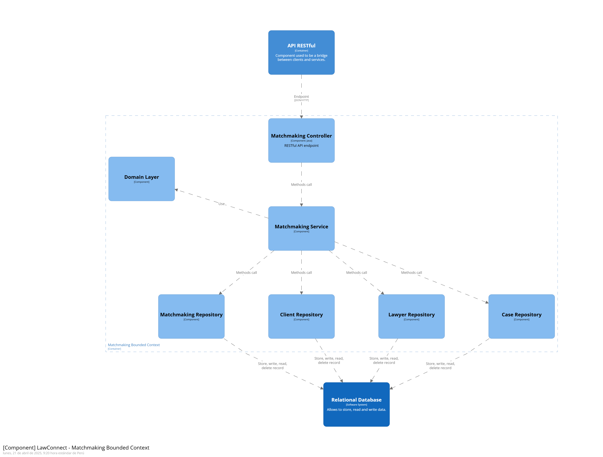  


##### 4.2.4.6. Bounded Context Software Architecture Code Level Diagrams

En esta sección del informe, se presentarán los diagramas a nivel de programación para tener una guía del funcionamiento de la aplicación y que se detalle las características del bounded context.


###### 4.2.4.6.1. Bounded Context Domain Layer Class Diagrams

En este diagrama se muestra la relación entre las clases que pertenecen al bounded context Matchmaking.


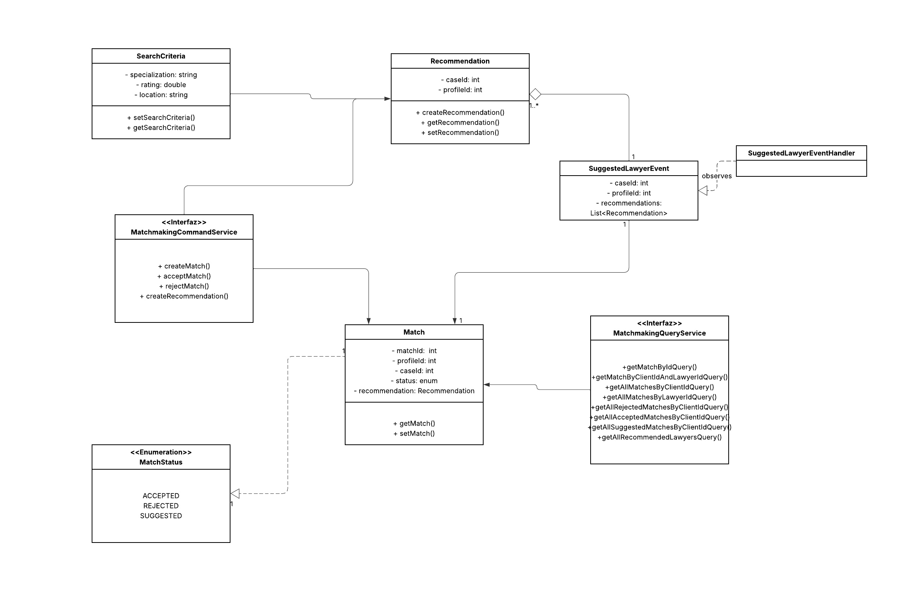  

##### 4.2.X.2. Interface Layer  

Enlace del diagrama en Lucidchart: https://lucid.app/lucidchart/f562fb42-f94d-4840-be83-ef1c400180f5/edit?viewport_loc=-16%2C283%2C1727%2C1241%2CHWEp-vi-RSFO&invitationId=inv_f78a52cc-3e46-4d38-ac9a-28478a2a2a48

###### 4.2.4.6.2. Bounded Context Database Design Diagram

En esta sección se presenta el diseño de la base de datos para el bounded context Matchmaking

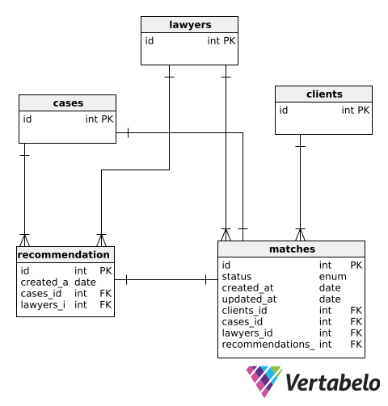  

Enlace del diagrama en Vertabelo: https://my.vertabelo.com/doc/OI6qkFKkRmRYm4KuK5dY1njVWEKdF68Z  

#### 4.2.5. Bounded Context: Tracking

##### 4.2.5.1. Domain Layer  

La capa de Dominio es la capa que contiene el núcleo del modelo de negocio y la lógica de dominio.

**Aggregate Root:** 
- Analytic: Entidad raíz que representa un seguimiento de caso legal. Contiene estado, timestamps, e IDs relevantes. Tiene lógica interna para construir y actualizarse con los comandos correspondientes.

**Interfaces:**
- AnalyticCommandService: Define las operaciones del dominio para aplicar comandos: handle(CreateAnalyticCommand) y handle(UpdateAnalyticCommand)

- AnalyticQueryService: Define las operaciones del dominio para ejecutar consultas: handle(GetAnalyticByCaseIdQuery) y handle(GetAnalyticsByUserIdQuery)

**Comandos:**
- CreateAnalyticCommand: Objeto que encapsula los datos necesarios para crear una nueva instancia de Analytic.

- UpdateAnalyticCommand: Objeto que encapsula los datos necesarios para actualizar una instancia existente de Analytic.

**Consultas:**
- GetAnalyticByCaseIdQuery: Objeto para solicitar una analítica por ID de caso.

- GetAnalyticsByUserIdQuery: Objeto para solicitar todas las analíticas asociadas a un ID de usuario.

##### 4.2.5.2. Interface Layer  

La capa de Interfaz es la capa responsable de exponer el API al exterior y transformar los datos entre el modelo de dominio y los recursos HTTP.

**Controlador:**
- AnalyticController: Controlador que representa los metodos que se van a exponer  a la web, esta clase se encarga de interactuar con el usuario mediante  HTTP. Esta clase tiene dependencias con los transformadores y los contratos definidos para cada servicio, esto porque los transformadores tienen la responsabilidad de serializar las clases que representan respuestas del servicio en commandos o en la entidad principal.

**Recursos:**
- CreateAnalyticResource: Objeto que representa los datos enviados por el cliente para crear un seguimiento.

- UpdateAnalyticResource: Objeto que representa los datos enviados por el cliente para actualizar un seguimiento.

- AnalyticResource: Representación del seguimiento de caso devuelta al cliente tras una operación o consulta.

**Assemblers (Transformadores):**
- CreateAnalyticCommandFromResourceAssembler: Convierte CreateAnalyticResource en CreateAnalyticCommand.

- UpdateAnalyticCommandFromResourceAssembler: Convierte UpdateAnalyticResource en UpdateAnalyticCommand.

- AnalyticResourceFromEntityAssembler: Transforma un objeto del dominio Analytic en un AnalyticResource para ser enviado al cliente.

##### 4.2.5.3. Application Layer  

La capa de Aplicación es la capa que contiene la lógica de aplicación, orquesta las operaciones entre capas externas y el dominio.

**Interfaces:**
- ExternalCaseService: Define el método updateCaseStatus para sincronizar el estado del caso con sistemas externos.

- ExternalUserService: Define el método isUserExist para verificar si un usuario existe externamente.

**Implementaciones:**
- AnalyticCommandServiceImpl: Implementa la lógica para crear y actualizar seguimientos de casos (Analytic) usando comandos.

- AnalyticQueryServiceImpl: Implementa las consultas sobre los seguimientos.

- ExternalCaseServiceImpl: Implementa el cambio de estado de un caso en el sistema externo.

- ExternalUserServiceImpl: Implementa la validación de usuarios consultando una fuente externa.

##### 4.2.5.4. Infrastructure Layer  

La capa de Infraestructura es la capa encargada de la persistencia y conexión con sistemas externos.

**Repositorio:**
- AnalyticRepository: Interfaz que define operaciones de acceso a datos sobre la entidad Analytic. Su implementación concreta se encargará de interactuar con la base de datos.

##### 4.2.5.5. Bounded Context Software Architecture Component Level Diagrams  

A continuación se muestra el diagrama de componentes realizado para el Bounded Context "Tracking".

  


##### 4.2.5.6. Bounded Context Software Architecture Code Level Diagrams

###### 4.2.5.6.1. Bounded Context Domain Layer Class Diagrams  

A continuación se muestra el diagrama de clases realizado para el Bounded Context "Tracking".


Link LucidChart: https://lucid.app/lucidchart/2f24abad-a0f7-43a4-88aa-75a98155725e/edit?viewport_loc=1513%2C-2244%2C5287%2C2801%2C0_0&invitationId=inv_fec486bd-cd05-4ba0-a373-c0d6f0b3cc42 

###### 4.2.5.6.2. Bounded Context Database Design Diagram

A continuación se muestra el diagrama de Base de Datos realizado para el Bounded Context "Tracking".

</img><br>

Link Vertabelo: https://my.vertabelo.com/doc/ljhlltORV7P42DB1eXIYnSo56Gft5W2d 

## Capítulo V: Solution UI/UX Design
En este capítulo nos vamos a enfocar en el desarrolló del diseño de la solución planteada para el proyecto: LawConnect. Para esto nos estamos basando en los estilos y reglas necesarias para hacer un diseño sólido y llamativo para nuestros usuarios.

### 5.1. Product Design

En esta parte del capítulo se desarrollará el proceso de diseño de los productos creados por DartlinWave. En este caso se incluye la arquitectura de la información y diseño visual que se utilizarán para crear las interfaces y experiencias de usuario (UI y UX, respectivamente).  

#### 5.1.1. Style Guidelines

En esta sección se explicarán las guías de estilo para la landing page y mobile application. De esta manera mantendremos coherencia en las vistas de los productos y crear un estilo reconocible para los usuarios.  

##### 5.1.1.1. General Style Guidelines

**Branding:**

*Brand Overview*

LawConnect es una aplicación móvil diseñada para mejorar la comunicación entre abogados egresados y clientes con problemas legales. Nuestro objetivo como startup es facilitar la oportunidad de crear ofertas laborales para abogados egresados debido a la creciente falta de puestos de trabajo disponibles para ellos. Asimismo, nos enfocamos que los clientes tengan la opción de escoger un abogado calificado para su caso de manera eficaz y rápida, que se acomode a sus necesidades.

*Brand Name*

LawConnect utiliza "Law" y "Connect" ("ley" y "conectar" en su traducción al español) para transmitir la noción de lo que brindará la aplicación. En este caso, tener "law" como la primera parte del nombre del producto, permite a los usuarios entender de manera rápida que está dedicado al rubro de leyes. Asimismo, esta situación se repite con "connect", debido a que representa cómo la conexión entre abogados calificados y clientes es realizada por la aplicación de manera eficiente. Al combinar ambas palabras, los usuarios sabrán, inmediatamente, que el producto está dedicado a hacer conexiones entre ellos dentro del marco del sector de abogacía. Este nombre fue escogido debido a que es bastante atractivo para los usuarios, ya que evoca los puntos más importantes y representativos de la aplicación en una sola palabra.

A continuación, se mostrará el logo diseñado para LawConnect:

***Figura .*** Logo de LawConnect.


Para la creación del logo nos enfocamos en determinar que sea representativo a lo que brindamos. Así llegamos a la idea de utilizar la balanza de la justicia, ya que engloba todo lo relacionado a leyes, abogados. Asimismo, representa nuestro compromiso de brindar una oportunidad de acceso a la justicia a los clientes con problemas legales, debido a que el proceso es transparente y claro para ellos, de esta manera, tomarán una decisión acorde a lo que necesiten al momento de escoger un abogado para sus casos. También, el color escogido, que es un amarillo ligero, transmite calma, que es el efecto exacto que buscamos causar en nuestros usuarios.

**Typography:**

Para la tipografía de los productos, se ha escogido Plus Jakarta Sans debido a la legibilidad que presenta y facilidad al momento de leer. Asimismo, es llamativo a plena vista del usuario. Para su implementación, hemos utilizado los cuatro niveles de encabezado como guía, los subtítulos, botones, cuerpo de texto, descripciones, etc.

***Figura .*** Type scale de Plus Jakarta Sans.

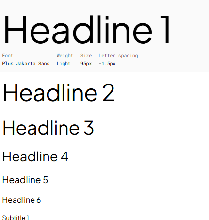  
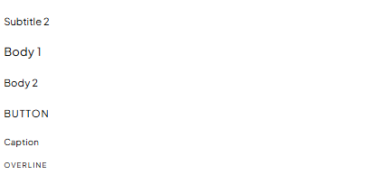

*Nota.* Listado de la representación de la fuente Plus Jakarta Sans. Tomado de _The type system_, por Google (https://m2.material.io/design/typography/the-type-system.html#type-scale), 2025.

**Colors:**

Para la elección de los colores representativos para los productos, escogimos investigar la reacción que causaría en los usuarios durante el uso de la aplicación o landing page. En este proyecto, se decidió utilizar los colores negro y rojo, con esto creamos la paleta de colores característica de LawConnect. Con estos colores esperamos transmitir un sentido de modernidad y calidez. En este caso, escogimos negro para tener una base sólida, también, transmite un aire de confianza, que es justamente lo que esperamos con hacer por la importancia de la aplicación en la vida de nuestros usuarios; así, también tiene un toque de elegancia y seriedad. Además, utilizamos rojo suave para que transmita energía, algo que llama bastante la atención de los usuarios. Por eso es que será utilizado en las llamadas de acción, botones y puntos clave de la aplicación. En sí, buscamos que haya un balance y armonía visual en el diseño de los productos y lo logramos con ambos colores. Enlace al diseño en Figma: https://www.figma.com/design/JZae3tfE2O0QIgquMoexvX/DesignProduct?node-id=8-2&t=eLq4SylKlmEwIeqj-1

***Figura .*** Paleta de Colores creada con Material Design

  

*Nota.* Demostración usable creada por Google para cumplir el estándar de accesibilidad al momento de crear la paleta de colores. Tomado de _The color system_, por Google (https://m2.material.io/design/color/the-color-system.html#tools-for-picking-colors), 2025.

***Figura .*** Paleta de Colores completa.

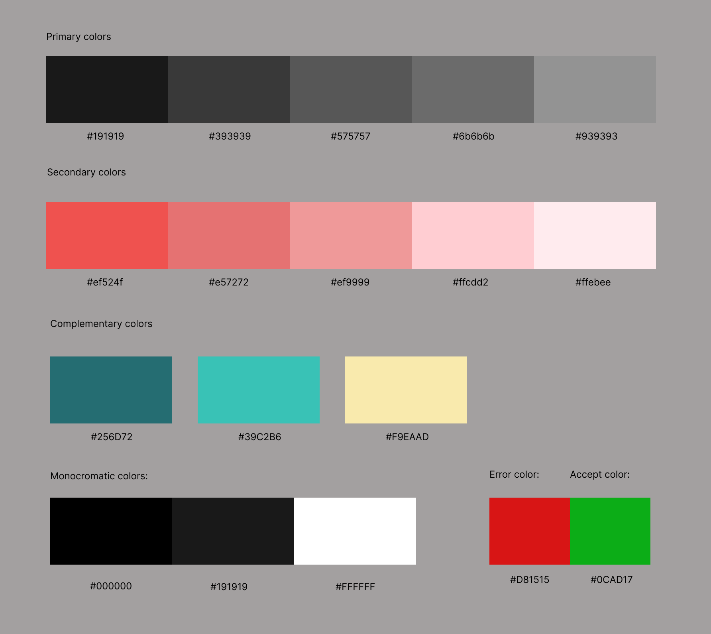

*Nota.* En esta paleta de colores, reunimos todos los colores que vamos a utilizar en nuestros productos.

**Spacing:**

El spacing a utilizar se presentará en los siguientes puntos, estos varían dependiendo de el lenguaje o sistema operativo utilizado. De esta manera, permitimos que la información se vea ordenada.

Para Landing Page:
- Button padding:
    - Vertical: 12px
    - Horizontal: 24px
- Input fields:
    - Altura: 48px
    - Espacio entre campos: 16px
- Margin entre secciones: 64px
- Height entre textos: 30px

Para Android:
- Button padding:
    - Vertical: 12dp
    - Horizontal: 18dp
- Input fields:
    - Altura: 40dp
    - Espacio entre campos: 16dp
- Margin entre secciones:
    - Principales: 32dp a 38dp
    - Internas: 16dp
- Spacing entre textos:
    - Título y subtítulos: 16dp
    - Párrafos: 12dp

Para iOS:
- Button padding: 12pt (vertical), 20pt (horizontal)
- Input fields: 56pt (altura), 16pt (espacio entre campos)
- Margin entre secciones:
    - Principales: 32pt a 38pt
    - Internas: 16pt
- Spacing entre textos:
    - Título y subtítulo: 16pt
    - Párrafos: 12pt


**Dimensions:**

Se prefirió usar un tono ligeramente formal, y amigable; pero, de igual manera, se mantiene el respeto hacia los usuarios. Con LawConnect, preferimos utilizar un lenguaje más serio debido a la importancia de los temas que se tratan. Después de todo, buscamos que el usuario confíe en nuestra aplicación; en el caso de los clientes con problemas legales, que encuentren a un abogado calificado y que los egresados puedan tener ofertas laborales.
#### 5.1.2. Information Architecture

En esta parte del informe se presentará la arquitectura de información (incluye etiquetas, forma de navegación, organización de la información, sistema de búsqueda), planeada para los productos que forman parte de LawConnect (Landing Page y aplicación móvil). Así, cumplimos nuestro objetivo de crear una interfaz amigable e intuitiva para nuestros segmentos objetivos.
##### 5.1.2.1. Organization Systems

**Organización Visual**
Se escogió la jerarquía visual para permitir que el usuario pueda seguir el contenido de la página o aplicación de manera correcta, en el orden de importancia. Por eso, se utilizan distintos tipos de tamaño de texto para asegurarnos de que la diferencia de la importancia de cada oración sea clara y precisa para que los clientes entiendan fácilmente. Por ejemplo, acorde a lo mencionado, se utilizaría un tamaño de letra más grande para los títulos y uno más ligero y pequeño para los subtítulos; esto sería aún más notorio con los párrafos.

También contamos con la organización secuencial, para que los clientes que tienen problemas legales puedan saber el orden preciso para crear su caso en la aplicación y escoger al abogado de su preferencia a través de las recomendaciones brindadas.

**Esquema de Categorización**:

Para categorizar la información, escogimos tres esquemas importantes:
* Alfabético: Para la lista de opciones del menú (se usa el menú hamburguesa), se utilizará el orden alfabético para la presentación de cada sección.
* Por tópico: Esta categorización está presente en la lista de especialidades disponibles durante la creación del caso (por ejemplo, familiar, penal, laboral, civil).
* Cronológico: Se utiliza al momento de hacer el proceso de creación de caso, que es el primer paso en la aplicación. A partir de esa información, pasa al segundo fase que es la elección de abogado, que se genera con un algoritmo para crear un emparejamiento y el cliente pueda escoger acorde a lo que prefiera.
* Audiencia: Lo utilizamos para hacer la diferenciación entre los abogados egresados y los clientes que buscan uno; la presentación de sus pantallas e información van a ser distintas debido a que los objetivos que tienen lo son. El abogado busca ser contratado mientras el cliente espera conseguir un profesional adecuado que lleve su caso.

##### 5.1.2.2. Labelling Systems

Para el sistema de etiquetas (que permitirá que la información sea clara de diferenciar y entender), decidimos utilizar íconos. Las íconos son ampliamente conocidos por facilitar el entendimiento de los funcionamientos presentes en las aplicaciones. En este caso, hemos decidido escoger los íconos de Material Design, presentes en *Compose Material 3* (https://developer.android.com/develop/ui/compose/graphics/images/material?hl=es-419) para la aplicación móvil en Android y para iOS decidimos utilizar Flutter, Cupertino (https://docs.flutter.dev/ui/design/cupertino), que permitirá seguir la guía de estilo del sistema operativo.

Asimismo, vamos a utilizar distintas etiquetas breves para la landing page:
* "Beneficios"
* "Testimonios"
* "Sobre nosotros"
* "Contáctanos"
* "Pruébalo"
* "Inicia Sesión"

En el caso de la aplicación móvil, tendremos en cuenta las etiquetas básicas como:
* "Guardar"
* "Cancelar"
* "Crear Caso"
* "Mis Casos"
* "Escoger" ("Match")
* "Seguimiento" ("Tracker")

##### 5.1.2.3. SEO Tags and Meta Tags

Para los SEO Tags y Meta Tags hemos decidido implementar palabras claves para que mejoren la probabilidad de encontrar LawConnect en los motores de búsqueda.

**Landing Page:**

```
<meta charset="UTF-8">
<meta name="viewport" content="width=device-width, initial-scale=1.0">
<title>LawConnect - Asesoría legal a la palma de tu mano</title>
<meta name="description" content="Conecta con abogados calificados de manera rápida y eficaz".>
<meta name="keywords" content="asesoría legal, abogados, consulta legal, online, LawConnect">
<meta name="author" content="LawConnect">
```

Con estos Tags tendremos la oportunidad de que nuestra landing page sea una de las primeras opciones al momento de buscar una solución para asesoría legal.

**Aplicación Móvil (App Store Optimization):**

* App Title: LawConnect - Asesoría Legal Eficaz
* App Subtitle: Consulta legal rápida, segura y personalizada
* App Keywords: abogado, consulta legal, leyes, asesoría legal, online
* App Description: "LawConnect te permite encontrar abogados calificados para tu caso legal y hacer su respectivo seguimiento en tiempo real. Una solución fácil y confiable."

##### 5.1.2.4. Searching Systems

En esta ocasión, la landing page no contará con una barra de búsqueda, solo tendrá disponibles secciones claras, y botones "call to action" para llevarlos a la aplicación móvil.

En el caso de la aplicación móvil, sería en dos ocasiones:  
* El abogado tendrá la opción de buscar entre sus casos, para encontrarlos con mayor facilidad. Por ejemplo, puede buscar el nombre del cliente, y le aparecerá el caso relacionado.
* Para el cliente habrá la opción de buscar los casos que tiene en el momento. Por ejemplo, si tiene una palabra clave que recuerde del caso, inmediatamente, saldrá la lista de búsqueda.

##### 5.1.2.5. Navigation Systems

Para el sistema de navegación hemos preferido mantener una navegación jerárquica para la landing page, en donde "Pruébalo" e "Iniciar Sesión" son los principales "call to action"; también, escogimos distintos patrones conocidos de *Mobile UI*.

A continuación se va a explicar cómo será el funcionamiento de cada uno en la aplicación móvil:

*  Content-based Navigation: Una implementación de este tipo de navegación sería que, a partir de la tarjeta del abogado, el cliente pueda tocarla y pasar al perfil del abogado (que cuenta con su forma de contacto); otra situación es cuando el abogado desea ver más información del caso y toca la tarjeta del mismo.
* Morphing Controls: En este caso, lo usaremos para el botón de "crear caso", este pasará a ser el de "guardar caso" y, finalmente, "escoger abogado" (a partir de matchmaking).
* "Sticky" Fixed Navigation: Se considera usar un menú inferior fijo que cuente con botones de "Inicio" y "Casos".
* Vertical Navigation: Usaremos este tipo de navegación para que los usuarios visualicen la lista casos.
* Popovers: Se utilizarán las ventanas emergentes en distintos casos:
    * Asegurarse de si el cliente quiere deshacer la creación del caso.
    * Si quiere terminar el caso, lo cual implicaría que el caso fue resuelto.
    * Si está seguro de que adjuntó toda la información necesaria para el caso.
    * Si está seguro de aceptar o rechazar el emparejamiento hecho por la aplicación.
* Sidebars: En este caso, usaremos el "menú hamburguesa", que anida "Mi Cuenta", "Soporte" y "Cerrar Sesión".

#### 5.1.3. Landing Page UI Design

Para el diseño de la interfaz de la landing page de LawConnect hemos seguido la guía de estilos para mantener coherencia entre los productos y permita que haya relación con la aplicación móvil. Durante esta sección se presentarán el wireframe y mock-up de la landing page, para proceder con su creación.
##### 5.1.3.1. Landing Page Wireframe

En esta sección se presentará el wireframe para la landing page, este es un esquema de baja fidelidad que solo nos ayudará para tener una estructura definida al momento de crear la página web. No se considera la paleta de colores, imágenes a usar, tipografía o texto. Enlace al diseño en Figma: https://www.figma.com/design/JZae3tfE2O0QIgquMoexvX/DesignProduct?node-id=3-12&t=eLq4SylKlmEwIeqj-1

Para navegador de escritorio:

***Figura .*** Wireframe de Landing Page de LawConnect para navegador de escritorio.

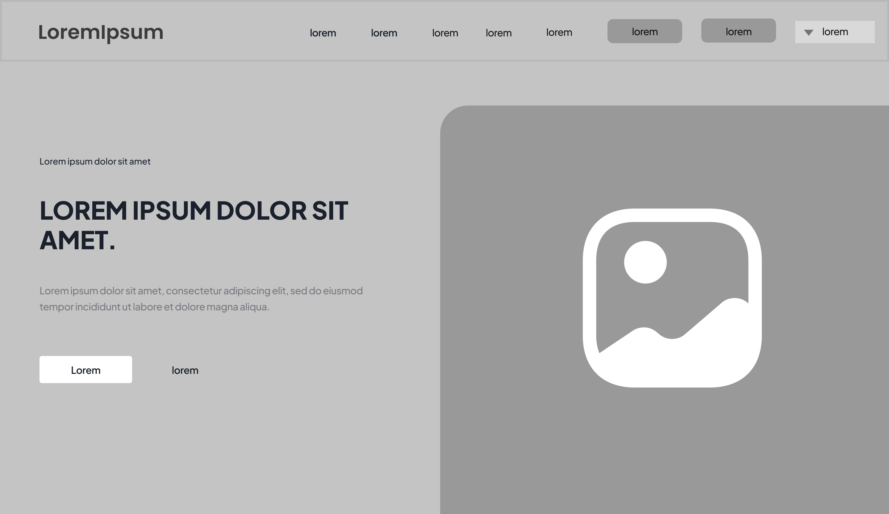

Para navegador de móvil:

***Figura .*** Wireframe de Landing Page de LawConnect para navegador de móvil.

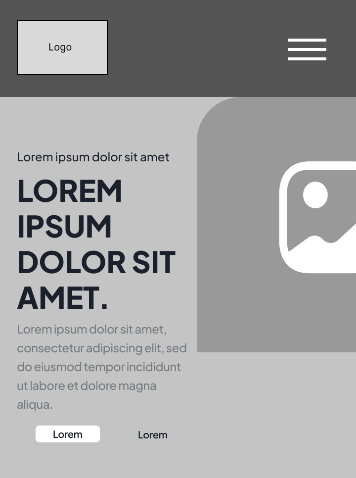

##### 5.1.3.2. Landing Page Mock-up
En esta parte se presentará el mock-up de la landing page, que es el equema de alta fidelidad. Esto nos permite tener un modelo exacto de cómo deberíamos crear la página web, ya que incluye imágenes, paleta de colores, tipografía, etiquetas, etc. Todo está basado acorde a las guías de estilo explicadas con anterioridad. Enlace al diseño en Figma: https://www.figma.com/design/JZae3tfE2O0QIgquMoexvX/DesignProduct?node-id=3-13&t=vLKUyiUl3yOqKCJS-1  


Para navegador de escritorio:

***Figura .*** Mock-up de Landing Page de LawConnect para navegador de escritorio.

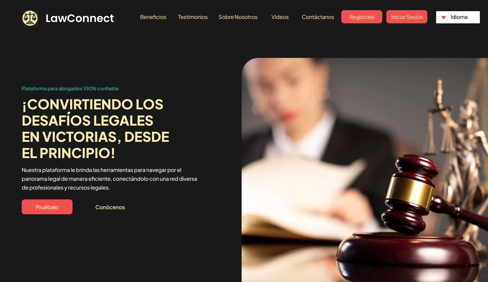

Para navegador de móvil:

***Figura .*** Mock-up de Landing Page de LawConnect para navegador de móvil.

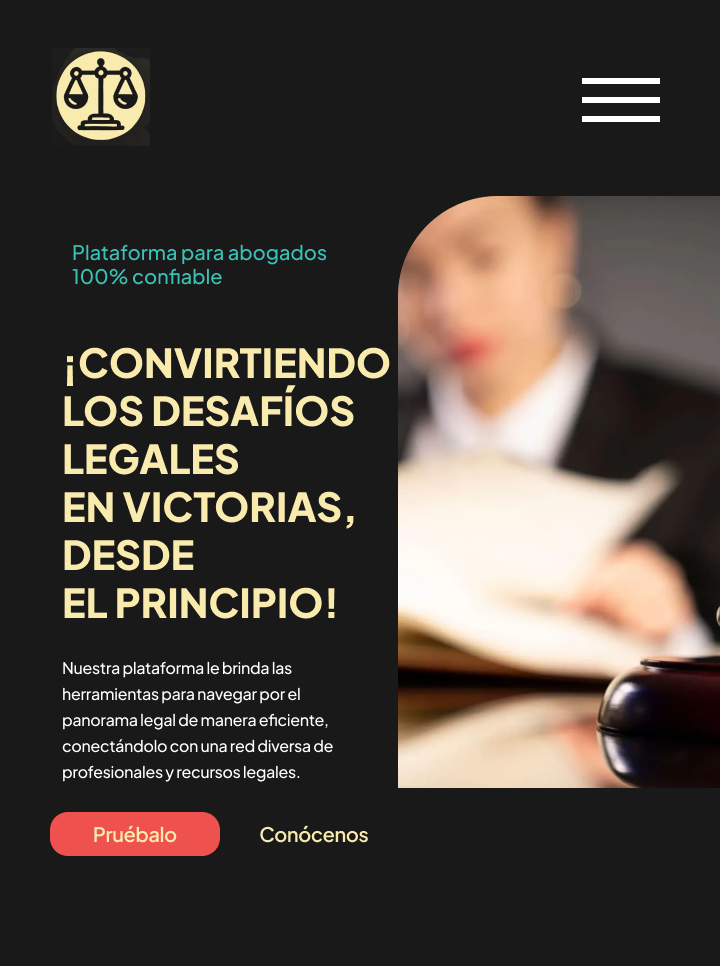


#### 5.1.4. Mobile Applications UX/UI Design 

##### 5.1.4.1. Mobile Applications Wireframes

***Figura .*** Wireframes de la aplicación móvil.


##### 5.1.4.2. Mobile Applications Wireflow Diagrams  

En este apartado se presentarán los wireflow diagrams, estos explican cómo es la navegación en la aplicación móvil.
Esto nos permite entender la experiencia de los usuarios y cuáles son sus objetivos con la aplicación.

Abogados egresados:

User goal 1: Como abogado quiero poder iniciar sesión, inscribirme a Law Connect, recuperar mi contraseña, crear mi perfil, incluir mi descripción y especialidad para ingresar a la aplicación móvil.  

***Figura .*** Representación del User Goal 1 de abogado egresado en la aplicación móvil.

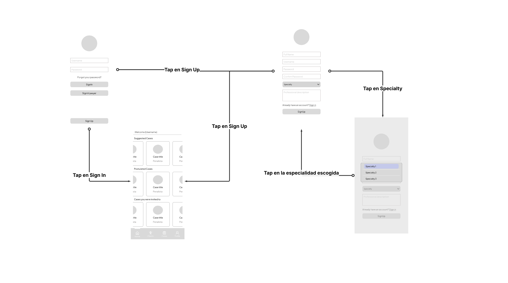

User goal 2: Como abogado quiero ver la lista de casos disponibles y aplicar a uno para poder trabajar con diferentes clientes.

***Figura .*** Representación del User Goal 2 de abogado egresado en la aplicación móvil.

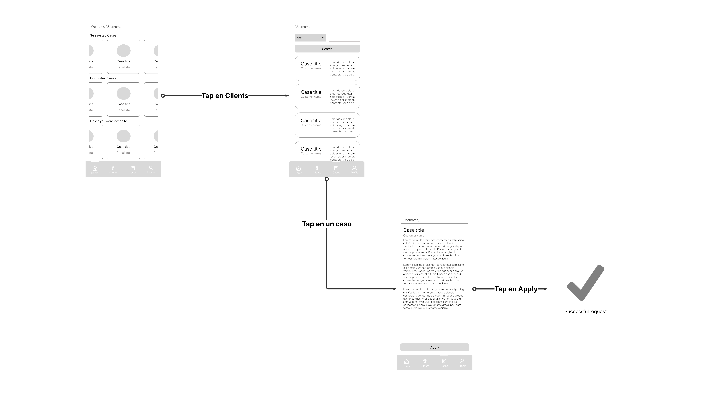

User goal 3: Como abogado quiero poder ver la lista de invitaciones a casos y poder aceptar o declinar uno para poder tener un manejo de los casos que llevo en la aplicación.

***Figura .*** Representación del User Goal 3 de abogado egresado en la aplicación móvil.

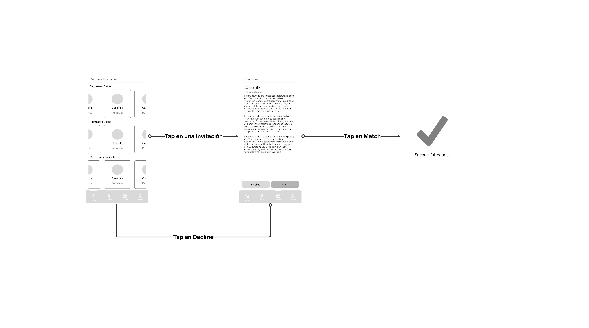

User goal 4: Como abogado quiero tener un seguimiento de los casos que llevo y actualizar su estado para tener una línea de tiempo sobre cómo van los casos y para gestionar un debido tiempo para cada uno.

***Figura .*** Representación del User Goal 4 de abogado egresado en la aplicación móvil.

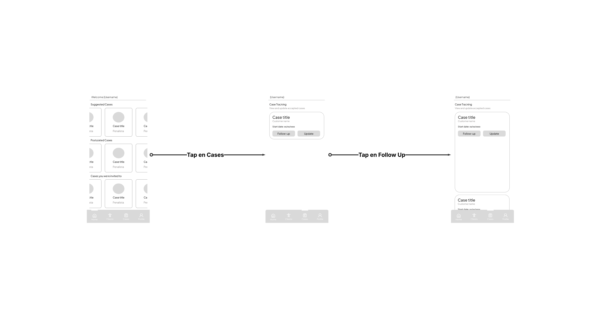

Clientes: 

User goal 1: Como cliente quiero poder iniciar sesión, inscribirme a Law Connect, recuperar mi contraseña, crear mi perfil para ingresar a la aplicación móvil.

***Figura .*** Representación del User Goal 1 de cliente en la aplicación móvil.

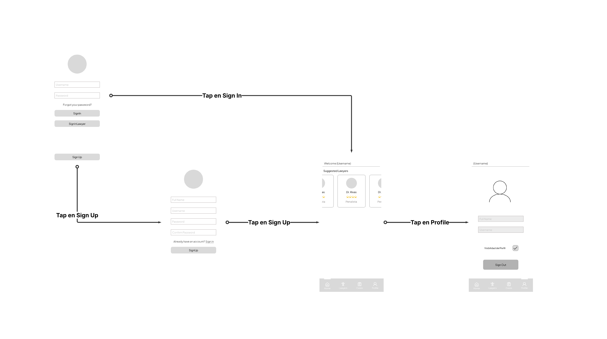

User goal 2: Como cliente quiero poder crear un caso para poder conectar con un abogado calificado.

***Figura .*** Representación del User Goal 2 de cliente en la aplicación móvil.

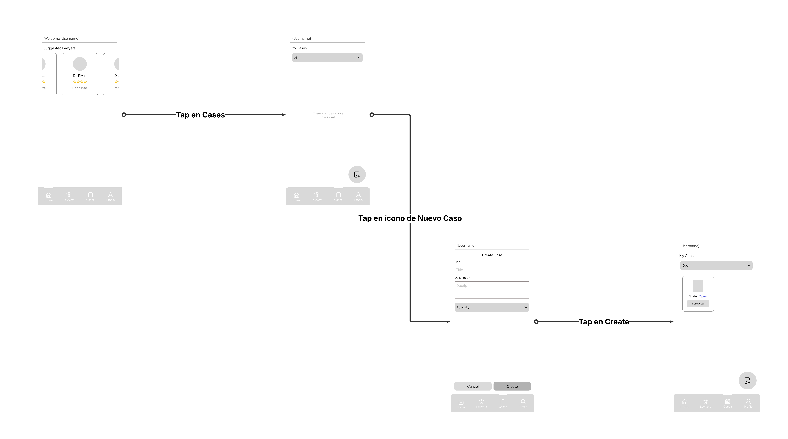

User goal 3: Como cliente quiero visualizar mi lista de casos y ver el seguimiento de los mismos para manejar de manera organizada los tiempos de cada uno.

***Figura .*** Representación del User Goal 3 de cliente en la aplicación móvil.


User goal 4: Como cliente quiero cambiar el estado del caso para poder seguir el caso con un abogado y no se muestre como disponible para otros abogados.

***Figura .*** Representación del User Goal 4 de cliente en la aplicación móvil.

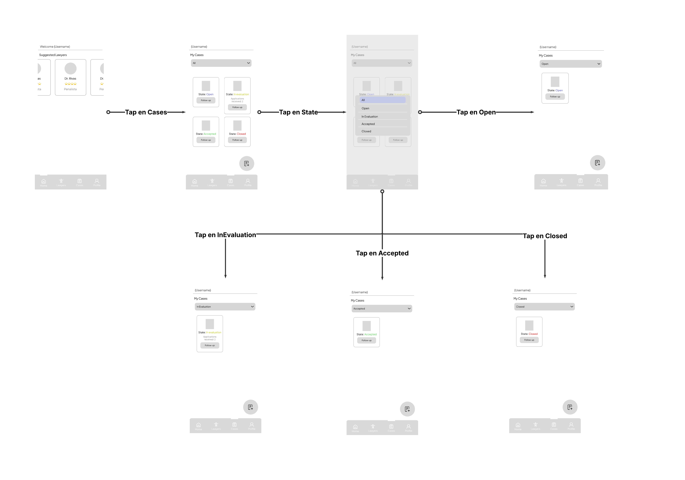

User goal 5: Como cliente quiero ver la lista de abogados, utilizar filtros, e invitar a un abogado al caso creado para llevarlo con el abogado de mi elección.

***Figura .*** Representación del User Goal 5 de cliente en la aplicación móvil.


User goal 6: Como cliente quiero tener una lista de postulantes para mi caso, para escoger uno de ellos acorde a mis preferencias.

***Figura .*** Representación del User Goal 6 de cliente en la aplicación móvil.

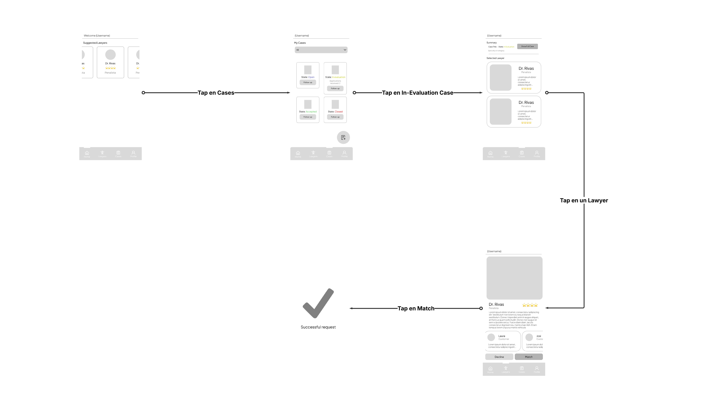

User goal 7: Como cliente quiero poder cerrar un caso para señalar que el proceso legal a terminado.

***Figura .*** Representación del User Goal 7 de cliente en la aplicación móvil.

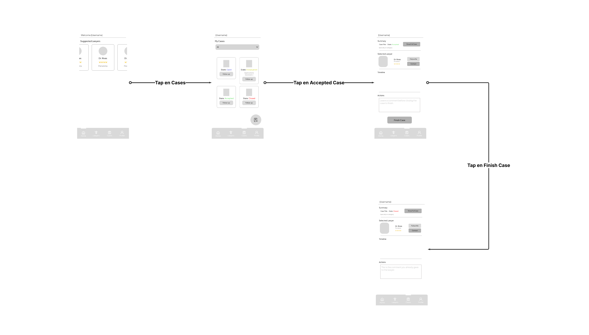

##### 5.1.4.3. Mobile Applications Mock-ups 

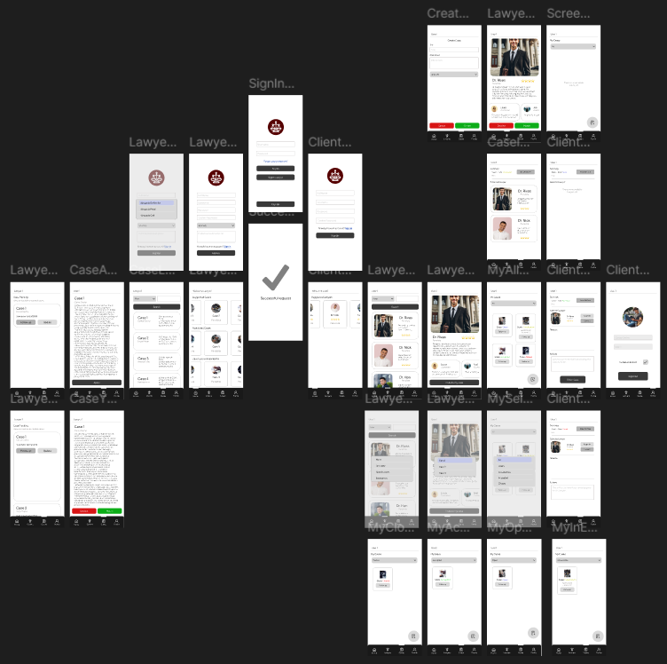

##### 5.1.4.4. Mobile Applications User Flow Diagrams 

En este apartado se presentarán los UserFlow diagrams, estos explican cómo es la navegación en la aplicación móvil con los mockups.

Abogados egresados:

User goal 1: Como abogado quiero poder iniciar sesión, inscribirme a Law Connect, recuperar mi contraseña, crear mi perfil, incluir mi descripción y especialidad para ingresar a la aplicación móvil.  

***Figura .*** Representación del User Goal 1 de abogado egresado en la aplicación móvil.

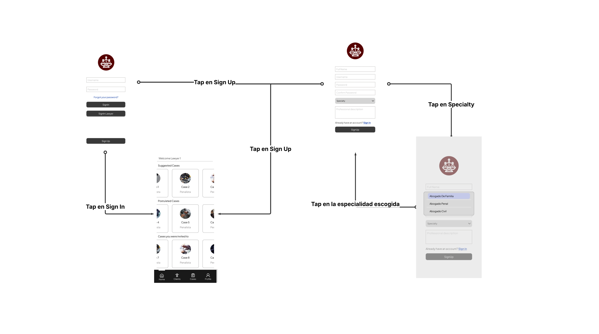


User goal 2: Como abogado quiero ver la lista de casos disponibles y aplicar a uno para poder trabajar con diferentes clientes.

***Figura .*** Representación del User Goal 2 de abogado egresado en la aplicación móvil.

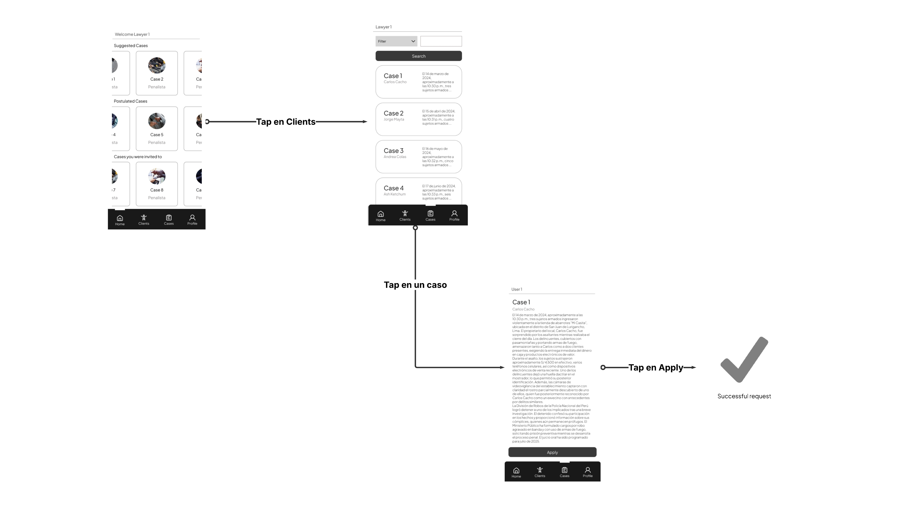


User goal 3: Como abogado quiero poder ver la lista de invitaciones a casos y poder aceptar o declinar uno para poder tener un manejo de los casos que llevo en la aplicación.

***Figura .*** Representación del User Goal 3 de abogado egresado en la aplicación móvil.


User goal 4: Como abogado quiero tener un seguimiento de los casos que llevo y actualizar su estado para tener una línea de tiempo sobre cómo van los casos y para gestionar un debido tiempo para cada uno.

***Figura .*** Representación del User Goal 4 de abogado egresado en la aplicación móvil.

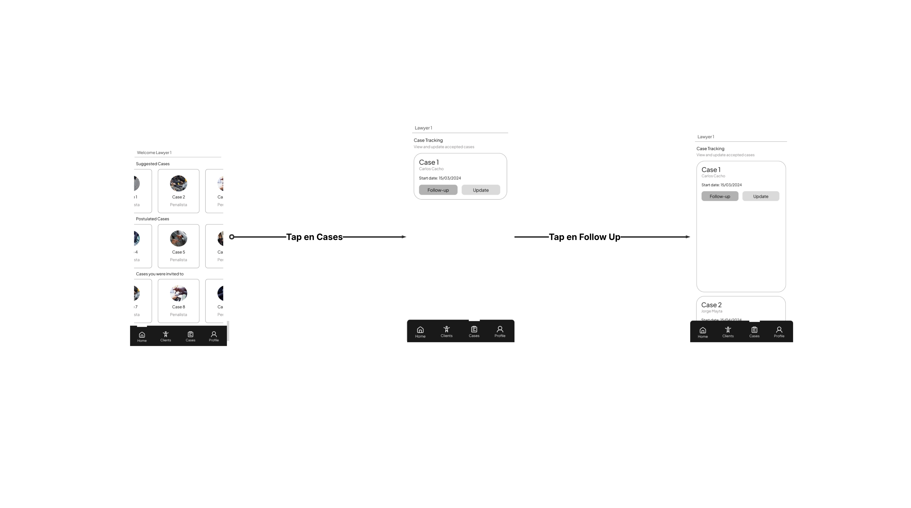


Clientes: 

User goal 1: Como cliente quiero poder iniciar sesión, inscribirme a Law Connect, recuperar mi contraseña, crear mi perfil para ingresar a la aplicación móvil.

***Figura .*** Representación del User Goal 1 de cliente en la aplicación móvil.

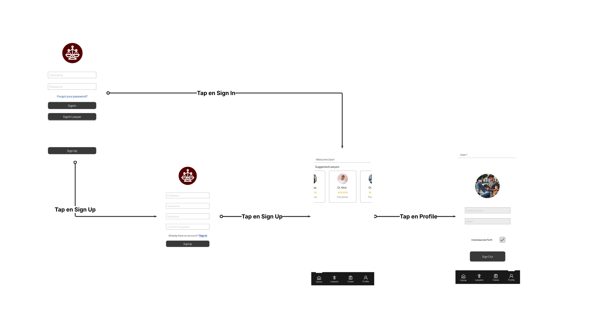


User goal 2: Como cliente quiero poder crear un caso para poder conectar con un abogado calificado.

***Figura .*** Representación del User Goal 2 de cliente en la aplicación móvil.

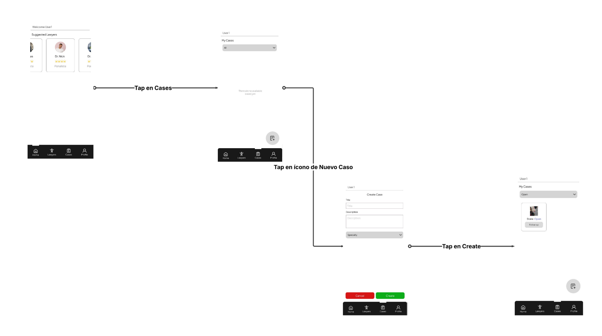


User goal 3: Como cliente quiero visualizar mi lista de casos y ver el seguimiento de los mismos para manejar de manera organizada los tiempos de cada uno.

***Figura .*** Representación del User Goal 3 de cliente en la aplicación móvil.

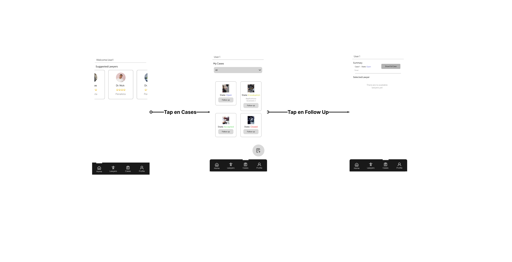


User goal 4: Como cliente quiero cambiar el estado del caso para poder seguir el caso con un abogado y no se muestre como disponible para otros abogados.

***Figura .*** Representación del User Goal 4 de cliente en la aplicación móvil.

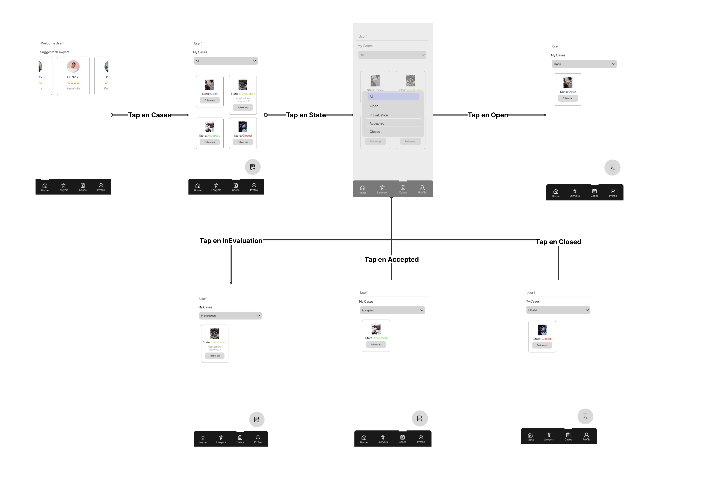


User goal 5: Como cliente quiero ver la lista de abogados, utilizar filtros, e invitar a un abogado al caso creado para llevarlo con el abogado de mi elección.

***Figura .*** Representación del User Goal 5 de cliente en la aplicación móvil.

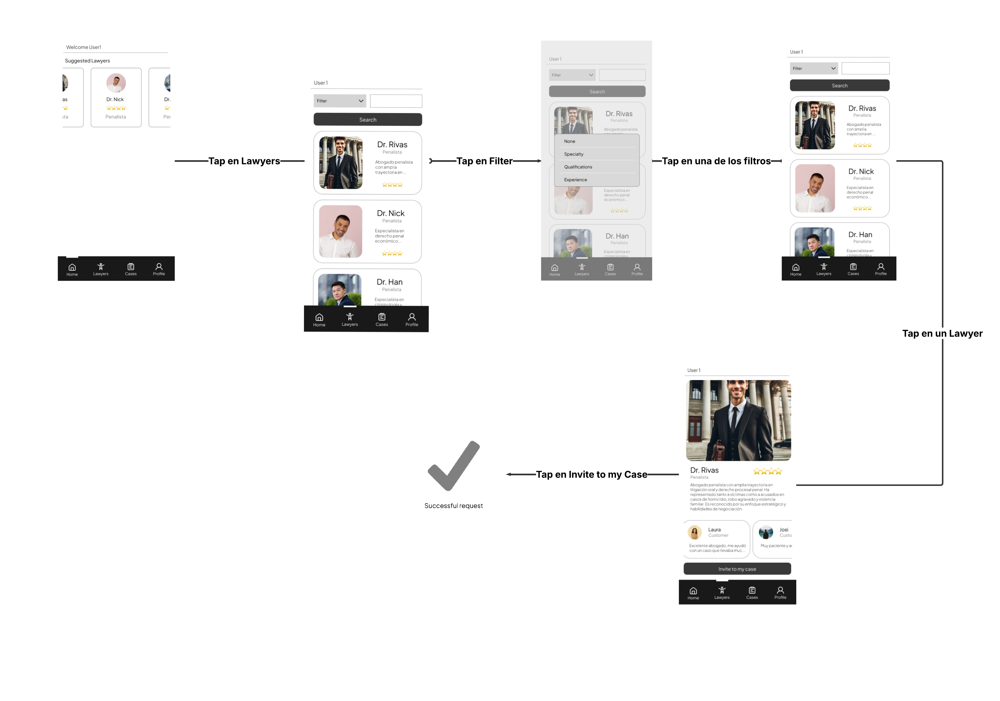


User goal 6: Como cliente quiero tener una lista de postulantes para mi caso, para escoger uno de ellos acorde a mis preferencias.

***Figura .*** Representación del User Goal 6 de cliente en la aplicación móvil.

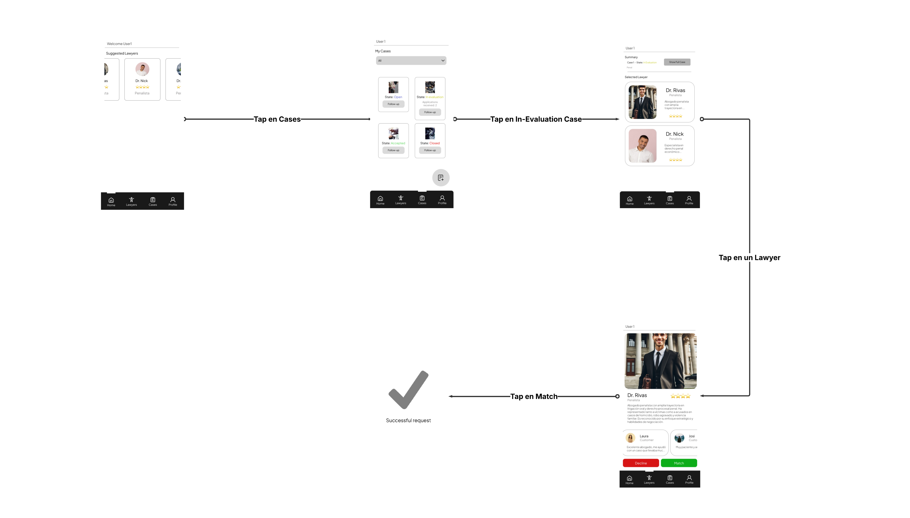


User goal 7: Como cliente quiero poder cerrar un caso para señalar que el proceso legal a terminado.

***Figura .*** Representación del User Goal 7 de cliente en la aplicación móvil.

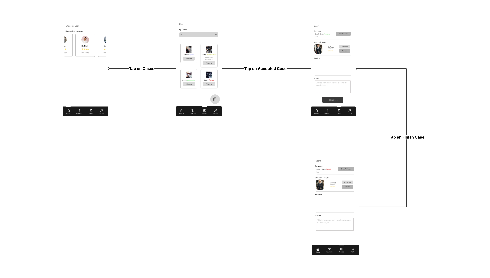


##### 5.1.4.5. Mobile Applications Prototyping

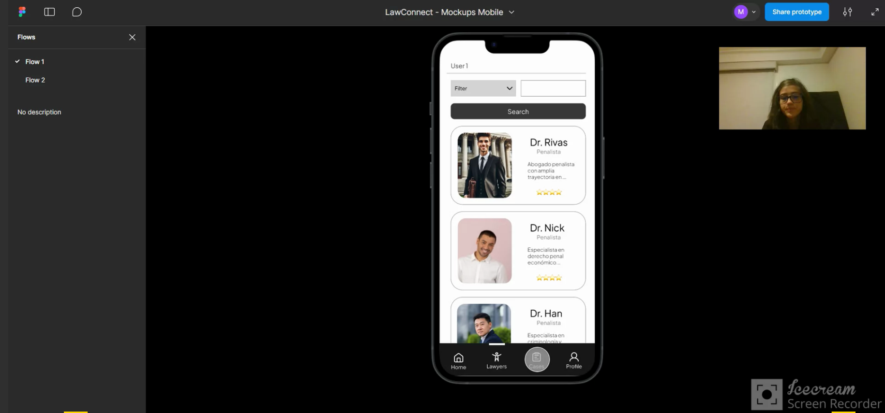

Link del video: https://www.youtube.com/watch?v=B1CFfRD_VAM 

## Capítulo VI: Product Implementation, Validation & Deployment

### 6.1. Software Configuration Management

#### 6.1.1. Software Development Environment Configuration

Project Management 

Github: (https://github.com/) Es donde organizamos el proyecto. Aquí está la organización, la cual contiene 4 repositorios: Informe, Landing Page, Frontend y Backend 

Requirements Management 

Pivotal Tracker: (https://www.pivotaltracker.com/) Es un software que usamos para gestionar los proyectos y establecer las historias de usuario del proyecto.

Product UX/UI Design 

UXPressia: (https://uxpressia.com/) Acá diseñamos las User Persona, User Journey Mapping y Empathy Mapping 

Figma: (https://www.figma.com/es-es/) Acá hicimos los diseños de la landing page y de la aplicación web (wireframes, mockups y prototipos) 

Software Development 

Git: Es un software de control de versiones para desarrollar el proyecto. 

Github: Es un sistema de control de versiones de Git. 

HTML5: Es un lenguaje de marcado que sirve para estructurar la página. 

CSS3: Es un lenguaje de hojas de estilo en cascada que le da estilo a la página (hace que una página sea visualmente más atractiva). 

JavaScript: Es un lenguje de programación que genera interactividad y dinamismo a una sitio web. 

VSCode: Es el editor de código fuente para el desarrollo de la landing page. 

Android Studio: Es el editor de codigo fuente para el desarrollo del frontend. 

IntelliJ: Es el IDE para el desarrollo del backend. 

Kotlin: Es un framework que usaremos para el desarrollo frontend de la aplicación móvil. 

Software Deployment 

Github Pages: Plataforma para desplegar la landing page.

#### 6.1.2. Source Code Management

Utilizamos Github como plataforma, así como un sistema de control de versiones. Para ello se creó una organización para el proyecto del equipo. En esta organización, se crearon 4 repositorios, los cuales corresponden al informe del proyecto, la landing page, el frontend y el backend. 

Organización del proyecto: https://github.com/DartlinWave 

Informe: https://github.com/DartlinWave/LawConnect-report 

Landing page: https://github.com/DartlinWave/LawConnect-LandingPage 

Frontend: https://github.com/DartlinWave/LawConnect 

Backend: https://github.com/DartlinWave/LawConnect-platform 

Usamos Gitflow para tener un mejor manejo del código usado en el proyecto. En Gitflow se establecieron dos ramas principales, las cuales son "main" y "Develop". La rama "main" contiene la versión final del informe y de la landing page. La rama "Develop" se usa para realizar los cambios hechos en el código sin afectar al "main". También se usa para integrar nuevas funcionalidades del proyecto. Además, usamos la rama temporal "Feature" para llevar a cabo las nuevas funciones del proyecto sin que este afecte a las ramas principales. En nuestro caso, dividimos las "Feature" por capítulos para el informe. De esa manera tendremos un mejor orden y estructura del proyecto. Los "Feature" los nombramos de la siguiente manera: "Feature/chapter#" donde el signo "#" representa el número del capítulo que se trabajó.


Semantic Versioning 2.0.0 

Según el Semantic Versioning 2.0.0 (https://semver.org/), los "Releases" se nombran de la siguiente manera: 

MAJOR version: Al realizar los cambios de APIs incompatibles

MINOR version: Al agregar funcionalidades compatibles con versiones anteriores

PATCH version: Al realizar correcciones de errores compatibles con versiones anteriores 

Conventional Commits

Para los textos de mensajes en commits se aplican los "Conventional Commits" (https://www.conventionalcommits.org/) de la siguiente manera (omitir las comillas simples): <'type'>[optional scope]: <'description'> Donde: <'type'>: Representa la palabra inicial que indica la clase de commit a emplear. Ejemplos: fix, feat, build, chore, docs, refactor, etc.[optional scope]: Representa el alcance del commit y no es obligatorio.<'description'>: Representa la descripción detallada del commit, así como las acciones realizadas.

#### 6.1.3. Source Code Style Guide & Conventions

#### 6.1.4. Software Deployment Configuration

### 6.2. Landing Page & Mobile Application Implementation

#### 6.2.1. Sprint 1

##### 6.2.1.1. Sprint Planning 1


| Sprint #                           | Sprint 1                                                                                                                                                                                                                                                                                                                                                                                                                                                                                       |
|------------------------------------|------------------------------------------------------------------------------------------------------------------------------------------------------------------------------------------------------------------------------------------------------------------------------------------------------------------------------------------------------------------------------------------------------------------------------------------------------------------------------------------------|
| Date                               | 2025-04-28                                                                                                                                                                                                                                                                                                                                                                                                                                                                                     |
| Time                               | 10 AM                                                                                                                                                                                                                                                                                                                                                                                                                                                                                          |
| Location                           | Google Meet                                                                                                                                                                                                                                                                                                                                                                                                                                                                                    |
| Prepared By                        | Gonzalo Zavala                                                                                                                                                                                                                                                                                                                                                                                                                                                                                 |
| Attendees (to planning meeting)    | Camila Loli, Bárbara Espinoza, Johan Tintaya                                                                                                                                                                                                                                                                                                                                                                                                                                                   |
| Sprint n – 1 Review Summary        | Esta entrega no cuenta con un sprint anterior.                                                                                                                                                                                                                                                                                                                                                                                                                                                 |
| Sprint n – 1 Retrospective Summary | Esta entrega no cuenta con un sprint anterior.                                                                                                                                                                                                                                                                                                                                                                                                                                                 |
| Sprint 1 Goal                      | Nuestro enfoque está en permitir que los abogados y clientes se puedan registrar, ingresar y manejar la estructura básica de sus perfiles y casos legales en la aplicación móvil.<br>Consideramos que entrega valor fundamental a los abogados egresados y clientes con problemas legales, ya que, les permite explorar una versión preliminar de la aplicación.<br>Esto será confirmado cuando los abogados egresados y clientes se puedan registrar de manera exitosa y crear casos básicos. |
| Sprint 1 Velocity                  | 13                                                                                                                                                                                                                                                                                                                                                                                                                                                                                             |
| Sum of Story points                | 13 Story Points                                                                                                                                                                                                                                                                                                                                                                                                                                                                                |
                                                                                                                                                                                                                                                                                                                                                                                                                           


##### 6.2.1.2. Sprint Backlog 1


| User Story                                           | Work-item/Task                                                            | Description                                                                                                                     | Estimation (Hours) | Assigned To | Status |
|------------------------------------------------------|---------------------------------------------------------------------------|---------------------------------------------------------------------------------------------------------------------------------|--------------------|-------------|--------|
| HU02 - Completar Perfil de Abogado                   | W01 Complete lawyer's profile feature in backend                          | Implementar de manera completa la función que permite al abogado crear su perfil                                                | 1                  | Gonzalo     | Done   |
| HU03 - Gestión de Casos Activos                      | W02 Create cases management feature in backend                            | Implementar la función que permite a los abogados tener gestión de sus casos activos                                            | 2                  | Gonzalo     | Done   |
| HU05 - Configuración de Disponibilidad               | W03 Set up the availability of the lawyer feature in the backend          | Implementar la configuración que permite a los abogados mostrar su disponibilidad                                               | 2                  | Gonzalo     | Done   |
| HU07 - Registro de Cliente                           | W04 Register a client feature in backend                                  | Implementar la función de registro de cliente en el backend                                                                     | 1                  | Gonzalo     | Done   |
| HU10 - Agendamiento de Cita                          | W05 Make an appointment with lawyer feature in backend                    | Implementar función que hace que el cliente agende una cita con el abogado                                                      | 1                  | Gonzalo     | Done   |
| HU17 - Testimonios de Clientes Satisfechos           | W06 Testimonials section in Landing Page                                  | Implementar una sección de testimonios de usuarios en la landing page                                                           | 1                  | Bárbara     | Done   |
| HU18 - Acceso Rápido a Funcionalidades Principales   | W07 Funcionality and quick access in Landing Page                         | Implementar botones "call-to-action" para llamar la atención de los usuarios y sea más fácil que ingresen a la aplicación móvil | 1                  | Camila      | Done   |
| HU19 - Información Clara y Concisa sobre el Servicio | W08 Have clear and solid information about the mobile app in Landing Page | Agregar información clara para que los usuarios entiendan el funcionamiento de la aplicación de manera rápida                   | 1                  | Camila      | Done   |
| HU20 - Diseño Atractivo y Responsivo                 | W09 Eye-catching design and responsive in Landing Page                    | Crear un diseño llamativo para los usuarios y quela landing page se adapte a sus dispositivos                                   | 1                  | Johan       | Done   |
| HU26 - Gestión de Roles y Permisos                   | W010 Create management of roles and permissions in backend                | Implementar la gestión de roles y permisos en el backend                                                                        | 2                  | Gonzalo     | Done   |

##### 6.2.1.3. Development Evidence for Sprint Review

##### 6.2.1.4. Testing Suite Evidence for Sprint Review

##### 6.2.1.5. Execution Evidence for Sprint Review

##### 6.2.1.6. Services Documentation Evidence for Sprint Review

Para la documentación de los servicios, se utilizó Swagger. Este servicio nos permite documentar los endpoints disponibles en la API.
Swagger es una herramienta de código abierto que permite crear documentación interactiva para API RESTful.
En este proyecto, estamos utilizando la version 3 de Swagger, que es la más reciente. Las anotaciones utilizadas para la documentación fueron:
```@Tag```, ```@Operation``` y ```@ApiResponse```.

Para el entorno de desarrollo, que hemos utilizado SwaggerUI para el desarrollo, su URL local es: http://localhost:8080/swagger-ui/index.html

Los commits relevantes, para determinar los controladores, son:
*

El repositorio en donde se encuentra este servicio es: https://github.com/DartlinWave/LawConnect-platform

Acorde a los bounded context que tenemos en el proyecto, se crearon los siguientes endpoints:  

**IAM**  

Este bounded context se encarga de la gestión de usuarios y su respectiva autenticación. De esta manera, nos aseguramos que los usuarios tengan acceso a la aplicación y puedan crear su cuenta.
Asimismo, se encarga de manejar los roles disponibles en la aplicación, en este caso, abogado o cliente.  

***Tabla .***

*Endpoints de Authentication, Roles y Users*

| Endpoint                                | Método | Descripción                               | Parámetros                                                                                                                     | Ejemplo de llamada                           | Respuesta     |
|-----------------------------------------|--------|-------------------------------------------|--------------------------------------------------------------------------------------------------------------------------------|----------------------------------------------|---------------|
| `/api/v1/authentication/sign-in`        | `POST` | Autenticar usuario con email y contraseña | Body: `email`, `password` (`SignInResource`)                                                                                   | `POST /api/v1/authentication/sign-in`        | `200 OK`      |
| `/api/v1/authentication/sign-up/lawyer` | `POST` | Registro de nuevo abogado                 | Body: `name`, `lastname`, `specialties`, `description`, `phone`, `dni`, `username`, `password` (`SignUpLawyerCommandResource`) | `POST /api/v1/authentication/sign-up/lawyer` | `201 Created` |
| `/api/v1/authentication/sign-up/client` | `POST` | Registro de nuevo cliente                 | Body: `name`, `lastname`, `phone`, `dni`, `username`, `password` (`SignUpClientResource`)                                      | `POST /api/v1/authentication/sign-up/client` | `201 Created` |
| `/api/v1/roles`                         | `GET`  | Obtener todos los roles disponibles       | Ninguno                                                                                                                        | `GET /api/v1/roles`                          | `200 OK`      |
| `/api/v1/users/{userId}`                | `GET`  | Obtener información de usuario por Id     | Path: `userId`                                                                                                                 | `GET /api/v1/users/1`                        | `200 OK`      |

***Figura .*** Visualización de Authentication en Swagger

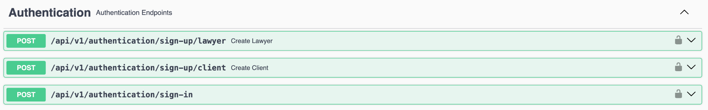

***Figura .*** Visualización de Roles en Swagger

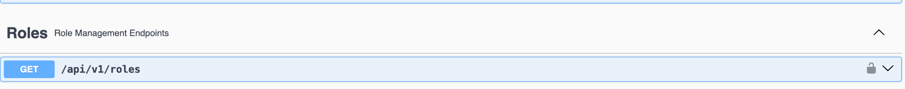

***Figura .*** Visualización de Users en Swagger


**Profiles**  
Este bounded context se encarga de la gestión de los perfiles de los usuarios. Así, los usuarios pueden visualizar su información y editarla.
De esta manera, por ejemplo, los abogados pueden mostrar su especialidad y su información de contacto.

***Tabla .***  

*Endpoints de Profiles*  

| Endpoint                           | Método | Descripción                                    | Parámetros     | Cómo llamar                     | Respuesta |
|------------------------------------|--------|------------------------------------------------|----------------|---------------------------------|-----------|
| `/api/v1/profiles/client/{userId}` | `GET`  | Obtener un perfil de cliente por Id de usuario | Path: `userId` | `GET /api/v1/profiles/client/1` | `200 OK`  |
| `/api/v1/profiles/lawyer/{userId}` | `GET`  | Obtener un perfil de abogado por Id de usuario | Path: `userId` | `GET /api/v1/profiles/lawyer/2` | `200 OK`  |

***Figura .*** Visualización de Profiles en Swagger  

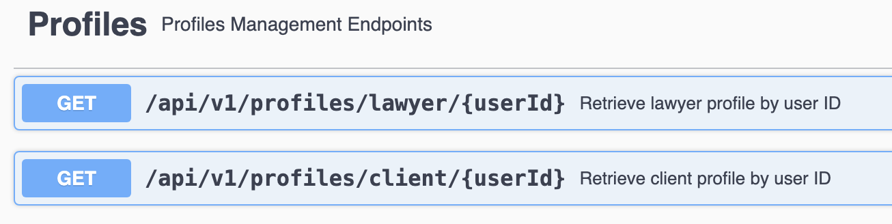

**Cases**    
Este bounded context se encarga de la gestión de los casos. Se gestiona la creación de los casos, la invitación a los abogados y postulación de los mismos.

***Tabla .***

*Endpoints de Cases*  

| Endpoint                 | Método | Descripción                                     | Parámetros                                                                                                      | Cómo llamar           | Respuesta     |
|--------------------------|--------|-------------------------------------------------|-----------------------------------------------------------------------------------------------------------------|-----------------------|---------------|
| `/api/v1/cases`          | `POST` | Crear un nuevo caso legal                       | Body: `clientId`, `title`, `description`, `requiredSpecialty`, `status`, `applicantsIds` (`CreateCaseResource`) | `POST /api/v1/cases`  | `201 Created` |
| `/api/v1/cases/{caseId}` | `GET`  | Obtener todos los casos de un cliente por su Id | Path: `caseId`                                                                                                  | `GET /api/v1/cases/1` | `200 OK`      |

***Figura .*** Visualización de Cases en Swagger

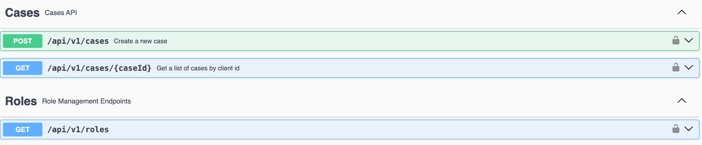

**Matchmaking**  
Este bounded context se encarga de la gestión del emparejamiento entre abogados y clientes. Maneja aceptar a un abogado para un caso, así como también rechazarlo.
Y también cuando un cliente acepta a un abogado para su caso o lo rechaza.

***Tabla .***

*Endpoints de Matchmaking*

| Endpoint                                             | Método  | Descripción                                  | Parámetros                                            | Cómo llamar                                        | Respuesta     |
|------------------------------------------------------|---------|----------------------------------------------|-------------------------------------------------------|----------------------------------------------------|---------------|
| `/api/v1/matches`                                    | `POST`  | Crear un nuevo match entre cliente y abogado | Body: `caseId`, `lawyerId` (`CreatePreMatchResource`) | `POST /api/v1/matches`                             | `201 Created` |
| `/api/v1/matches/{matchId}`                          | `GET`   | Obtener match por Id                         | Path: `matchId`                                       | `GET /api/v1/matches/2`                            | `200 OK`      |
| `/api/v1/matches/{matchId}/accept-lawyer-by-client`  | `PATCH` | Cliente acepta postulación de abogado        | Path: `matchId`                                       | `PATCH /api/v1/matches/2/accept-lawyer-by-client`  | `200 OK `     |
| `/api/v1/matches/{matchId}/decline-lawyer-by-client` | `PATCH` | Cliente rechaza postulación de abogado       | Path: `matchId`                                       | `PATCH /api/v1/matches/2/decline-lawyer-by-client` | `200 OK `     |
| `/api/v1/matches/{matchId}/accept-case-by-lawyer`    | `PATCH` | Abogado acepta invitación de cliente         | Path: `matchId`                                       | `PATCH /api/v1/matches/2/accept-case-by-lawyer`    | `200 OK `     |
| `/api/v1/matches/{matchId}/reject-case-by-lawyer`    | `PATCH` | Abogado rechaza invitación de cliente        | Path: `matchId`                                       | `PATCH /api/v1/matches/2/reject-case-by-lawyer`    | `200 OK `     |
| `/api/v1/matches/lawyerId/{lawyerId}/pending`        | `GET`   | Lista de matches pendientes de un abogado    | Path: `lawyerId`                                      | `GET /api/v1/matches/lawyer/3/pending`             | `200 OK`      |
| `/api/v1/matches/caseId/{caseId}/pending`            | `GET`   | Lista de matches pendientes de un caso       | Path: `caseId`                                        | `GET /api/v1/matches/case/4/pending`               | `200 OK`      |

***Figura .*** Visualización de Matchmaking en Swagger

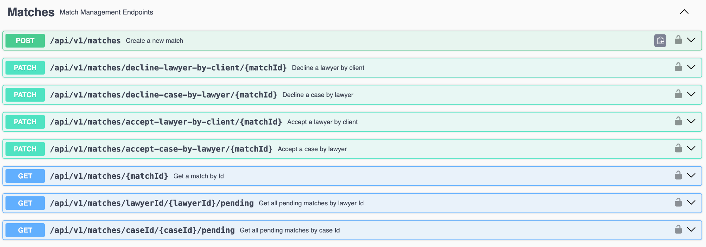

**Tracking**   
Este bounded context se encarga de la gestión del seguimiento de los casos. Permite que los usuarios puedan actualizar el estado de los casos.

***Tabla .***  

*Endpoints de Tracking*  

| Endpoint                          | Método | Descripción                                    | Parámetros                                             | Cómo llamar                         | Respuesta     |
|-----------------------------------|--------|------------------------------------------------|--------------------------------------------------------|-------------------------------------|---------------|
| `/api/v1/status`                  | `POST` | Crear un nuevo estado del caso                 | Body: `legalCaseId`, `status` (`CreateStatusResource`) | `POST /api/v1/status`               | `201 Created` |
| `/api/v1/status?legalCaseId={id}` | `GET`  | Obtener todos los estados de un caso por su Id | Query param: `legalCaseId`                             | `GET /api/v1/status?legalCaseId=12` | `200 OK`      |

***Figura .*** Visualización de Tracking en Swagger

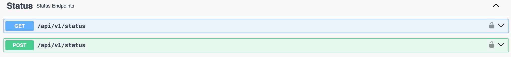

##### 6.2.1.7. Software Deployment Evidence for Sprint Review

Para el despliegue de la Landing Page creada por el equipo, se utilizó GitHub Pages. 
Para esto, se creó un repositorio en GitHub, donde se subieron todos los archivos de la landing page. 
Luego, se configuró el repositorio para que GitHub Pages lo despliegue automáticamente.
Este servicio de GitHub permite que cualquier repositorio público pueda ser desplegado como una página web estática, es un proceso sencillo y rápido. 
Asimismo, permite que las actualizaciones realizadas en el repositorio se reflejen automáticamente en la página web.

El primer paso consiste en ir a la pestaña de *Settings* dentro del repositorio de la Landing Page, ya deben de estar incluidos los materiales necesarios para su despliegue.  

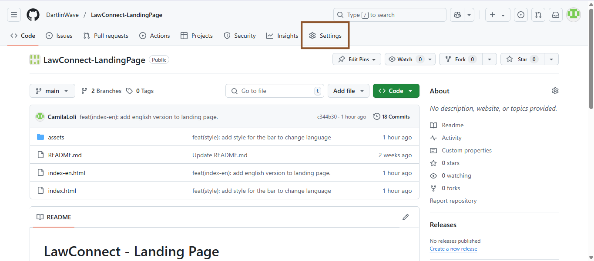  

Continuamos con la pestaña *Pages*, ahí es donde empezaremos el proceso de despliegue, escoger la rama que va a ser utilizada.  

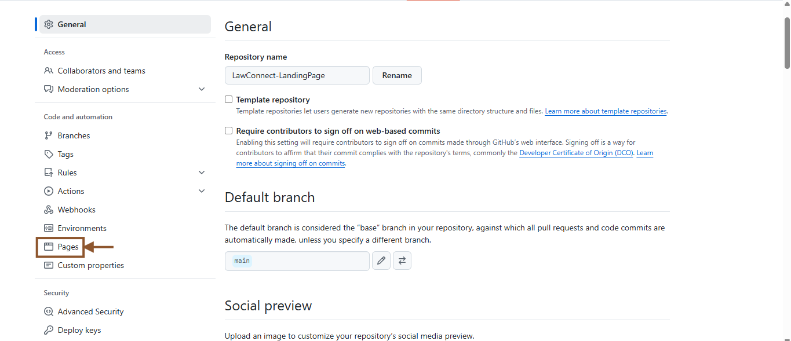  

Terminamos al dar clic al botón *Save*, luego de escoger la rama y carpeta a desplegar. Así, tenemos lista la landing page, desplegada, y que todos los usuarios puedan conocer la aplicación antes de descargarla a sus móviles.  

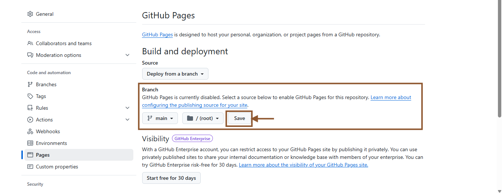  

El enlace a la landing page es el siguiente: https://dartlinwave.github.io/LawConnect-LandingPage/

##### 6.2.1.8. Team Collaboration Insights during Sprint

### 6.3. Validation Interviews

#### 6.3.1. Diseño de Entrevistas

#### 6.3.2. Registro de Entrevistas

#### 6.3.3. Evaluaciones según heurísticas

### 6.4. Video About-the-Product

## Conclusiones
<p align="justify">
A partir de la primera entrega, se consolidó una base sólida en TB1 al definir de forma precisa los segmentos objetivo, establecer las bases del Lean UX y actualizar conceptos esenciales que permitieron identificar las necesidades y retos del mercado, mientras que en TP se avanzó en la concreción de la solución mediante wireframes, mockups y prototipos, lo que evidenció un fuerte compromiso con la usabilidad y la experiencia del usuario. En conjunto, ambas fases reflejan la sinergia entre el análisis profundo y la materialización de ideas, permitiendo no solo validar las suposiciones iniciales sino también ofrecer una visión clara y coherente del producto final, orientado a conectar de manera efectiva a abogados egresados con clientes que requieren asesoría legal. Este enfoque integral sienta las bases para futuras iteraciones, garantizando que la solución tecnológica se ajuste a las necesidades reales de los usuarios y promueva un desarrollo ágil y enfocado en la mejora continua.
</p>

## Conclusiones y recomendaciones 
<p align="justify">
A partir del proceso para completar la primera entrega del proyecto, entendemos que necesitamos una base concisa y clara para poder empezar con la creación de nuestro producto. Empezamos con el Lean UX Process, lo que nos permitió conocer de forma exacta nuestro público objetivo. Continuamos con los gráficos AS-IS y TO-BE, de esta manera pudimos representar el estado actual y futuro del flujo que habrá dentro de la aplicación. Asimismo, con las entrevistas a nuestros segmentos objetivos previamente identificados, logramos entender sus necesidades y reforzar nuestro diseño de aplicación web. A partir de ello, pudimos crear nuestras User Stories que definirán cómo continuaremos el proyecto y qué debemos cumplir al momento de finalizarlo. 
</p>

<p align="justify">
Y finalmente cada integrante se encargó de definir las clases que tendra cada Bounded Context y realizar los diagramas solicitados. En resumen, esta primera entrega nos permitió tener una base firme, que se alinea con nuestras metas como empresa y los beneficios que esperamos brindar a los usuarios. 
</p>

## Video About-the-Team

## Bibliografía

Gobierno del Perú. (12 de agosto de 2020). _II Informe bienal sobre la realidad universitaria_. Sunedu.
https://cdn.www.gob.pe/uploads/document/file/1230044/Informe%20Bienal.pdf?v=1603336820

Gobierno del Perú. (17 de marzo de 2022). _III Informe bienal sobre la realidad universitaria_. Sunedu. [https://cdn.www.gob.pe/uploads/document/file/3018068/III%20Informe%20Bienal.pdf](https://cdn.www.gob.pe/uploads/document/file/3018068/III%20Informe%20Bienal.pdf)

Pontificia Universidad Católica del Perú. (2019). _Informe del mercado laboral de Derecho_. Bolsa de Trabajo PUCP. https://cdn01.pucp.education/btpucp/2019/07/23142115/informe-del-mercado-laboral-de-derecho.pdf

Vallecilla, C. (21 de marzo de 2024). El desempleo en Perú dic. 2023 - feb. 2024 no varió, pero se recuperaron casi 640 mil empleos. _tyba- ¡La app de las inversiones en el Perú!_ https://tyba.pe/blog/tasa-de-desempleo-en-peru-dic-2023-feb-2024/

## Anexos 
### Anexo A. GitHub Repositories
Link de la organización DartlinWave: https://github.com/DartlinWave

<table>
    <tr>
        <th>Repository</th>
        <th>Link to Repository</th>
    </tr>
    <tr>
        <td>LawConnect-report</td>
        <td>https://github.com/DartlinWave/LawConnect-report</td>
    </tr>
    <tr>
        <td>LawConnect-platform</td>
        <td>https://github.com/DartlinWave/LawConnect-platform</td>
    </tr>
</table>
